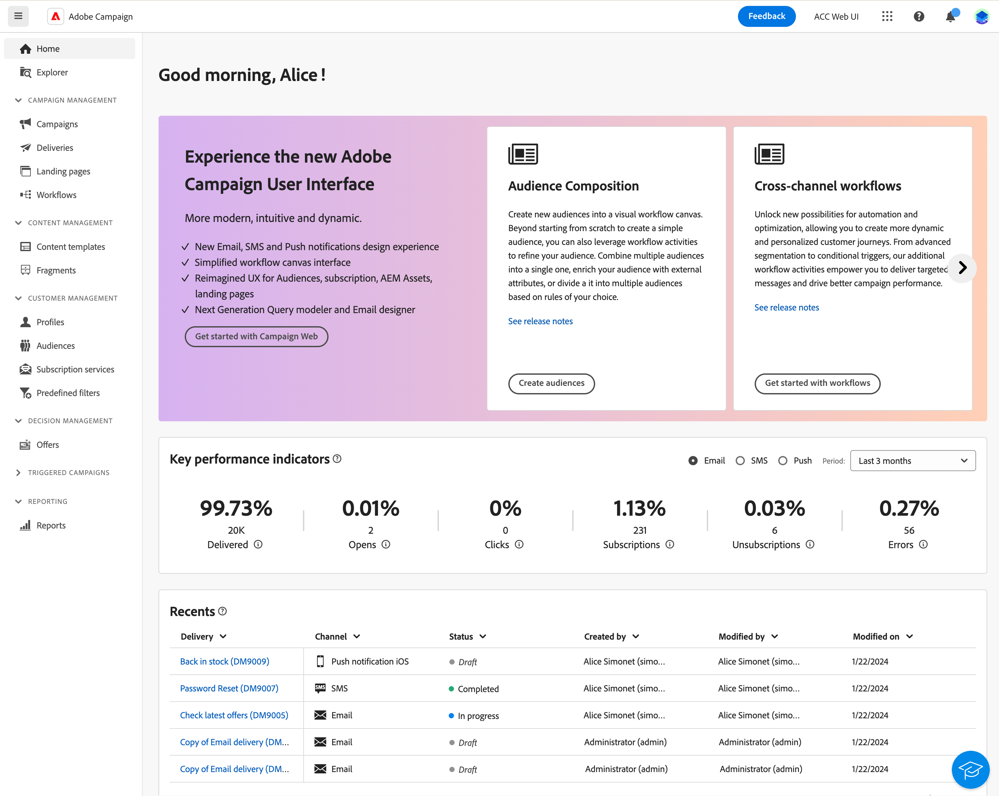
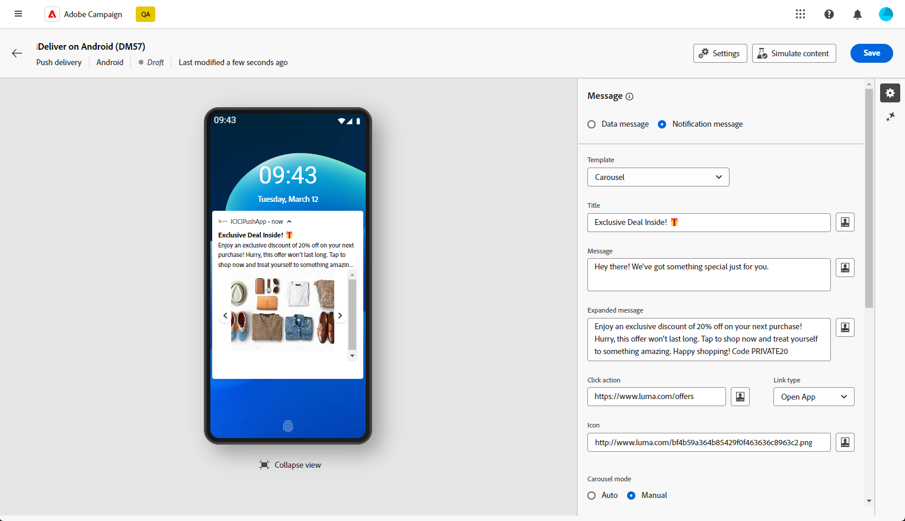
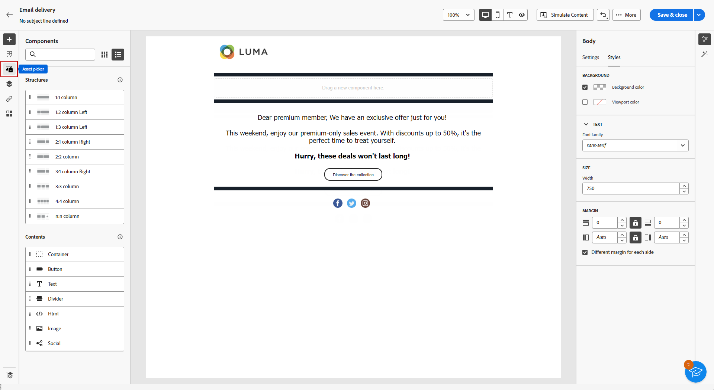
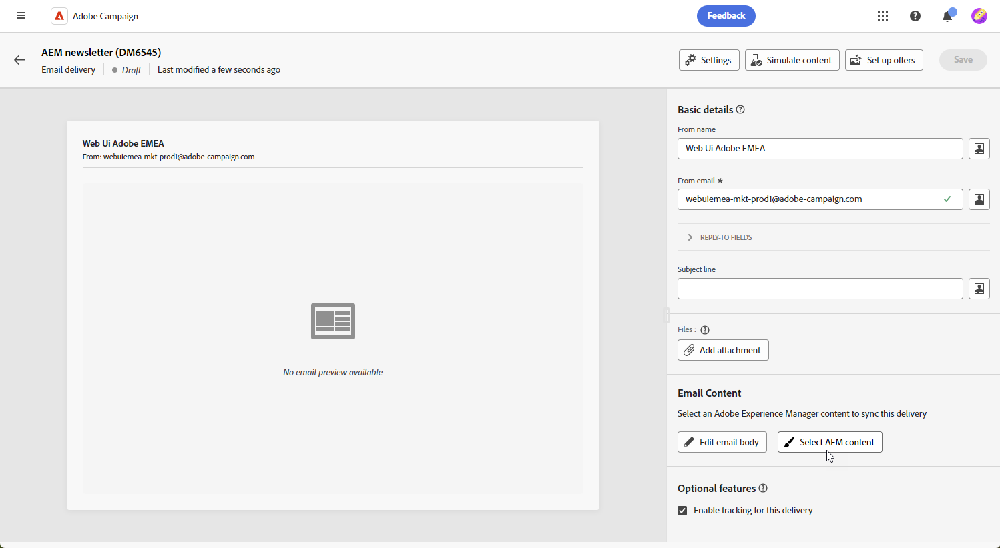
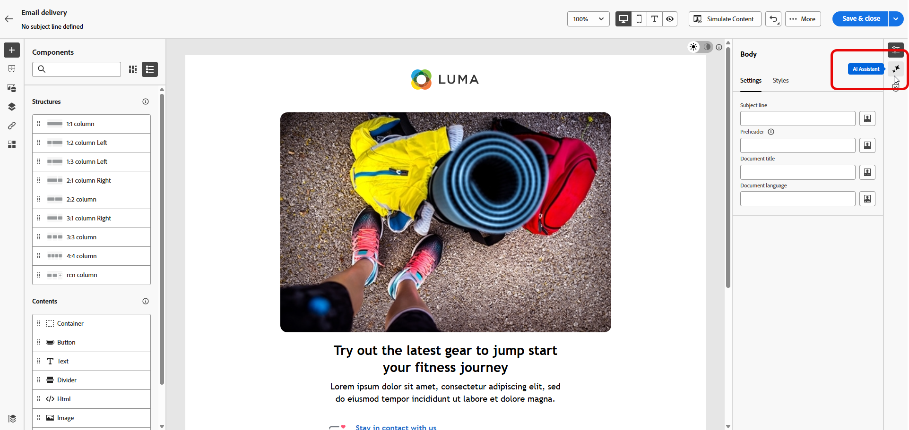
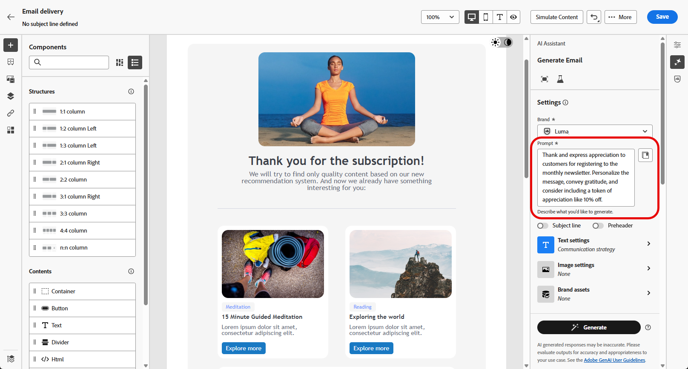

# Do Campaign Standard ao v8 {#ac-acs}

Bem-vindo ao Adobe Campaign v8.

Como um usuário que está fazendo a transição do Campaign Standard para o Campaign v8, este guia de referência foi projetado para você. Ele ajuda você a se familiarizar com o novo ambiente do Campaign e orientar sobre as etapas necessárias para começar a usar sua função.

1. Comece aprendendo [as novidades do Adobe Campaign v8](#new).

1. Em seguida, compreenda [as diferenças de experiência entre o Adobe Campaign Standard e o Adobe Campaign v8 de acordo com sua função](#experiences).

## Novidades {#new}

Dê uma olhada nos últimos aprimoramentos na interface da Web do Adobe Campaign nesta página. Para obter uma lista abrangente dos principais recursos e atualizações de versão, confira [esta seção](../../v8/rn/whats-new.md).

### Aprimoramentos no Campaign v8 {#ac-enhancements}

Os principais aprimoramentos fornecidos com o Adobe Campaign v8 estão listados abaixo.

* **Interface do Usuário da Web**

  O Adobe Campaign v8 oferece um console do cliente e uma interface da Web, atendendo a diferentes preferências e necessidades do usuário. O console do cliente oferece uma experiência poderosa em aplicativos de desktop, enquanto a interface do usuário da Web é projetada para ser intuitiva e acessível, tornando-a uma escolha ideal para profissionais de marketing familiarizados com o Adobe Campaign Standard.

  A interface do usuário da Web compartilha muitas semelhanças com o Adobe Campaign Standard, embora algumas terminologias possam diferir.

  Você pode [saber mais sobre a Interface do Usuário da Web da Adobe Campaign aqui](../../v8/campaign-web-home.md).

  {zoomable="yes"}

  Todos os novos recursos e aprimoramentos estão listados nas [Notas de versão](../../v8/rn/release-notes.md). As versões da interface do usuário do Adobe Campaign Web operam em um modelo de entrega contínua que permite uma abordagem à implantação de recursos mais dimensionável e em fases. Devido a isso, essas notas de versão são atualizadas várias vezes por mês. Verifique-as regularmente.

* **Desempenho**

  O Adobe Campaign v8 aproveita tecnologias avançadas de banco de dados em escala de nuvem, resultando em melhorias significativas no desempenho e na eficiência. Essa arquitetura reprojetada oferece vários benefícios importantes:

   * *Escala*: o sistema agora oferece suporte a um aumento substancial nos recursos de processamento, com a taxa de transferência do processamento em lote atingindo até **20 milhões de operações por hora**. Com essa nova arquitetura, perfis ainda maiores podem ser gerenciados com desempenho previsível.
   * *Velocidade*: o sistema foi aprimorado para qualquer atividade de marketing: segmentação, preparação de entrega ou taxa de transferência para mensagens transacionais que agora é de **1 milhões por hora**.

  Os serviços em nuvem totalmente gerenciados fornecem ao usuário:

   * Exploração de dados em tempo real: acesse e analise dados instantaneamente para obter insights rápidos e tomar decisões mais informadas.

   * Criação rápida de público-alvo: crie facilmente públicos-alvo direcionados em minutos para obter uma segmentação de campanha mais eficiente.

  Em geral, a arquitetura robusta do Adobe Campaign v8 fornece uma base poderosa para gerenciar campanhas de marketing extensas e complexas com velocidade e eficiência aprimoradas.

### Novos recursos no Adobe Campaign v8 {#ac-new-features}

Como usuário do Campaign Standard em transição para o Adobe Campaign v8, os seguintes recursos estão disponíveis:

* **Push avançado**

  O Adobe Campaign v8 oferece a capacidade de enviar notificações por push avançadas, que podem capturar a atenção dos usuários e incentivá-los a tomar medidas. Essas notificações podem incluir uma variedade de elementos, como texto, imagens, botões, temporizadores de contagem regressiva, sons etc.

  {zoomable="yes"}

  Para facilitar a criação dessas notificações avançadas, o Adobe Campaign v8 fornece vários modelos que permitem projetar e personalizar o conteúdo de notificações complexas, como carrosséis ou cronômetros.

  Você pode adaptar suas notificações com base no sistema do cliente:

   * Para modelos do [Android](../../v8/push/rich-push.md)

   * Para modelos de [iOs](../../v8/push/rich-push.md)

  As notificações por push são uma ferramenta essencial para envolver os usuários de aplicativos móveis, permitindo que você os acesse mesmo quando eles não estiverem usando ativamente seu aplicativo.

* **Adobe Experience Manager as a Cloud Service**

  O Adobe Campaign v8 é perfeitamente integrado ao Adobe Experience Manager as a Cloud Service, aprimorando sua capacidade de fornecer experiências personalizadas e ricas em conteúdo aos seus clientes. Essa integração nativa simplifica o gerenciamento de conteúdo e aproveita os recursos robustos da Adobe Experience Manager para otimizar seus esforços de marketing.

  Estes são os principais recursos ativados por essa integração:

   * *Gerenciamento de ativos*: no Adobe Campaign v8, o designer de email fornece um seletor para acessar e gerenciar ativos. Esse recurso simplifica a integração de elementos do Adobe Experience Manager na entrega, tornando o gerenciamento de conteúdo mais eficiente. [Saiba mais sobre o Gerenciamento de ativos](../../v8/integrations/aem-assets.md)

     {zoomable="yes"}

   * *Importação de modelo de email*: o Adobe Campaign v8 permite procurar e importar modelos de email do Adobe Experience Manager diretamente para o Campaign. [Saiba mais sobre a importação de modelo de email](../../v8/integrations/aem-content.md)

     {zoomable="yes"}

  O Adobe Experience Manager as a Cloud Service oferece agilidade nativa em nuvem, permitindo que você acelere seu tempo de implantação e se adapte às necessidades empresariais em evolução. Essa integração não apenas aprimora seus recursos de gerenciamento de conteúdo, como também permite proporcionar experiências mais personalizadas e envolventes aos seus clientes em todos os pontos de contato.

* **Assistente de IA**

  O Assistente de IA do Campaign torna a criação e a execução de campanhas de marketing em canais como Email, SMS e Push intuitivas, simples e sem complicações, economizando tempo, melhorando a eficiência e obtendo melhores resultados.

  {zoomable="yes"}

  O Assistente de IA revoluciona a maneira como você cria conteúdo profissional e consistente com a marca em todos os canais. Com modelos avançados de GenAI e profunda compreensão das diretrizes da sua marca, o Assistente de IA gera automaticamente conteúdo personalizado, envolvente e eficaz com base no objetivo de marketing, com conteúdo otimizado para estilos, layouts, tom e muito mais.

  O AI Assistant torna a criação e a execução de campanhas de marketing intuitivas, simples e sem complicações, economizando tempo, melhorando a eficiência e obtendo melhores resultados.

  {zoomable="yes"}

  Ele fornece uma variante de modelos de email e gera e gera novamente imagens. Saiba mais sobre o Assistente de IA em [esta seção](../../v8/content/generative-full-content.md). O Adobe Campaign v8 tem um assistente de IA disponível para [Email](../../v8/content/generative-full-content.md), [SMS](../../v8/content/generative-text.md) e [Push](../../v8/content/generative-full-content.md).

* **Infraestrutura de SMS atualizada - SMS v2.0**

  A simplicidade e a facilidade de uso do SMS fazem dele um canal de comunicação muito valioso, além de sua robustez e compatibilidade incomparável em bilhões de terminais.

  O Adobe Campaign v8 vem com uma nova infraestrutura que melhora o envio de SMS. [Saiba mais sobre as novas configurações de SMS](https://experienceleague.adobe.com/pt-br/docs/campaign/campaign-v8/send/sms/sms){target="_blank"}.

* **Infraestrutura de push atualizada**

  O Adobe Campaign v8 está introduzindo nosso mais recente serviço de notificação por push, alimentado por uma estrutura robusta criada em uma tecnologia moderna de ponta. Este serviço foi projetado para desbloquear novos níveis de escalabilidade, garantindo que suas notificações possam alcançar um público maior com eficiência contínua. Com nossa infraestrutura aprimorada e nossos processos otimizados, você pode esperar maior escala e confiabilidade, permitindo que você interaja e se conecte com seus usuários de aplicativos móveis como nunca.

  [Saiba mais sobre a infraestrutura de push atualizada](https://experienceleague.adobe.com/pt-br/docs/campaign/campaign-v8/send/push/push-data-collection){target="_blank"}.

## Managed Services {#ac-managed-services}

O Adobe Campaign v8 está disponível como um Managed Cloud Services, fornecendo supervisão proativa, alertas oportunos e governança de serviços. O Adobe Managed Cloud Service oferece aos profissionais de marketing uma solução mais ágil, segura e escalável para o gerenciamento de campanha em vários canais, com baixo custo total de propriedade. A nova oferta combina os serviços com uma supervisão proativa e alertas oportunos.

## Recursos do Campaign Standard adicionados na v8 {#ac-v8-added}

Com o objetivo de uma transição descomplicada para o Campaign v8, os recursos principais do Campaign Standard foram adicionados ao Campaign v8. Eles estão detalhados em [esta documentação](../../v8/rn/acs-migration.md).

* **Relatórios dinâmicos**: os relatórios dinâmicos fornecem relatórios totalmente personalizáveis e em tempo real para medir o impacto de suas atividades de marketing. Eles adicionam acesso aos dados do perfil, permitindo análises demográficas por dimensões do perfil, como gênero, cidade e idade, além de dados funcionais de campanhas de email, como aberturas e cliques. [Saiba mais](../../v8/reporting/dynamic-reporting/get-started-reporting.md)

* **Marca centralizada**: cada empresa tem diretrizes técnicas e visuais da marca. Com o Adobe Campaign, é possível definir um conjunto de especificações para apresentar uma marca consistente aos seus clientes, de logotipos a aspectos técnicos, como remetente de email, URL ou domínios. [Saiba mais](../../v8/administration/branding/branding-gs.md)

* **APIs REST**: como usuário de migração do Campaign Stardard, você pode usar APIs REST para criar integrações para o Adobe Campaign e construir seu próprio ecossistema conectando o Adobe Campaign com o painel de tecnologias que você usa. [Saiba mais](https://experienceleague.adobe.com/docs/campaign/campaign-v8/developer/apis/get-started-apis.html?lang=pt-BR){target="_blank"}

* **Páginas de destino**: algumas melhorias foram inseridas nas páginas de destino do Campaign v8 para garantir a paridade de recursos com o Campaign Standard. Saiba mais nas[&#x200B; notas de versão](../../v8/rn/release-notes.md#new-24-4) e na [documentação](../../v8/landing-pages/get-started-lp.md) da página de destino.

* **Fragmentos visuais** - Os fragmentos visuais são componentes visuais reutilizáveis que podem ser referenciados em uma ou mais entregas de email ou em modelos de conteúdo. Ao modificar um fragmento, todos os conteúdos que o usam serão atualizados. Essa funcionalidade permite pré-construir vários blocos de conteúdo personalizados que podem ser usados por usuários de marketing para montar rapidamente o conteúdo de mensagens em um processo de design aprimorado. [Saiba mais](../../v8//content/use-visual-fragments.md)

## Principais diferenças entre o Campaign Standard e o Campaign v8 {#experiences}

A maioria dos conceitos é semelhante entre o Adobe Campaign v8 e o Adobe Campaign Standard. No entanto, há algumas diferenças, conforme descrito abaixo.

Abaixo estão algumas diferenças de terminologia entre o Campaign Standard e o Campaign v8.

* Os recursos personalizados são **Esquemas**
* As mensagens são chamadas de **Entregas**
* Usuários do produto são **Operadores**
* As funções são configuradas com **Direitos nomeados**
* Os grupos de segurança são **Grupos de operadores**.
* As entidades organizacionais são gerenciadas por meio de **Permissões de pasta**

Além disso, como usuário existente do Campaign, observe que alguns conceitos foram renomeados para alinhar-se aos padrões de terminologia mais recentes. Essas alterações se aplicam somente à interface do Campaign Web e não são refletidas no console do cliente. Elas estão detalhadas abaixo.

* Os destinatários agora são chamados de **Perfis**. [Saiba mais](../../v8/audience/gs-audiences-recipients.md).
* Os seed addresses agora são chamados de **Perfis de teste**. [Saiba mais](../../v8/preview-test/test-deliveries.md).
* A análise da entrega agora é a **preparação da entrega**. Quando precisar iniciar a preparação da mensagem, clique no botão **Preparar**. [Saiba mais](../../v8/monitor/prepare-send.md).
* A Visualização de email agora está disponível através do botão **Simular conteúdo**. [Saiba mais](../../v8/preview-test/preview-test.md)
* As listas agora são **Públicos-alvo**. [Saiba mais](../../v8/audience/gs-audiences-recipients.md).

## Nova experiência do usuário

Acesse o guia de referência relevante para sua função e descubra a nova experiência de usuário com o Adobe Campaign v8.

<table>
<tr>
  <td>
    
    

  </td>
  <td>
  
    

  </td>
  </tr>
  <tr>
    <td>
    <a href="marketers.md">
    <strong>Profissional de marketing</strong>
    </a>
    </td>
    <td>
      <a href="admin-developers.md">
      <strong>Administrador ou Desenvolvedor</strong>
      </a>
    </td>
  </tr>
    <td>
    <em>Gerente de campanha, especialista em marketing de mídia</em>
    </td>
    <td>
      <em> Administrador do sistema, Especialista técnico em marketing</em>
    </td>
  <tr>
    <td>
    <b>As principais tarefas/responsabilidades incluem:</b>
    </td>
      <td>
    <b>As principais tarefas/responsabilidades incluem:</b>
    </td>
  </tr>
  <tr>
    <td>
      <li>Criar campanhas de marketing
      <li>Criação de fluxos de trabalho
      <li>Testar e executar campanhas
      <li>Implantar campanhas multicanal
      <li>Otimizar campanhas
      <li>Otimizar campanhas automatizadas
    </td>
    <td>
        <li>Gerenciamento de acesso
        <li>Configuração do sistema
        <li>Personalização do sistema
    </td>
</tr>
</table>

<!--
## Deprecated items

Adobe constantly evaluates product capabilities to identify older features that should be replaced with more modern alternatives to improve overall customer value, always under careful consideration of backward compatibility.

Please refer to [this documentation for information on deprecated items](https://experienceleague.adobe.com/pt-br/docs/campaign-standard/using/release-notes/deprecated-features).
-->
