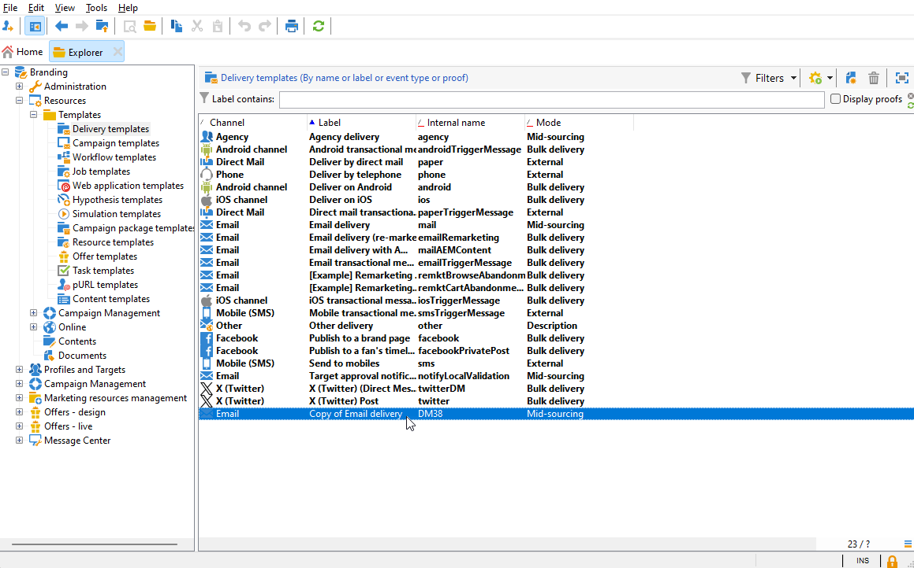
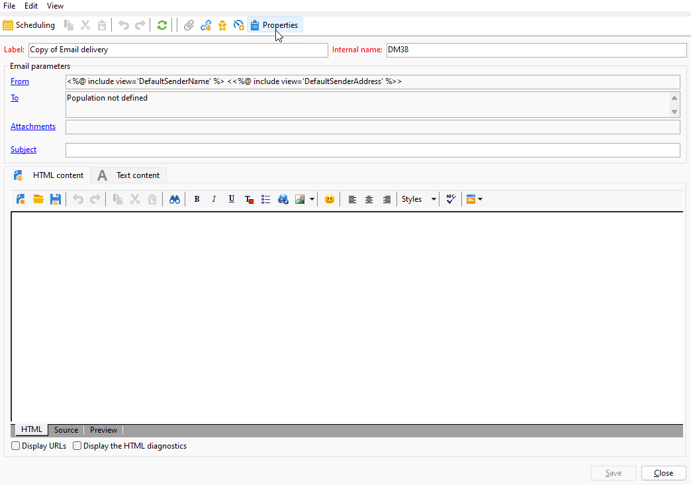
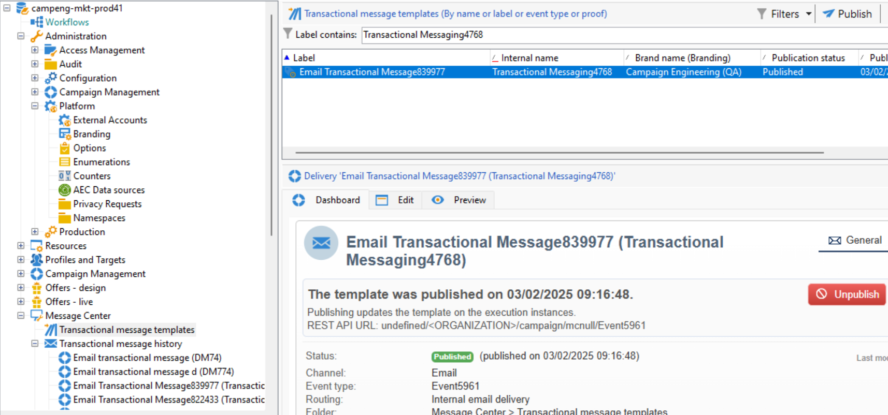

# Atribuir sua marca {#branding-assign}

## Vincular uma marca a um modelo {#linking-a-brand-to-a-template}

Para usar os parâmetros definidos para uma marca, ela deve estar vinculada a um template do delivery. Para fazer isso, é necessário criar ou editar um modelo.

Seu modelo será vinculado à marca. No editor de email, elementos como **Endereço de email do remetente padrão**, **Nome do remetente padrão** ou **logotipo** usarão os dados da marca configurada.

>[!BEGINTABS]

>[!TAB Adobe Campaign Web]

Para criar um template do delivery, você pode duplicar um template incorporado, converter um delivery existente em um template ou criar um template do delivery do zero. [Saiba mais](../../msg/delivery-template.md)

Depois que o modelo for criado, você pode vinculá-lo a uma marca. Para fazer isso:

1. Navegue até a guia **[!UICONTROL Modelos]**, no menu esquerdo **[!UICONTROL Entregas]**, e selecione um modelo de entrega.

   

1. Clique em **[!UICONTROL Configurações]**.

   

1. Na guia **[!UICONTROL Delivery]**, acesse o campo **[!UICONTROL Branding]** e selecione a marca que deseja vincular ao modelo.

   

1. Confirme a seleção e salve o modelo.

Agora você pode usar esse template para enviar seus deliveries.

>[!TAB Adobe Campaign V8]

Para criar um template do delivery, você pode duplicar um template incorporado, converter um delivery existente em um template ou criar um template do delivery do zero. [Saiba mais](https://experienceleague.adobe.com/docs/campaign/campaign-v8/send/create-templates.html?lang=pt-BR)

Depois que o modelo for criado, você pode vinculá-lo a uma marca. Para fazer isso:

1. Navegue até **[!UICONTROL Recursos]** `>` **[!UICONTROL Modelos]** `>` **[!UICONTROL Modelos de entrega]** no Adobe Campaign Explorer.

1. Selecione um template de delivery ou duplique um existente.

   

1. Acesse as **[!UICONTROL Propriedades]** do modelo de entrega selecionado.

   

1. Na guia **[!UICONTROL Geral]**, selecione sua marca no menu suspenso **[!UICONTROL Marca]**.

   

1. Após a configuração, selecione **OK**.

Agora você pode usar esse template para enviar seus deliveries.

>[!ENDTABS]

## Atribuir uma marca ao seu delivery {#assigning-a-brand-to-an-email}

>[!BEGINTABS]

>[!TAB Adobe Campaign Web]

Para criar um novo delivery independente, siga as etapas abaixo.

1. Navegue até o menu **[!UICONTROL Entregas]** no painel esquerdo e clique no botão **[!UICONTROL Criar entrega]**.

   

1. Selecione Email or Push notification como canal e escolha um template de delivery na lista.

1. Clique no botão **[!UICONTROL Criar entrega]** para confirmar.

1. Na página **[!UICONTROL Propriedades]**, clique em **[!UICONTROL Configurações]**.

   

1. Na guia **[!UICONTROL Delivery]**, acesse o campo **[!UICONTROL Branding]**.

   

1. Selecione a marca que deseja vincular ao modelo.

   

1. Personalize ainda mais seus deliveries. Para obter mais informações sobre como criar um email, consulte a seção [Criar seu primeiro email](../../email/create-email.md).

>[!TAB Adobe Campaign V8]

Para criar um novo delivery independente, siga as etapas abaixo.

1. Para criar uma nova entrega, navegue até a guia **[!UICONTROL Campanhas]**.

1. Clique em **[!UICONTROL Entregas]** e clique no botão **[!UICONTROL Criar]** acima da lista de entregas existentes.

   

1. Selecione um template de delivery.

1. Acesse as **[!UICONTROL Propriedades]** do modelo de entrega selecionado.

   

1. Na guia **[!UICONTROL Geral]**, selecione sua marca no menu suspenso **[!UICONTROL Marca]**.

   

1. Após a configuração, selecione **OK**.

1. Personalize ainda mais seus deliveries. Para obter mais informações sobre como criar um email, consulte a seção [Design e enviar emails](../../email/create-email.md).

>[!ENDTABS]

## Verificar identidade visual associada a mensagens transacionais {#check-branding-transactional}

>[!IMPORTANT]
>
>Esta seção se aplica somente a mensagens transacionais (Centro de Mensagens).
>
>Embora os recursos transacionais estejam disponíveis na interface da Web do Campaign, as etapas de verificação abaixo devem ser executadas no console do cliente do Campaign v8 (instância de controle).

Os deliveries transacionais sincronizados das instâncias de execução em tempo real (RT) para a instância de controle não replicam propriedades como roteamento ou marca. Esses deliveries sincronizados são gerados semanalmente a partir do mesmo modelo para trazer de volta os indicadores de delivery na instância de controle.

Por causa disso, a instância de controle exibe a marca padrão. As configurações de marca e roteamento reais usadas durante a execução da mensagem são definidas no template de mensagem transacional na instância de controle.

Para verificar qual marca foi usada para uma mensagem transacional:

1. Identifique o nome interno do modelo transacional publicado em Tempo Real (por exemplo, `TransactionalMessaging4768`).

   

1. Na instância de controle, pesquise por esse nome interno em **Modelos de mensagem transacional**.

   

1. Abra o modelo para exibir a marca e outras propriedades relacionadas.
