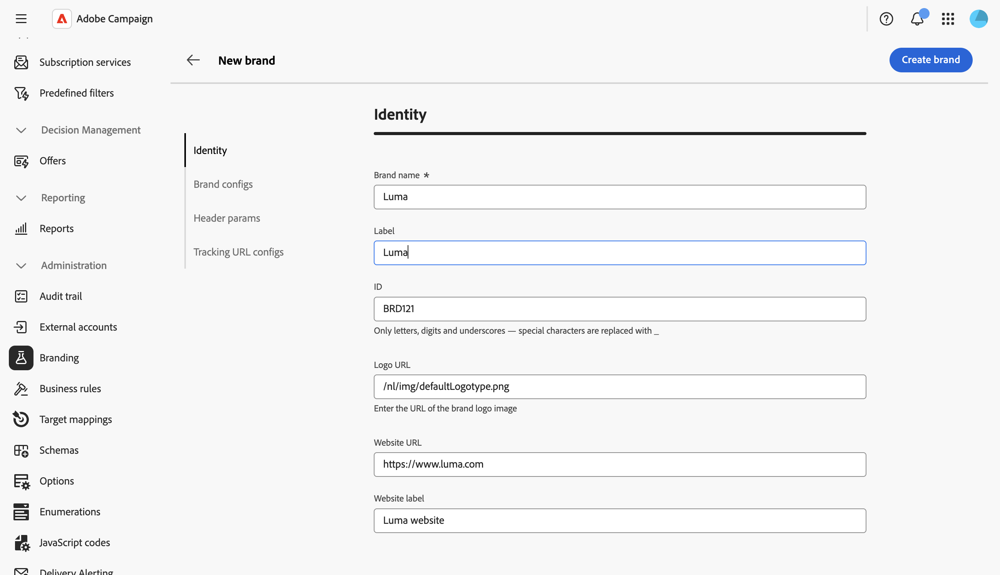

# Configurar marcas {#branding-configure}

Os administradores técnicos podem criar e gerenciar várias marcas diretamente na interface do usuário da Web. Isso permite definir todos os elementos que compõem a identidade da sua marca, incluindo logotipos e até mesmo configurações de rastreamento de email.

>[!NOTE]
>
>Esse recurso exige o pacote de marcas na sua instância. Entre em contato com seu representante da Adobe se você não visualizar o menu **Identidade visual**.

## Criar ou editar uma marca {#create-edit-brand}

>[!CONTEXTUALHELP]
>id="acw_branding_create"
>title="Criar uma marca"
>abstract="Clique em **Criar marca** para definir uma nova identidade de marca. Preencha os detalhes da marca nas guias de configuração e clique em **Criar marca** para salvar. A marca fica disponível para ser vinculada a templates de delivery e deliveries independentes."

Para criar uma nova marca, siga estas etapas:

1. Navegue até **[!UICONTROL Administração > Identidade Visual]** no menu esquerdo ou até **[!UICONTROL Administração > Plataforma > Identidade Visual]** no **[!UICONTROL Explorer]**.

1. Clique no botão **[!UICONTROL Criar marca]** acima da lista.

   

1. Preencha os detalhes da marca nas diferentes seções. Cada campo é descrito na seção [Atributos da marca](#brand-attributes) abaixo.

   

1. Clique em **[!UICONTROL Criar marca]** para salvar. A marca agora está disponível para ser vinculada a templates de delivery e deliveries independentes. [Saiba como atribuir uma marca](branding-assign.md).

Para editar uma marca existente, selecione-a na lista, atualize os campos e salve as alterações.

## Atributos da marca {#brand-attributes}

Uma **[!UICONTROL Marca]** está configurada em quatro seções: **[!UICONTROL Identidade]**, **[!UICONTROL Configurações de marca]**, **[!UICONTROL Parâmetros de cabeçalho de email]** e **[!UICONTROL Parâmetros de rastreamento de URL]**.

### Identidade {#identity}

A seção **[!UICONTROL Identidade]** permite definir e personalizar sua marca.

Esta seção contém os seguintes campos:

* **[!UICONTROL Marca]**: o nome da sua marca. Este campo é obrigatório.
* **[!UICONTROL Rótulo]**: o rótulo visível na interface.
* **[!UICONTROL ID]**: o identificador interno gerado automaticamente. Você pode alterá-lo. Somente letras, dígitos e sublinhados são permitidos. Caracteres especiais são substituídos por sublinhados.
* **[!UICONTROL URL do logotipo]**: a URL da imagem do logotipo da marca.
* **[!UICONTROL URL do site]** e **[!UICONTROL Rótulo do site]**: a URL do site e o rótulo associados à marca.

### Configurações da marca {#brand-configs}

Na seção **[!UICONTROL Configurações de marca]**, você define os protocolos de subdomínio e URL usados para rastreamento e acesso à página de aterrissagem.

Esta seção contém os seguintes campos:

* **[!UICONTROL Subdomínio da marca]**: a URL do subdomínio específico dessa marca, solicitado para delegação da Adobe.
* **[!UICONTROL Protocolo de URL de Rastreamento]**, **[!UICONTROL Protocolo de URL de mirror page]** e **[!UICONTROL Protocolo de URL de aplicativo]**: o protocolo usado para cada tipo de URL (por exemplo, **Seguro (https)**).

>[!NOTE]
>
>A configuração de rastreamento, espelhamento e servidores de aplicativos é armazenada em contas externas separadas associadas ao roteamento. Essas configurações são aplicadas durante o provisionamento e não devem ser modificadas. Para exibir URLs, acesse a guia **[!UICONTROL Prefixos de marca]** da sua conta externa.

### Parâmetros de cabeçalho de email {#header-param}

Os **[!UICONTROL Parâmetros de cabeçalho de email]** permitem que você personalize o que os destinatários verão na seção de cabeçalho de suas campanhas.

Esta seção contém os seguintes campos:

* **[!UICONTROL Remetente (endereço de email)]**: o endereço de email da marca.
* **[!UICONTROL Remetente (nome)]**: o nome da marca.
* **[!UICONTROL Responder para (endereço de email)]**: o endereço de email ao qual o cliente pode responder.
* **[!UICONTROL Responder para (nome)]**: o nome de exibição das respostas.
* **[!UICONTROL Erro (endereço de email)]**: o endereço de email a ser usado em caso de erro.

<!--
>[!IMPORTANT]
>
>After having updated the header parameters of the emails, if the name and email address of the sender have not changed in the email created from the template, check the template's advanced settings.
-->

### Parâmetros de rastreamento de URL {#tracking-param}

Na seção **[!UICONTROL Parâmetros de rastreamento de URL]**, é possível aprimorar o rastreamento de URL definindo parâmetros adicionais para integração com ferramentas de análise da Web, como Adobe Analytics e Google Analytics.

Esta seção contém os seguintes campos:

* **[!UICONTROL Parâmetros de URL adicionais]**: adicione parâmetros como pares de valores chave junto com suas condições de aplicabilidade. Cada nome de parâmetro deve ser exclusivo e não vazio, e cada valor de parâmetro deve ser não vazio. A condição de aplicabilidade pode estar vazia, mas nenhum desses valores pode incluir tags JST.

* **[!UICONTROL Lista de permissões de nomes de domínio]**: adicione nomes de domínio ou expressões regulares para corresponder a URLs nas quais os parâmetros de rastreamento serão anexados.

**Exemplo:** Uma URL rastreada como `https://www.luma.com` se tornará `https://www.luma.com/?age=21&deliveryName=DM101` quando os parâmetros adicionais `age=21` e `deliveryName=DM101` estiverem configurados para esse domínio.

## Configurar identidade visual para mensagens transacionais {#branding-transactional-config}

>[!IMPORTANT]
>
>Esta seção se aplica somente a mensagens transacionais (Centro de Mensagens).
>
>Embora os recursos transacionais estejam disponíveis na interface do usuário da Web do Campaign, as etapas abaixo devem ser executadas no console do cliente do Campaign v8 (instância de controle).

Se você estiver usando mensagens transacionais (Centro de mensagens) com marca, será necessária uma configuração adicional.

### Fórmulas de rastreamento para instâncias em tempo real

Quando a identidade visual é ativada em uma instância de controle em tempo real (RT), opções específicas de rastreamento são usadas para gerenciar fórmulas de rastreamento. Essas fórmulas são configuradas centralmente na instância de Controle RT, em vez de individualmente em cada instância de Execução RT.

As opções a seguir definem as fórmulas de rastreamento usadas pelos deliveries de RT:

* **`NmsTracking_RT_ClickFormula`**: especifica a fórmula usada para rastreamento de cliques em instâncias RT

* **`NmsTracking_RT_OpenFormula`**: especifica a fórmula usada para rastreamento aberto em instâncias RT

Se sua implementação exigir fórmulas de rastreamento personalizadas para mensagens transacionais, use a opção abaixo:

* **`Branding_RT_ListXtkOptions_toPublish`**: liste aqui os nomes de opção XTK para suas fórmulas personalizadas (separadas por vírgulas). Isso garante que os deliveries de RT possam aplicar as fórmulas de rastreamento personalizadas.
