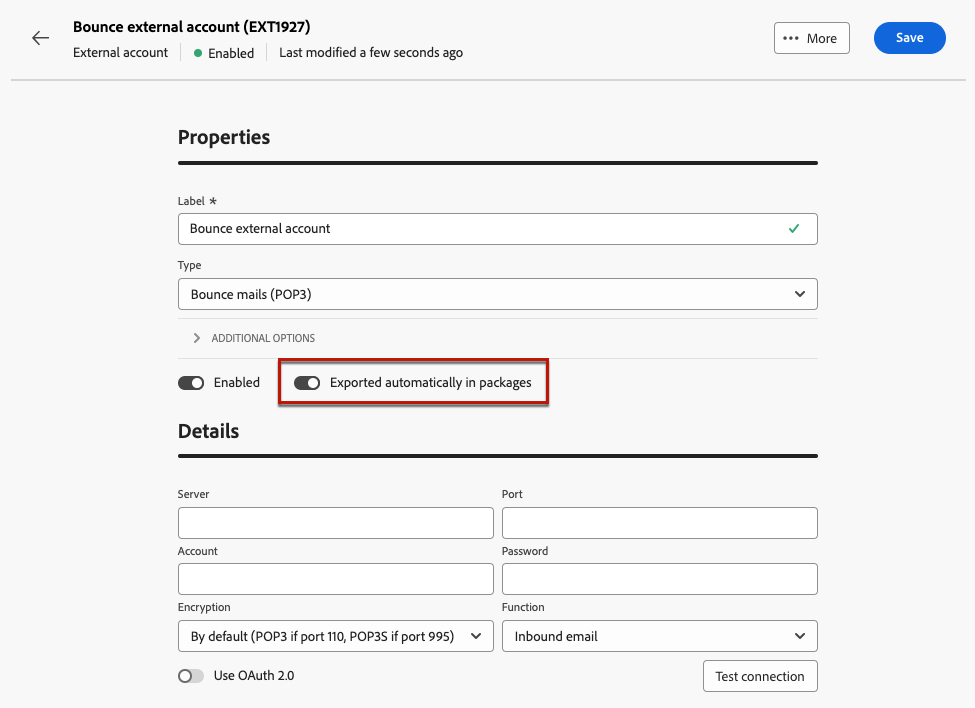

# Criar uma conta externa {#create-external-account}

Para criar uma nova conta externa, siga as etapas descritas abaixo. As configurações específicas dependem do tipo de conta externa que você está criando.

1. No menu do painel esquerdo, selecione **[!UICONTROL Contas externas]** em **[!UICONTROL Administração]**.

1. Clique em **[!UICONTROL Criar conta externa]**.

   

1. Insira seu **[!UICONTROL Rótulo]** e selecione o **[!UICONTROL Tipo]** da conta externa.

   * [Tipos específicos de campanha](external-account.md)
   * [Integração da solução da Adobe](integration-external-account.md)
   * [Transferir dados](transfer-external-account.md)
   * [Banco de dados externo](external-account-database.md)

   

1. Clique em **[!UICONTROL Create]**.

1. No menu suspenso **[!UICONTROL Opções adicionais]**, altere o caminho **[!UICONTROL Nome interno]** ou **[!UICONTROL Pasta]**, se necessário.

   

1. Habilite a opção **[!UICONTROL Exportado automaticamente em pacotes]** para exportar automaticamente dados gerenciados por esta conta externa. <!--Exported where??-->

   

1. Na seção **[!UICONTROL Detalhes]**, configure o acesso à conta especificando credenciais com base no tipo de conta externa escolhido. [Saiba mais](#bounce)

1. Clique em **[!UICONTROL Testar conexão]** para verificar se sua configuração está correta.

1. No menu **[!UICONTROL Mais...]**, duplique ou exclua sua conta externa.

   

1. Quando a configuração for concluída, clique em **[!UICONTROL Salvar]**.
