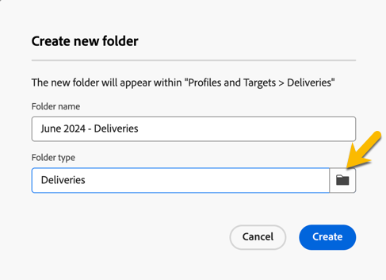

# Criar e gerenciar uma pasta

No Adobe Campaign, é possível criar novas pastas para gerenciar a árvore de navegação. No **[!UICONTROL Explorer]**, vá para a pasta em que deseja criar sua nova pasta.

No botão **[!UICONTROL ...]**, você tem **[!UICONTROL Criar nova pasta]**

{zoomable="yes"}

Ao criar uma nova pasta, por padrão, o tipo de pasta é o tipo da pasta principal.
No nosso exemplo, criamos uma pasta na pasta **[!UICONTROL Deliveries]**.

{zoomable="yes"}

Você pode alterar o tipo da pasta clicando no ícone de Tipo de pasta e escolhê-lo na lista apresentada:

{zoomable="yes"}

Você configurará o tipo de pasta clicando no botão **[!UICONTROL Confirmar]**.

Para criar uma pasta sem um tipo específico, escolha **[!UICONTROL Pasta genérica]** tipo.

No console do Adobe Campaign, você tem o processo de criação e gerenciamento de uma pasta explicado [aqui](https://experienceleague.adobe.com/en/docs/campaign/campaign-v8/config/configuration/folders-and-views) e a possibilidade de configurar permissões em pastas. [Saiba mais](https://experienceleague.adobe.com/en/docs/campaign/campaign-v8/admin/permissions/folder-permissions)
