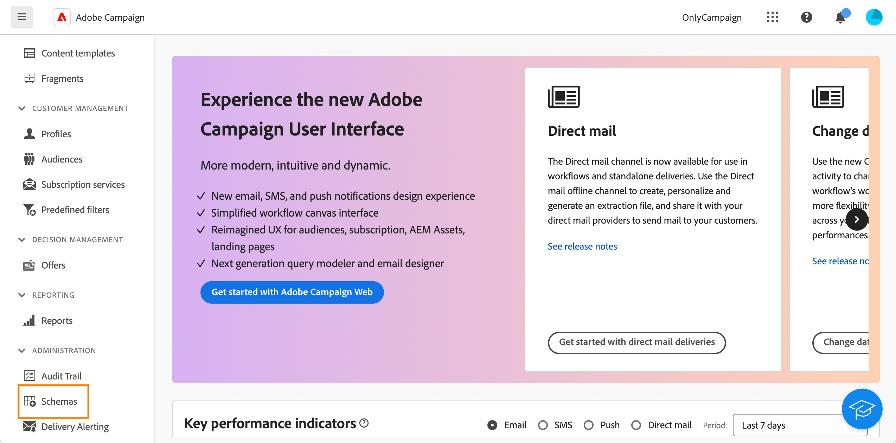
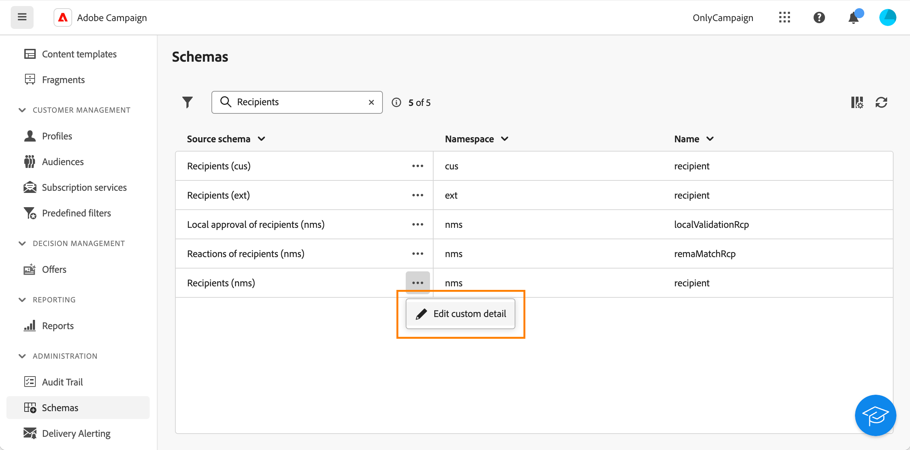
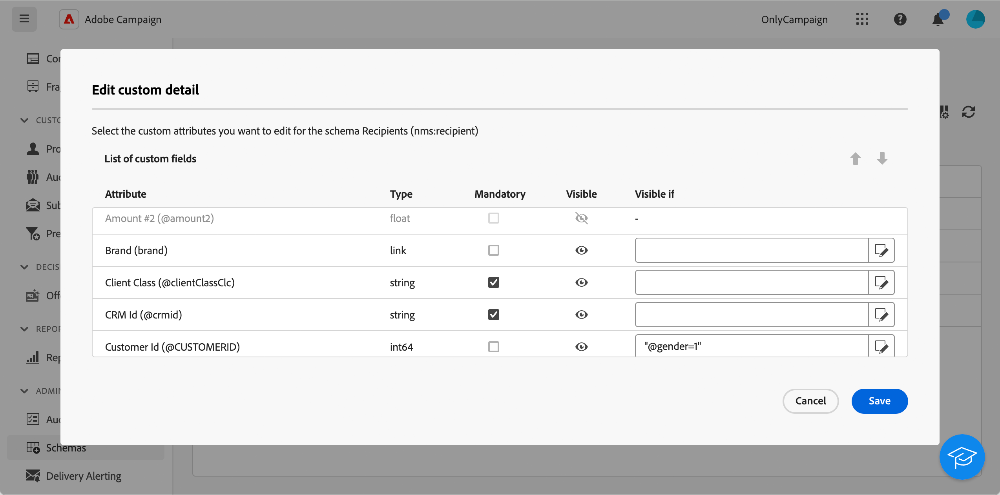

# Configurar campos personalizados {#custom-fields}

Os campos personalizados são atributos adicionais adicionados aos esquemas prontos para uso por meio do console do Adobe Campaign. Saiba mais na [Documentação do Adobe Campaign v8](https://experienceleague.adobe.com/docs/campaign/campaign-v8/developer/shemas-forms/extend-schema.html){target="_blank"}

Esses campos personalizados são exibidos em várias telas, por exemplo, os detalhes de um perfil ou um perfil de teste.

Na interface do usuário da Web, não é possível criar campos personalizados, mas você pode modificar a forma como eles são exibidos. As modificações se aplicam a todos os usuários do Campaign.

>[!NOTE]
>
>Você precisa ter direitos de administrador para modificar campos personalizados.

Campos personalizados estão disponíveis nos seguintes esquemas:

* Destinatários (nms)
* Campanhas (nms)
* Entregas (nms)
* Seed addresses (nms)

Para configurar campos personalizados, siga estas etapas:

1. Em **Administração**, clique em **Esquemas**.

   {zoomable=&quot;yes&quot;}

1. Localize o esquema desejado, por exemplo, o **Destinatários (nms)** esquema.

   {zoomable=&quot;yes&quot;}

1. Clique em **Mais ações** e selecione **Editar detalhes personalizados**.

   {zoomable=&quot;yes&quot;}

   A variável **Editar detalhes personalizados** exibe todos os campos personalizados e seus tipos.

   {zoomable=&quot;yes&quot;}

   Essa tela permite executar as seguintes ações:

   * altere a ordem dos diferentes campos usando as setas para cima e para baixo.
   * torne o campo obrigatório: marque a **Obrigatório** caixa.
   * tornar o campo visível ou ocultá-lo: clique no botão **Visível** botão.
   * adicione uma condição de visibilidade: clique no link **Visível se** e escreva a expressão xtk usando as funções xtk disponíveis.

1. Navegue até a tela que exibe o campo personalizado. No nosso exemplo, é a tela de detalhes do perfil.

   {zoomable=&quot;yes&quot;}
