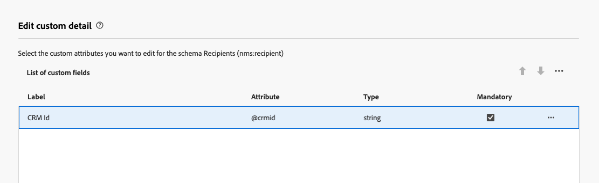

# Configurar campos personalizados {#custom-fields}

>[!CONTEXTUALHELP]
>id="acw_schema_editcustomfields"
>title="Editar detalhes personalizados"
>abstract="Todos os campos personalizados da interface do esquema selecionado são exibidos. É possível alterar a ordem de exibição na interface usando as setas para cima e para baixo e agrupar os campos em subseções adicionando separadores. Para excluir um campo personalizado ou editar configurações como condições de visibilidade, clique no botão de reticências."

>[!CONTEXTUALHELP]
>id="acw_schema_editcustomfields_settings_general"
>title="Geral"
>abstract="Defina as configurações gerais do campo personalizado. Se nenhum rótulo for fornecido, o rótulo definido no esquema será exibido. Use o campo **Visível se** para definir uma condição usando uma expressão xtk que controla quando o campo é exibido. Você também pode marcar o campo como obrigatório ou somente leitura na interface."

>[!CONTEXTUALHELP]
>id="acw_schema_editcustomfields_settings_link"
>title="Propriedades do link"
>abstract="Use o modelador de consultas para especificar regras para a exibição de um campo personalizado do tipo link. Por exemplo, restringir valores de lista com base em outra entrada de campo."

>[!CONTEXTUALHELP]
>id="acw_schema_editcustomfields_settings_layout"
>title="Layout"
>abstract="Por padrão, os campos personalizados são exibidos na interface em duas colunas. Ative essa opção para exibir o campo personalizado na largura total da tela, em vez de em duas colunas."

>[!CONTEXTUALHELP]
>id="acw_schema_editcustomfields_separatorproperties"
>title="Propriedades do separador"
>abstract="Especifique o nome que será exibido na interface da subseção."

<!-- NOT USED IN THE UI?-->
>[!CONTEXTUALHELP]
>id="acw_schema_editcustomfields_settings"
>title="Configurações de atributo"
>abstract="Configurações de atributo"

Os campos personalizados são atributos adicionais adicionados a esquemas prontos para uso por meio do console do Adobe Campaign. Eles permitem personalizar esquemas ao incluir novos atributos para atender às necessidades da sua organização. Saiba como estender um esquema na [documentação do Adobe Campaign v8](https://experienceleague.adobe.com/docs/campaign/campaign-v8/developer/shemas-forms/extend-schema.html){target="_blank"}.

Campos personalizados podem ser exibidos em várias telas, como detalhes do perfil na interface da Web do Campaign. Os administradores podem controlar quais campos ficam visíveis e como eles são exibidos. Essas alterações se aplicam a todos os usuários do Campaign.

>[!NOTE]
>
>Você precisa ter direitos de administrador para gerenciar campos personalizados.

Campos personalizados estão disponíveis para os seguintes esquemas:

* Campanhas (nms)
* Planos (nms)
* Programas (nms)
* Destinatários (nms)
* Seed addresses (nms)
* Entregas (nms)

## Adicionar campos personalizados à interface {#add}

Para exibir campos personalizados na interface, siga estas etapas:

1. Navegue até o menu **[!UICONTROL Esquemas]** no painel de navegação esquerdo e localize o esquema desejado.

   Use o filtro **[!UICONTROL Editável]** no painel de filtros para identificar rapidamente esquemas com campos personalizados.

   

1. Clique no ícone de lápis localizado ao lado do nome do esquema para acessar seus campos personalizados. Neste exemplo, queremos adicionar campos ao esquema **[!UICONTROL Recipients]**.

1. A lista de campos personalizados exibidos na interface do esquema é exibida. Aqui, o campo &quot;ID do CRM&quot; está visível na tela de detalhes dos perfis e foi marcado como obrigatório.

   | Configuração de campos personalizados | Renderização na interface |
   |  ---  |  ---  |
   | {zoomable="yes"} | {zoomable="yes"} |

1. Para adicionar um campo personalizado à interface, clique no botão **[!UICONTROL Adicionar]** no canto superior direito da tela e escolha uma das seguintes opções:

   * **[!UICONTROL Atributos personalizados]**: selecione um ou vários campos personalizados para exibir na interface.
   * **[!UICONTROL Preencha automaticamente a lista de campos personalizados]**: adicione à interface todos os campos personalizados definidos para o esquema.

   

1. Depois que os campos personalizados forem adicionados, você poderá:

   * **Reordenar campos**: use as setas para cima e para baixo.
   * **Tornar campos obrigatórios**: marque a caixa de seleção **Obrigatório**.
   * **Editar configurações de campos**: clique no botão de reticências e escolha **[!UICONTROL Editar]**. [Saiba mais](#settings)
   * **Excluir campos**: clique no botão de reticências e escolha **[!UICONTROL Excluir]**.
   * **Organize os campos em subseções na interface**: clique em **[!UICONTROL Adicionar]** e escolha **[!UICONTROL Separador]**. [Saiba mais](#separator)

## Definir configurações de campos personalizados {#settings}

Para definir configurações específicas para cada campo personalizado, clique no botão de reticências ao lado do campo desejado e selecione **[!UICONTROL Editar]**.

Configurações disponíveis:

* **[!UICONTROL Atributo]**: o nome do campo personalizado.
* **[!UICONTROL Rótulo (personalizado)]**: o rótulo a ser exibido na interface. Se nenhum rótulo for fornecido, o rótulo definido no esquema será exibido.
* **[!UICONTROL Visível se]**: defina uma condição usando uma expressão xtk que controle quando o campo é exibido. Por exemplo, oculte este campo se outro campo estiver vazio.
* **[!UICONTROL Obrigatório]**: tornar o campo obrigatório na interface.
* **[!UICONTROL Somente leitura]**: tornar o campo somente leitura na interface. Os usuários não poderão editar o valor do campo.
* **[!UICONTROL Configurações de filtro]** (para campos do tipo link): use o modelador de consulta para especificar regras para a exibição de um campo personalizado do tipo link. Por exemplo, restringir valores de lista com base em outra entrada de campo.

  Você também pode fazer referência ao valor inserido em outros campos em suas condições usando a sintaxe `$(<field-name>)`. Isso permite fazer referência ao valor atual de um campo, conforme inserido no formulário, mesmo que ele ainda não tenha sido salvo no banco de dados.

  No exemplo abaixo, a condição verifica se o valor do campo @ref corresponde ao valor inserido no campo @refCom. Por outro lado, usar `@refCom` em vez de `$(@refCom)` referenciaria o valor do campo @ref como ele existe no banco de dados.

  +++Exibir exemplo

  

+++

* **[!UICONTROL Abranger duas colunas]**: por padrão, os campos personalizados são exibidos na interface em duas colunas. Ative essa opção para exibir o campo personalizado na largura total da tela, em vez de em duas colunas.

## Organizar campos personalizados em subseções {#separator}

A interface do usuário da Web do Campaign permite adicionar separadores para agrupar campos personalizados na interface para facilitar a leitura. Para fazer isso, siga estes passos:

1. Clique no botão **[!UICONTROL Adicionar]** e selecione **[!UICONTROL Separador]**.

1. Uma nova linha representando o separador é adicionada à lista. Clique no botão de reticências e escolha **[!UICONTROL Editar]** para nomear a subseção.

1. Use as setas para cima e para baixo para mover o separador para o local desejado. Os campos listados abaixo do separador serão agrupados abaixo dele.

   Neste exemplo, os campos &quot;Coleções interessadas&quot; e &quot;Marca&quot; são agrupados em uma subseção &quot;Coleção&quot;.

   | Configuração de campos personalizados | Renderização na interface |
   |  ---  |  ---  |
   | {zoomable="yes"} | {zoomable="yes"} |
