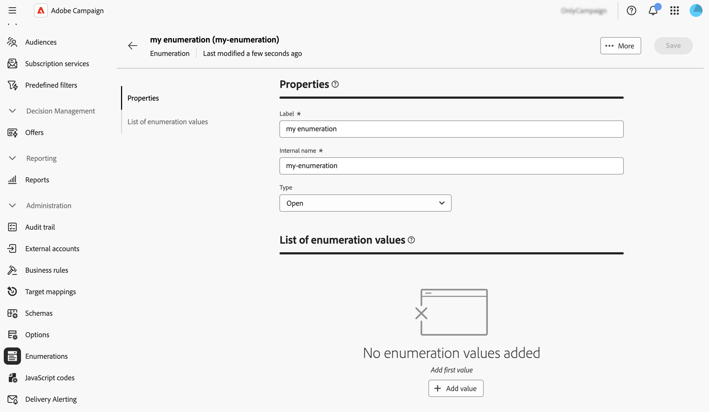

# Gerenciar enumerações {#enumerations}

>[!CONTEXTUALHELP]
>id="acw_enumerations_list"
>title="Enumerações"
>abstract="Uma enumeração é uma lista de valores sugeridos pelo sistema para preencher campos. Enumerações permitem padronizar os valores desses campos, ajudam na entrada de dados ou podem ser usadas em consultas."

>[!CONTEXTUALHELP]
>id="acw_enumerations_properties"
>title="Propriedades"
>abstract="Defina as propriedades da enumeração, como nome, nome interno e tipo. As enumerações **[!UICONTROL fechadas]** têm uma lista fixa de valores que só podem ser modificados no menu **[!UICONTROL Listas discriminadas]**. As enumerações **[!UICONTROL abertas]** permitem que os usuários adicionem novos valores diretamente nos campos com base nessa lista discriminada. As enumerações de **[!UICONTROL sistema]** estão associadas a campos do sistema. As enumerações de **[!UICONTROL emoticon]** são usadas para atualizar a lista de emoticons."

>[!CONTEXTUALHELP]
>id="acw_enumerations_values"
>title="Valores de enumeração"
>abstract="Para adicionar um valor à enumeração, clique no botão **[!UICONTROL Adicionar valor]** e configure-o conforme necessário."

## O que são listas discriminadas? {#about}

Uma enumeração é uma lista de valores sugeridos pelo sistema para preencher campos. Use enumerações para padronizar os valores desses campos, ajuda com a entrada de dados ou uso em queries. A lista de valores aparece como uma lista suspensa na qual você pode selecionar o valor a ser inserido no campo. A lista suspensa também permite entrada preditiva: insira as primeiras letras e o aplicativo preencherá o restante.

Os valores desse tipo de campo são definidos por meio do menu **[!UICONTROL Administração]** / **[!UICONTROL Enumerações]** no painel de navegação esquerdo.

## Criar uma lista discriminada {#create}

Para criar uma lista discriminada, siga estas etapas:

1. Navegue até o menu **[!UICONTROL Enumerations]** e clique no botão **[!UICONTROL Criar enumeração]**.

1. Insira um **[!UICONTROL Rótulo]** e um **[!UICONTROL Nome interno]** para a enumeração.

   

1. Selecione a enumeração **[!UICONTROL Type]**:

   * **[!UICONTROL Enumerações]** fechadas têm uma lista fixa de valores, que só podem ser modificados no menu **[!UICONTROL Enumerations]**.
   * As enumerações **[!UICONTROL Abertas]** permitem que os usuários adicionem novos valores diretamente nos campos com base nessa enumeração.
   * Enumerações **[!UICONTROL System]** estão associadas a campos do sistema.
   * As enumerações de **[!UICONTROL emoticon]** são usadas para atualizar a lista de emoticons.

1. Clique em **[!UICONTROL Criar]**. Os detalhes da lista discriminada são exibidos, permitindo adicionar valores à lista.

   

1. Para adicionar um valor, clique no botão **[!UICONTROL Adicionar valor]** e configure-o conforme necessário:

   * **[!UICONTROL Rótulo]**: o rótulo a ser exibido na enumeração.
   * **[!UICONTROL Nome interno]**: o nome interno do valor (para enumerações do sistema).
   * **[!UICONTROL U+ (nome interno)]** (enumerações de emoticons): o código unicode do emoticon (para enumerações de emoticons).

   

1. Salve as alterações. A enumeração é atualizada nas telas onde é usada.

## Caso de uso: adicionar valores predefinidos a uma enumeração {#uc}

Por padrão, o campo &quot;Origem&quot; na tela de detalhes do perfil permite que os usuários insiram qualquer valor livremente.

Cada vez que um usuário insere um valor para o campo, o valor é automaticamente adicionado à lista discriminada &quot;Origem&quot;. Isso pode levar a valores redundantes, inconsistentes ou errôneos ao longo do tempo na lista de valores.

Para garantir a consistência dos dados e orientar os usuários ao preencher o campo, defina um conjunto de valores predefinidos. Siga estas etapas:

1. Vá para o menu **[!UICONTROL Enumerations]** e abra a lista discriminada &quot;Origin&quot;.

2. Revise a lista de valores inseridos pelo usuário e limpe-a. Clique no botão de reticências ao lado de um valor para excluí-lo. Se a lista contiver muitas inconsistências, exclua toda a lista discriminada e recrie-a do zero.

   

3. Adicione valores predefinidos. Para fazer isso, clique no botão **[!UICONTROL Adicionar valor]** e insira os valores predefinidos que os usuários devem selecionar.

   

4. Para impor a consistência, alterne o tipo de enumeração para **[!UICONTROL Fechado]**, o que restringe os usuários aos valores predefinidos. Se for necessária flexibilidade, mantenha-a **[!UICONTROL Aberta]** para permitir novas entradas de usuário.

5. Retorne à tela de detalhes do perfil. O campo &quot;Origem&quot; agora exibe os valores predefinidos para seleção.

   