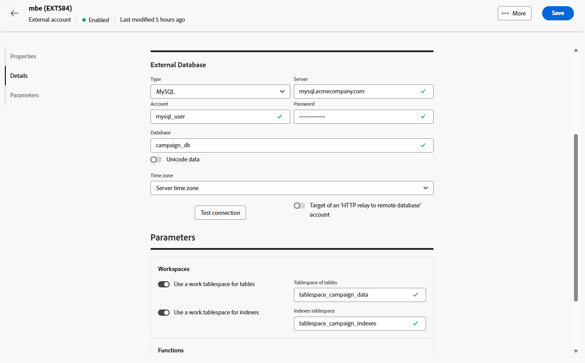

# Contas do banco de dados externo {#external-accounts}

Use uma conta externa do tipo External database para conectar o Adobe Campaign a um banco de dados de terceiros.

As configurações da conta externa variam de acordo com o mecanismo de banco de dados ao qual você está se conectando. As instruções detalhadas para cada banco de dados compatível podem ser encontradas nas seções abaixo.

## Amazon Redshift

A conta externa do Amazon Redshift permite conectar sua instância do Campaign ao banco de dados externo do Amazon Redshift.

Na Adobe Campaign Web User Interface, configure a conta externa do Amazon Redshift.

1. [Crie sua conta externa](external-account.md) e selecione **[!UICONTROL Banco de dados externo]** como o **[!UICONTROL Tipo]** da sua conta externa e Amazon Redshift como **[!UICONTROL Tipo de provedor]**.

1. Clique em **[!UICONTROL Create]**.

1. Para configurar a conta externa do **[!UICONTROL Amazon Redshift]**, preencha os seguintes campos:

   * **[!UICONTROL Tipo]**: Amazon Redshift

   * **[!UICONTROL Servidor]**: insira o nome DNS do seu servidor Redshift.

   * **[!UICONTROL Conta]**: forneça o nome de usuário Redshift que será usado para autenticação.

   * **[!UICONTROL Senha]**: digite a senha associada à conta de usuário.

   * **[!UICONTROL Banco de dados]**: especifique o nome do banco de dados se ele ainda não estiver definido no DSN. Deixe esse campo vazio se o DSN incluir o banco de dados.

   * **[!UICONTROL Esquema de trabalho]**: insira o nome do esquema onde o Adobe Campaign operará.

   * **[!UICONTROL Opções]**: adicione todas as opções de configuração avançadas que possam ser exigidas pelo seu ambiente.

   * **[!UICONTROL Fuso horário]**: selecione ou insira o fuso horário do servidor para garantir operações precisas baseadas em tempo.

   

1. Depois de configurar a conexão, crie as funções Adobe Campaign SQL em seu banco de dados Redshift remoto. Quando essas funções estiverem disponíveis, clique em **[!UICONTROL Implantar funções]** para ativá-las.

1. Vincule sua **[!UICONTROL conta de armazenamento]** para otimizar o desempenho e habilitar processos de carregamento de dados mais rápidos entre o Adobe Campaign e o Amazon Redshift.

1. Insira sua **[!UICONTROL função da conta]** que determina as permissões que a Adobe Campaign usará ao interagir com seu ambiente Redshift.

## Amazon Redshift (herdado)

A conta externa Amazon Redshift (herdada) permite conectar sua instância do Campaign ao banco de dados externo do Amazon Redshift.

Na Adobe Campaign Web User Interface, configure a conta externa do Amazon Redshift (herdado).

1. [Crie sua conta externa](external-account.md) e selecione **[!UICONTROL Banco de dados externo]** como o **[!UICONTROL Tipo]** da sua conta externa e Amazon Redshift (legado) como **[!UICONTROL Tipo de provedor]**.

1. Clique em **[!UICONTROL Create]**.

1. Para configurar a conta externa **[!UICONTROL Amazon Redshift (herdada)]**, preencha os seguintes campos:

   * **[!UICONTROL Tipo]**: Amazon Redshift (herdado)

   * **[!UICONTROL Servidor]**: insira o nome DNS do seu servidor Redshift.

   * **[!UICONTROL Conta]**: forneça o nome de usuário Redshift que será usado para autenticação.

   * **[!UICONTROL Senha]**: digite a senha associada à conta de usuário.

   * **[!UICONTROL Banco de dados]**: especifique o nome do banco de dados se ele ainda não estiver definido no DSN. Deixe esse campo vazio se o DSN incluir o banco de dados.

   * **[!UICONTROL Esquema de trabalho]**: insira o nome do esquema onde o Adobe Campaign operará.

   * **[!UICONTROL Fuso horário]**: selecione ou insira o fuso horário do servidor para garantir operações precisas baseadas em tempo.

   

1. Depois de configurar a conexão, crie as funções Adobe Campaign SQL em seu banco de dados Redshift remoto. Quando essas funções estiverem disponíveis, clique em **[!UICONTROL Implantar funções]** para ativá-las.

## Azure Synapse Analytics

A conta externa do Azure Synapse Analytics permite conectar a instância do Campaign ao banco de dados externo do Azure Synapse.

Na interface da Web do Adobe Campaign, configure a conta externa do Azure Synapse Analytics.

1. [Crie sua conta externa](external-account.md) e selecione **[!UICONTROL Banco de dados externo]** como o **[!UICONTROL Tipo]** da sua conta externa e Amazon Redshift como **[!UICONTROL Tipo de provedor]**.

1. Clique em **[!UICONTROL Create]**.

1. Para configurar a conta externa do **[!UICONTROL Azure Synapse Analytics]**, preencha os seguintes campos:

   * **[!UICONTROL Tipo]**: Azure Synapse Analytics

   * **[!UICONTROL Servidor]**: insira a URL do servidor do Azure Synapse.

   * **[!UICONTROL Conta]**: forneça o nome de usuário que irá autenticar com o banco de dados do Synapse.

   * **[!UICONTROL Senha]**: digite a senha associada à conta.

   * **[!UICONTROL Banco de dados]**: especifique o banco de dados de destino ao qual você deseja que o Adobe Campaign se conecte.

   * **[!UICONTROL Prefixo de tabelas e funções]**: por padrão, é definido como o nome da conta. Você pode ajustá-lo se preferir usar um prefixo diferente para identificar objetos relacionados ao Campaign.

   * **[!UICONTROL Opções]**: adicione todas as opções de configuração avançadas que possam ser exigidas pelo seu ambiente.

   * **[!UICONTROL Fuso horário]**: selecione ou insira o fuso horário do servidor para garantir operações precisas baseadas em tempo.

   

1. Você pode optar por habilitar a opção **[!UICONTROL Usar um tablespace de trabalho para tabelas]** e especificar o **[!UICONTROL Tablespace de tabelas]** onde suas tabelas de trabalho serão armazenadas.

1. Se necessário, habilite a opção **[!UICONTROL Usar um tablespace de trabalho para índices]** e forneça o **[!UICONTROL tablespace de índices]**.

   

1. Depois de configurar a conexão, crie as funções Adobe Campaign SQL no banco de dados remoto do Azure Synapse Analytics. Quando essas funções estiverem disponíveis, clique em **[!UICONTROL Implantar funções]** para ativá-las.

## Databricks

A conta externa Databricks permite conectar sua instância do Campaign ao banco de dados externo Databricks.

Na interface da Web do Adobe Campaign, configure a conta externa do Databricks.

1. [Crie sua conta externa](external-account.md) e selecione **[!UICONTROL Banco de dados externo]** como o **[!UICONTROL Tipo]** da sua conta externa e Databricks como **[!UICONTROL Tipo de provedor]**.

1. Clique em **[!UICONTROL Create]**.

1. Para configurar a conta externa **[!UICONTROL Databricks]**, preencha os seguintes campos:

   * **[!UICONTROL Tipo]**: Databricks

   * **[!UICONTROL Servidor]**: insira o nome DNS do servidor de Databricks.

   * **[!UICONTROL Conta]**: forneça o nome de usuário dos Databricks que serão usados para autenticação.

   * **[!UICONTROL Senha]**: digite a senha associada à conta de usuário.

   * **[!UICONTROL Catálogo]**: especifique o catálogo que deseja usar.

   * **[!UICONTROL Esquema de trabalho]**: insira o nome do esquema onde o Adobe Campaign criará e gerenciará seus objetos de trabalho.

   * **[!UICONTROL Opções]**: adicione todas as opções de configuração avançadas que possam ser exigidas pelo seu ambiente.

   

1. Depois de configurar a conexão, crie as funções Adobe Campaign SQL no banco de dados remoto do Databricks. Quando essas funções estiverem disponíveis, clique em **[!UICONTROL Implantar funções]** para ativá-las.

1. Vincule sua **[!UICONTROL conta de armazenamento]** para otimizar o desempenho e habilitar processos de carregamento de dados mais rápidos entre a Adobe Campaign e os Databricks.

## Google BigQuery

A conta externa do Google BigQuery permite conectar sua instância do Campaign ao banco de dados externo do Google BigQuery.

Na Interface do usuário da Web do Adobe Campaign, configure a conta externa do Google BigQuery.

1. [Crie sua conta externa](external-account.md) e selecione **[!UICONTROL Banco de dados externo]** como o **[!UICONTROL Tipo]** da sua conta externa e o Google BigQuery como **[!UICONTROL Tipo de provedor]**.

1. Clique em **[!UICONTROL Create]**.

1. Para configurar a conta externa do **[!UICONTROL Google BigQuery]**, preencha os seguintes campos:

   * **[!UICONTROL Tipo]**: Google BigQuery

   * **[!UICONTROL Conta]**: insira o nome de usuário ou a conta de serviço que a Adobe Campaign usará para se conectar ao BigQuery.

   * **[!UICONTROL Método de carregamento do arquivo de logon]**: escolha como fornecer a chave de conta de serviço inserindo o caminho do arquivo de chave manualmente ou carregando o arquivo de chave diretamente no servidor.

   * **[!UICONTROL Servidor]**: se você selecionar a opção de entrada manual, forneça a URL do servidor.

   * **[!UICONTROL Projeto]**: especifique a ID de projeto da Google Cloud associada à sua instância do BigQuery.

   * **[!UICONTROL Conjunto de dados]**: insira o nome do conjunto de dados onde a Adobe Campaign armazenará e consultará os dados.

   * **[!UICONTROL Opções]**: adicione todas as opções de configuração avançadas que possam ser exigidas pelo seu ambiente.

   

1. Em **[!UICONTROL Parâmetros]**, cole o conteúdo do arquivo JSON da chave de conta de serviço para autenticar o Adobe Campaign com o Google BigQuery.

1. Depois de configurar a conexão, crie as funções Adobe Campaign SQL no banco de dados remoto do Google BigQuery. Quando essas funções estiverem disponíveis, clique em **[!UICONTROL Implantar funções]** para ativá-las.

1. Se o ambiente exigir acesso de proxy para se conectar ao servidor BigQuery, defina as configurações de proxy.

   Comece selecionando o tipo de proxy: http, http_no_tunnel, socks4 ou socks5.

1. Preencha os seguintes campos de configuração de proxy para estabelecer acesso seguro:

   * **[!UICONTROL Host do Proxy]**: o endereço do servidor proxy.
   * **[!UICONTROL Porta do Proxy]**: a porta usada pelo servidor proxy.
   * **[!UICONTROL UID de Proxy]**: a ID de usuário para autenticação com o servidor proxy, se necessário.
   * **[!UICONTROL Host do Proxy]**: a senha correspondente ao UID do Proxy (se aplicável).

   

## Microsoft SQL Server

A conta externa do Microsoft SQL Server permite conectar a instância do Campaign ao banco de dados externo do Microsoft SQL Server.

Na Adobe Campaign Web User Interface, configure a conta externa do Microsoft SQL Server.

1. [Crie sua conta externa](external-account.md) e selecione **[!UICONTROL Banco de dados externo]** como o **[!UICONTROL Tipo]** da sua conta externa e o Microsoft SQL Server como o **[!UICONTROL Tipo de provedor]**.

1. Clique em **[!UICONTROL Create]**.

1. Para configurar a conta externa do **[!UICONTROL Microsoft SQL Server]**, preencha os seguintes campos:

   * **[!UICONTROL Tipo]**: Microsoft SQL Server

   * **[!UICONTROL Servidor]**: insira o nome DNS do Microsoft SQL Server.

   * **[!UICONTROL Conta]**: forneça o nome de usuário do Microsoft SQL Server que será usado para autenticação.

   * **[!UICONTROL Senha]**: digite a senha associada à conta de usuário.

   * **[!UICONTROL Banco de dados]**: especifique o nome do banco de dados se ele ainda não estiver definido no DSN. Deixe esse campo vazio se o DSN incluir o banco de dados.

   * **[!UICONTROL Opções]**: adicione todas as opções de configuração avançadas que possam ser exigidas pelo seu ambiente.

   * **[!UICONTROL Prefixo de tabelas e funções]**: por padrão, é definido como o nome da conta. Você pode ajustá-lo se preferir usar um prefixo diferente para identificar objetos relacionados ao Campaign.

   * **[!UICONTROL Fuso horário]**: selecione ou insira o fuso horário do servidor para garantir operações precisas baseadas em tempo.

   

1. Você pode optar por habilitar a opção **[!UICONTROL Usar um tablespace de trabalho para tabelas]** e especificar o **[!UICONTROL Tablespace de tabelas]** onde suas tabelas de trabalho serão armazenadas.

1. Se necessário, habilite a opção **[!UICONTROL Usar um tablespace de trabalho para índices]** e forneça o **[!UICONTROL tablespace de índices]**.

1. Depois de configurar a conexão, crie as funções Adobe Campaign SQL no banco de dados remoto do Microsoft SQL Server. Quando essas funções estiverem disponíveis, clique em **[!UICONTROL Implantar funções]** para ativá-las.

## MySQL

A conta externa do MySQL permite conectar a instância do Campaign ao banco de dados externo do MySQL.
Na Adobe Campaign Web User Interface, configure a conta externa do MySQL.

1. [Crie sua conta externa](external-account.md) e selecione **[!UICONTROL Banco de dados externo]** como o **[!UICONTROL Tipo]** da sua conta externa e MySQL como **[!UICONTROL Tipo de provedor]**.

1. Clique em **[!UICONTROL Create]**.

1. Para configurar a conta externa do **[!UICONTROL MySQL]**, preencha os seguintes campos:

   * **[!UICONTROL Tipo]**: MySQL

   * **[!UICONTROL Servidor]**: insira o nome DNS do seu servidor MySQL.

   * **[!UICONTROL Conta]**: forneça o nome de usuário MySQL que será usado para autenticação.

   * **[!UICONTROL Senha]**: digite a senha associada à conta de usuário.

   * **[!UICONTROL Banco de dados]**: especifique o nome do banco de dados se ele ainda não estiver definido no DSN. Deixe esse campo vazio se o DSN incluir o banco de dados.

   * **[!UICONTROL Fuso horário]**: selecione ou insira o fuso horário do servidor para garantir operações precisas baseadas em tempo.

   

1. Você pode optar por habilitar a opção **[!UICONTROL Usar um tablespace de trabalho para tabelas]** e especificar o **[!UICONTROL Tablespace de tabelas]** onde suas tabelas de trabalho serão armazenadas.

1. Se necessário, habilite a opção **[!UICONTROL Usar um tablespace de trabalho para índices]** e forneça o **[!UICONTROL tablespace de índices]**.

1. Depois de configurar a conexão, crie as funções Adobe Campaign SQL no banco de dados MySQL remoto. Quando essas funções estiverem disponíveis, clique em **[!UICONTROL Implantar funções]** para ativá-las.

## Netezza

A conta externa do Netezza permite conectar a instância do Campaign ao banco de dados externo do Netezza.

Na interface da Web do Adobe Campaign, configure a conta externa do Netezza.

1. [Crie sua conta externa](external-account.md) e selecione **[!UICONTROL Banco de dados externo]** como o **[!UICONTROL Tipo]** da sua conta externa e Netezza como o **[!UICONTROL Tipo de provedor]**.

1. Clique em **[!UICONTROL Create]**.

1. Para configurar a conta externa do **[!UICONTROL Netezza]**, preencha os seguintes campos:

   * **[!UICONTROL Tipo]**: Netezza

   * **[!UICONTROL Servidor]**: insira o nome DNS do servidor Netezza.

   * **[!UICONTROL Conta]**: forneça o nome de usuário do Netezza que será usado para autenticação.

   * **[!UICONTROL Senha]**: digite a senha associada à conta de usuário.

   * **[!UICONTROL Banco de dados]**: especifique o nome do banco de dados se ele ainda não estiver definido no DSN. Deixe esse campo vazio se o DSN incluir o banco de dados.

   * **[!UICONTROL Fuso horário]**: selecione ou insira o fuso horário do servidor para garantir operações precisas baseadas em tempo.

   

1. Você pode optar por habilitar a opção **[!UICONTROL Usar um tablespace de trabalho para tabelas]** e especificar o **[!UICONTROL Tablespace de tabelas]** onde suas tabelas de trabalho serão armazenadas.

1. Se necessário, habilite a opção **[!UICONTROL Usar um tablespace de trabalho para índices]** e forneça o **[!UICONTROL tablespace de índices]**.

1. Depois de configurar a conexão, crie as funções Adobe Campaign SQL no banco de dados remoto do Netezza. Quando essas funções estiverem disponíveis, clique em **[!UICONTROL Implantar funções]** para ativá-las.

## ODBC (Sybase ASE, Sybase IQ)

A conta externa ODBC (Sybase ASE, Sybase IQ) permite conectar sua instância do Campaign ao banco de dados externo ODBC (Sybase ASE, Sybase IQ).
Na Adobe Campaign Web User Interface, configure a conta externa ODBC (Sybase ASE, Sybase IQ).

1. [Crie sua conta externa](external-account.md) e selecione **[!UICONTROL Banco de dados externo]** como o **[!UICONTROL Tipo]** da sua conta externa e ODBC (Sybase ASE, Sybase IQ) como **[!UICONTROL Tipo de provedor]**.

1. Clique em **[!UICONTROL Create]**.

1. Para configurar a conta externa **[!UICONTROL ODBC (Sybase ASE, Sybase IQ)]**, preencha os seguintes campos:

   * **[!UICONTROL Tipo]**: ODBC (Sybase ASE, Sybase IQ)

   * **[!UICONTROL Servidor]**: insira o nome DNS do seu servidor ODBC (Sybase ASE, Sybase IQ).

   * **[!UICONTROL Conta]**: forneça o nome de usuário do Servidor ODBC (Sybase ASE, Sybase IQ) que será usado para autenticação.

   * **[!UICONTROL Senha]**: digite a senha associada à conta de usuário.

   * **[!UICONTROL Banco de dados]**: especifique o nome do banco de dados se ele ainda não estiver definido no DSN. Deixe esse campo vazio se o DSN incluir o banco de dados.

   * **[!UICONTROL Opções]**: adicione todas as opções de configuração avançadas que possam ser exigidas pelo seu ambiente.

   * **[!UICONTROL Ferramenta de inserção em massa]**: especifique o caminho completo para o executável da ferramenta de inserção em massa.

   * **[!UICONTROL Fuso horário]**: selecione ou insira o fuso horário do servidor para garantir operações precisas baseadas em tempo.

   

1. Você pode optar por habilitar a opção **[!UICONTROL Usar um tablespace de trabalho para tabelas]** e especificar o **[!UICONTROL Tablespace de tabelas]** onde suas tabelas de trabalho serão armazenadas.

1. Se necessário, habilite a opção **[!UICONTROL Usar um tablespace de trabalho para índices]** e forneça o **[!UICONTROL tablespace de índices]**.

1. Depois de configurar a conexão, crie as funções Adobe Campaign SQL no banco de dados ODBC remoto. Quando essas funções estiverem disponíveis, clique em **[!UICONTROL Implantar funções]** para ativá-las.

## Retransmissão HTTP para uma instância remota

A conta externa HTTP relay to remote database permite conectar sua instância do Campaign à retransmissão HTTP ao banco de dados externo remoto.

Na Adobe Campaign Web User Interface, configure a retransmissão HTTP para a conta externa do banco de dados remoto.

1. [Crie sua conta externa](external-account.md) e selecione **[!UICONTROL Banco de dados externo]** como o **[!UICONTROL Tipo]** da sua conta externa e Amazon Redshift como **[!UICONTROL Tipo de provedor]**.

1. Clique em **[!UICONTROL Create]**.

1. Para configurar a conta externa do **[!UICONTROL HTTP relay to remote database]**, preencha os seguintes campos:

   * **[!UICONTROL Tipo]**: retransmissão HTTP para o banco de dados remoto

   * **[!UICONTROL Servidor]**: insira a URL completa do servidor de retransmissão HTTP que se conecta ao banco de dados remoto.

   * **[!UICONTROL Conta]**: forneça o nome de usuário usado para autenticação com o servidor de retransmissão HTTP.

   * **[!UICONTROL Senha]**: digite a senha associada a esta conta.

   * **[!UICONTROL Datasource]**: especifique o banco de dados de destino ao qual o Adobe Campaign deve se conectar por meio da retransmissão.

   * **[!UICONTROL Opções]**: adicione todas as opções de configuração avançadas que possam ser exigidas pelo seu ambiente.

   

1. Você pode optar por habilitar a opção **[!UICONTROL Usar um tablespace de trabalho para tabelas]** e especificar o **[!UICONTROL Tablespace de tabelas]** onde suas tabelas de trabalho serão armazenadas.

1. Se necessário, habilite a opção **[!UICONTROL Usar um tablespace de trabalho para índices]** e forneça o **[!UICONTROL tablespace de índices]**.

1. Depois de configurar a conexão, crie as funções Adobe Campaign SQL em sua retransmissão HTTP remota para o banco de dados remoto. Quando essas funções estiverem disponíveis, clique em **[!UICONTROL Implantar funções]** para ativá-las.

## Oracle

A conta externa do Oracle permite conectar a instância do Campaign ao banco de dados externo do Oracle.
Na interface da Web do Adobe Campaign, configure a conta externa do Oracle.

1. [Crie sua conta externa](external-account.md) e selecione **[!UICONTROL Banco de dados externo]** como o **[!UICONTROL Tipo]** da sua conta externa e Oracle como o **[!UICONTROL Tipo de provedor]**.

1. Clique em **[!UICONTROL Create]**.

1. Para configurar a conta externa do **[!UICONTROL Oracle]**, preencha os seguintes campos:

   * **[!UICONTROL Tipo]**: Oracle

   * **[!UICONTROL Servidor]**: insira o nome DNS do servidor Oracle.

   * **[!UICONTROL Conta]**: forneça o nome de usuário do Oracle que será usado para autenticação.

   * **[!UICONTROL Senha]**: digite a senha associada à conta de usuário.

   * **[!UICONTROL Fuso horário]**: selecione ou insira o fuso horário do servidor para garantir operações precisas baseadas em tempo.

   

1. Você pode optar por habilitar a opção **[!UICONTROL Usar um tablespace de trabalho para tabelas]** e especificar o **[!UICONTROL Tablespace de tabelas]** onde suas tabelas de trabalho serão armazenadas.

1. Se necessário, habilite a opção **[!UICONTROL Usar um tablespace de trabalho para índices]** e forneça o **[!UICONTROL tablespace de índices]**.

1. Depois de configurar a conexão, crie as funções Adobe Campaign SQL no banco de dados remoto do Oracle. Quando essas funções estiverem disponíveis, clique em **[!UICONTROL Implantar funções]** para ativá-las.

## PostgreSQL

A conta externa do PostgreSQL permite conectar a instância do Campaign ao banco de dados externo do PostgreSQL.
Na Adobe Campaign Web User Interface, configure a conta externa do PostgreSQL.

1. [Crie sua conta externa](external-account.md) e selecione **[!UICONTROL Banco de dados externo]** como o **[!UICONTROL Tipo]** da sua conta externa e PostgreSQL como **[!UICONTROL Tipo de provedor]**.

1. Clique em **[!UICONTROL Create]**.

1. Para configurar a conta externa **[!UICONTROL PostgreSQL]**, preencha os seguintes campos:

   * **[!UICONTROL Tipo]**: PostgreSQL

   * **[!UICONTROL Servidor]**: insira o nome DNS do seu servidor PostgreSQL.

   * **[!UICONTROL Conta]**: forneça o nome de usuário PostgreSQL que será usado para autenticação.

   * **[!UICONTROL Senha]**: digite a senha associada à conta de usuário.

   * **[!UICONTROL Banco de dados]**: especifique o nome do banco de dados se ele ainda não estiver definido no DSN. Deixe esse campo vazio se o DSN incluir o banco de dados.

   * **[!UICONTROL Esquema de trabalho]**: insira o nome do esquema onde o Adobe Campaign criará e gerenciará seus objetos de trabalho.

   * **[!UICONTROL Fuso horário]**: selecione ou insira o fuso horário do servidor para garantir operações precisas baseadas em tempo.

   

1. Você pode optar por habilitar a opção **[!UICONTROL Usar um tablespace de trabalho para tabelas]** e especificar o **[!UICONTROL Tablespace de tabelas]** onde suas tabelas de trabalho serão armazenadas.

1. Se necessário, habilite a opção **[!UICONTROL Usar um tablespace de trabalho para índices]** e forneça o **[!UICONTROL tablespace de índices]**.

1. Depois de configurar a conexão, crie as funções Adobe Campaign SQL no banco de dados remoto PostgreSQL. Quando essas funções estiverem disponíveis, clique em **[!UICONTROL Implantar funções]** para ativá-las.

## SAP HANA

A conta externa do SAP HANA permite conectar a instância do Campaign ao banco de dados externo do SAP HANA.

Na interface da Web do Adobe Campaign, configure a conta externa do SAP HANA.

1. [Crie sua conta externa](external-account.md) e selecione **[!UICONTROL Banco de dados externo]** como o **[!UICONTROL Tipo]** da sua conta externa e SAP HANA como o **[!UICONTROL Tipo de provedor]**.

1. Clique em **[!UICONTROL Create]**.

1. Para configurar a conta externa do **[!UICONTROL SAP HANA]**, preencha os seguintes campos:

   * **[!UICONTROL Tipo]**: SAP HANA

   * **[!UICONTROL Servidor]**: insira o nome DNS do servidor SAP HANA.

   * **[!UICONTROL Conta]**: forneça o nome de usuário do SAP HANA que será usado para autenticação.

   * **[!UICONTROL Senha]**: digite a senha associada à conta de usuário.

   * **[!UICONTROL Opções]**: adicione todas as opções de configuração avançadas que possam ser exigidas pelo seu ambiente.

   * **[!UICONTROL Esquema de trabalho]**: insira o nome do esquema onde o Adobe Campaign criará e gerenciará seus objetos de trabalho.

   * **[!UICONTROL Fuso horário]**: selecione ou insira o fuso horário do servidor para garantir operações precisas baseadas em tempo.

   

1. Você pode optar por habilitar a opção **[!UICONTROL Usar um tablespace de trabalho para tabelas]** e especificar o **[!UICONTROL Tablespace de tabelas]** onde suas tabelas de trabalho serão armazenadas.

1. Se necessário, habilite a opção **[!UICONTROL Usar um tablespace de trabalho para índices]** e forneça o **[!UICONTROL tablespace de índices]**.

1. Depois de configurar a conexão, crie as funções Adobe Campaign SQL no banco de dados remoto do SAP HANA. Quando essas funções estiverem disponíveis, clique em **[!UICONTROL Implantar funções]** para ativá-las.

## Snowflake

A conta externa do Snowflake permite conectar a instância do Campaign ao banco de dados externo do Snowflake.

Na interface da Web do Adobe Campaign, configure a conta externa do Snowflake.

1. [Crie sua conta externa](external-account.md) e selecione **[!UICONTROL Banco de dados externo]** como o **[!UICONTROL Tipo]** da sua conta externa e Snowflake como o **[!UICONTROL Tipo de provedor]**.

1. Clique em **[!UICONTROL Create]**.

1. Para configurar a conta externa do **[!UICONTROL Snowflake]**, preencha os seguintes campos:

   * **[!UICONTROL Tipo]**: Snowflake

   * **[!UICONTROL Servidor]**: insira o nome DNS do servidor Snowflake.

   * **[!UICONTROL Conta]**: forneça o nome de usuário do Snowflake que será usado para autenticação.

   * **[!UICONTROL Senha]**: digite a senha associada à conta de usuário.

   * **[!UICONTROL Banco de dados]**: especifique o nome do banco de dados se ele ainda não estiver definido no DSN. Deixe esse campo vazio se o DSN incluir o banco de dados.

   * **[!UICONTROL Esquema de trabalho]**: insira o nome do esquema onde o Adobe Campaign criará e gerenciará seus objetos de trabalho.

   * **[!UICONTROL Opções]**: adicione todas as opções de configuração avançadas que possam ser exigidas pelo seu ambiente.

   * **[!UICONTROL Fuso horário]**: selecione ou insira o fuso horário do servidor para garantir operações precisas baseadas em tempo.

   

1. Depois de configurar a conexão, crie as funções Adobe Campaign SQL no banco de dados remoto do Snowflake. Quando essas funções estiverem disponíveis, clique em **[!UICONTROL Implantar funções]** para ativá-las.

1. Se você estiver usando a autenticação de par de chaves, no menu **[!UICONTROL keypair.auth]**, insira os valores necessários para:

   * **[!UICONTROL Senha]**: a senha que protege a chave privada, se aplicável.

   * **[!UICONTROL Chave privada]**: a chave privada usada para autenticar a conta do Snowflake.

## Teradata

A conta externa do Teradata permite conectar a instância do Campaign ao banco de dados externo do Teradata.

Na interface da Web do Adobe Campaign, configure a conta externa do Teradata.

1. [Crie sua conta externa](external-account.md) e selecione **[!UICONTROL Banco de dados externo]** como o **[!UICONTROL Tipo]** da sua conta externa e Teradata como o **[!UICONTROL Tipo de provedor]**.

1. Clique em **[!UICONTROL Create]**.

1. Para configurar a conta externa do **[!UICONTROL Teradata]**, preencha os seguintes campos:

   * **[!UICONTROL Tipo]**: Teradata

   * **[!UICONTROL Servidor]**: insira o nome DNS do servidor Teradata.

   * **[!UICONTROL Conta]**: forneça o nome de usuário do Teradata que será usado para autenticação.

   * **[!UICONTROL Senha]**: digite a senha associada à conta de usuário.

   * **[!UICONTROL Banco de dados]**: especifique o nome do banco de dados se ele ainda não estiver definido no DSN. Deixe esse campo vazio se o DSN incluir o banco de dados.

   * **[!UICONTROL Opções]**: adicione todas as opções de configuração avançadas que possam ser exigidas pelo seu ambiente.

   * **[!UICONTROL Fuso horário]**: selecione ou insira o fuso horário do servidor para garantir operações precisas baseadas em tempo.

   

1. Você pode optar por habilitar a opção **[!UICONTROL Usar um tablespace de trabalho para tabelas]** e especificar o **[!UICONTROL Tablespace de tabelas]** onde suas tabelas de trabalho serão armazenadas.

1. Se necessário, habilite a opção **[!UICONTROL Usar um tablespace de trabalho para índices]** e forneça o **[!UICONTROL tablespace de índices]**.

1. Depois de configurar a conexão, crie as funções Adobe Campaign SQL no banco de dados remoto do Teradata. Quando essas funções estiverem disponíveis, clique em **[!UICONTROL Implantar funções]** para ativá-las.

1. Se necessário, insira o **[!UICONTROL Script PostConnect]** se quiser que um script seja executado automaticamente depois que cada conexão for estabelecida. Se desejar que o script seja executado sempre, habilite a opção **[!UICONTROL Executar sempre]**.

## Vertica Analytics

Na interface da Web do Adobe Campaign, configure a conta externa do Vertica Analytics.

1. [Crie sua conta externa](external-account.md) e selecione **[!UICONTROL Banco de dados externo]** como o **[!UICONTROL Tipo]** da sua conta externa e Vertica Analytics como o **[!UICONTROL Tipo de provedor]**.

1. Clique em **[!UICONTROL Create]**.

1. Para configurar a conta externa do **[!UICONTROL Vertica Analytics]**, preencha os seguintes campos:

   * **[!UICONTROL Tipo]**: Vertica Analytics

   * **[!UICONTROL Servidor]**: insira o nome DNS do servidor Vertica Analytics.

   * **[!UICONTROL Conta]**: forneça o nome de usuário do Vertica Analytics que será usado para autenticação.

   * **[!UICONTROL Senha]**: digite a senha associada à conta de usuário.

   * **[!UICONTROL Banco de dados]**: especifique o nome do banco de dados se ele ainda não estiver definido no DSN. Deixe esse campo vazio se o DSN incluir o banco de dados.

   * **[!UICONTROL Esquema de trabalho]**: insira o nome do esquema onde o Adobe Campaign criará e gerenciará seus objetos de trabalho.

   * **[!UICONTROL Opções]**: adicione todas as opções de configuração avançadas que possam ser exigidas pelo seu ambiente.

   * **[!UICONTROL Fuso horário]**: selecione ou insira o fuso horário do servidor para garantir operações precisas baseadas em tempo.

   

1. Depois de configurar a conexão, crie as funções Adobe Campaign SQL no banco de dados remoto do Vertica Analytics. Quando essas funções estiverem disponíveis, clique em **[!UICONTROL Implantar funções]** para ativá-las.

## Microsoft Fabric {#fabric}

A conta externa do Microsoft Fabric permite conectar sua instância do Campaign ao banco de dados externo do Microsoft Fabric.

Na Interface do usuário da Web do Adobe Campaign, configure a conta externa do Microsoft Fabric.

1. [Crie sua conta externa](external-account.md) e selecione **[!UICONTROL Banco de dados externo]** como o **[!UICONTROL Tipo]** da sua conta externa e o Microsoft Fabric como **[!UICONTROL Tipo de provedor]**.

1. Clique em **[!UICONTROL Create]**.

1. Para configurar a conta externa do **[!UICONTROL Microsoft Fabric]**, preencha os seguintes campos:

   * **[!UICONTROL Tipo]**: Microsoft Fabric

   * **[!UICONTROL Servidor]**: insira o nome DNS do seu servidor do Microsoft Fabric.

   * **[!UICONTROL Conta]**: forneça o nome de usuário (ou entidade de serviço) do Microsoft Fabric que será usado para autenticação.

   * **[!UICONTROL Senha]**: digite a senha ou a senha associada à conta.

   * **[!UICONTROL Opções]**: adicione todas as opções de configuração avançadas que possam ser exigidas pelo seu ambiente.

   

1. Depois de configurar a conexão, crie as funções Adobe Campaign SQL em seu banco de dados Redshift remoto. Quando essas funções estiverem disponíveis, clique em **[!UICONTROL Implantar funções]** para ativá-las.

1. Vincule sua **[!UICONTROL conta de armazenamento]** para otimizar o desempenho e habilitar processos de carregamento de dados mais rápidos entre o Adobe Campaign e o Microsoft Fabric.

1. Insira sua **[!UICONTROL função da conta]** que determina as permissões que a Adobe Campaign usará ao interagir com seu ambiente Redshift.
