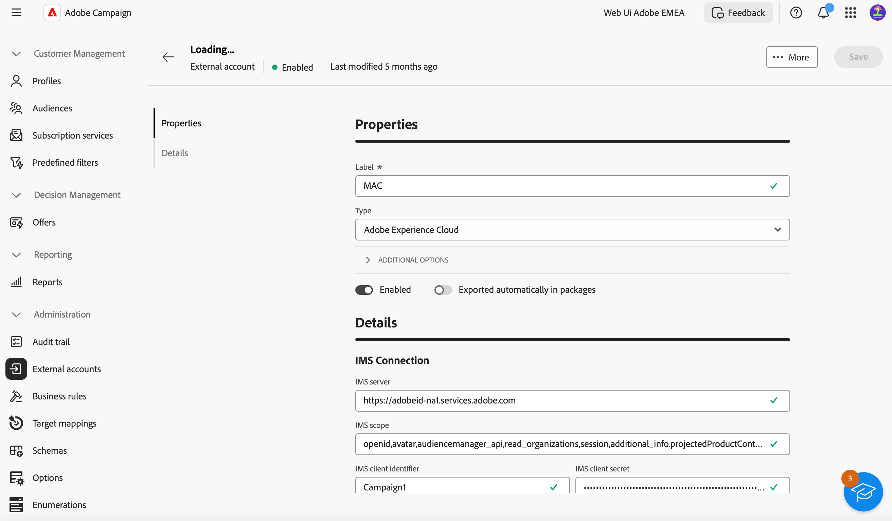

# Contas externas da Integração de soluções da Adobe {#integration-external-account}

Dependendo do tipo de conta externa da Integração de soluções da Adobe que você selecionou, siga as etapas abaixo para definir as configurações de conexão e conta para uma integração perfeita com os serviços da Adobe.

## Adobe Experience Cloud

Para se conectar ao console do Adobe Campaign usando uma Adobe ID, você deve configurar a conta externa do Adobe Experience Cloud (MAC).

Para configurar a conta externa do **[!UICONTROL Adobe Experience Cloud]**, preencha os seguintes campos:

* **[!UICONTROL IMS server]**

  URL do seu servidor IMS. Verifique se as instâncias de estágio e de produção apontam para o mesmo ponto final de produção IMS.

* **[!UICONTROL IMS scope]**

  Os escopos definidos aqui devem ser um subconjunto daqueles provisionados pelo IMS.

* **[!UICONTROL IMS client identifier]**

  ID do seu cliente IMS.

* **[!UICONTROL IMS client secret]**

  Credencial do segredo do cliente IMS.

* **[!UICONTROL Callback server]**

  URL de acesso da instância do Adobe Campaign.

* **[!UICONTROL IMS organization ID]**

  ID da sua organização. Para encontrar seu ID de organização, consulte [esta página](https://experienceleague.adobe.com/docs/core-services/interface/administration/organizations.html?lang=pt-BR){target=_blank}.

* **[!UICONTROL Association mask]**

  A sintaxe que permitirá que os nomes de configuração no Painel Enterprise sejam sincronizados com os grupos no Adobe Campaign.

* **[!UICONTROL Server]**

  URL da sua instância da Adobe Experience Cloud.

* **[!UICONTROL Tenant]**

  Nome do seu locatário do Adobe Experience Cloud.
