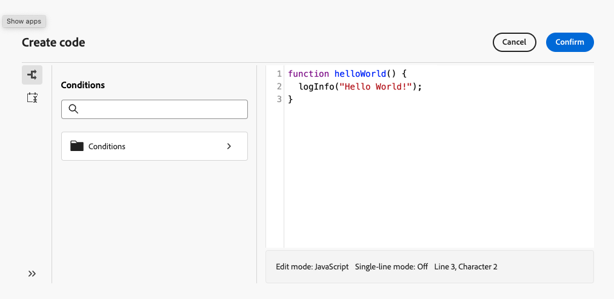

# Trabalhar com códigos JavaScript {#javascript-codes}

>[!CONTEXTUALHELP]
>id="acw_javascript_codes_list"
>title="Códigos em JavaScript"
>abstract="Códigos em JavaScript"

>[!CONTEXTUALHELP]
>id="acw_javascript_codes_create"
>title="Criar código em JavaScript"
>abstract="Criar código em JavaScript"

## Sobre códigos JavaScript {#about}

Os códigos JavaScript permitem criar funções reutilizáveis que podem ser usadas em fluxos de trabalho, de modo semelhante a uma biblioteca. Essas funções são armazenadas no menu **[!UICONTROL Administração]** > **[!UICONTROL Códigos JavaScript]** no painel de navegação esquerdo.


Na lista de códigos JavaScript, é possível:

* **Duplicar ou excluir um código**: clique no botão de reticências e selecione a ação desejada.
* **Modificar um código**: clique no nome de um código para abrir suas propriedades, fazer suas alterações e salvar.
* **Criar um novo código JavaScript**: clique no botão **[!UICONTROL Criar código JavaScript]**.

>[!NOTE]
>
>Embora o local do menu de códigos do JavaScript seja diferente no console do Adobe Campaign e na interface do usuário da Web, a lista é idêntica e funciona como um espelho.

## Criar um código JavaScript {#create}

Para criar um código JavaScript, siga estas etapas:

1. Navegue até o menu **[!UICONTROL Códigos JavaScript]** e clique no botão **[!UICONTROL Criar código JavaScript]**.

1. Defina as propriedades do código:

   * **[!UICONTROL Namespace]**: especifique o namespace relevante para seus recursos personalizados. Por padrão, o namespace é &quot;cus&quot;, mas pode variar dependendo da implementação.
   * **[!UICONTROL Nome]**: o identificador exclusivo usado para fazer referência ao código.
   * **[!UICONTROL Rótulo]**: o rótulo descritivo exibido na lista de códigos do JavaScript.

   

   >[!NOTE]
   >
   >Depois de criados, os campos **[!UICONTROL Namespace]** e **[!UICONTROL Nome]** não podem ser modificados. Para fazer alterações, duplique o código e atualize conforme necessário.
   >
   >No console do Campaign, o nome do código JavaScript aparece como uma concatenação desses dois campos.

1. Clique no botão **[!UICONTROL Criar código]** para definir o código JavaScript. O painel esquerdo fornece dois menus que permitem usar funções predefinidas relacionadas a condições e formatação de data.

   

1. Clique em **[!UICONTROL Confirmar]** para salvar seu código.

1. Quando o código JavaScript estiver pronto, clique em **[!UICONTROL Criar]**. O código JavaScript agora está disponível para uso em workflows.

## Usar um código JavaScript de um workflow {#workflow}

### Carregar bibliotecas de código do JavaScript {#library}

Você pode fazer referência a códigos JavaScript em workflows para evitar a regravação de códigos para tarefas repetitivas. Para usar esses códigos, carregue a biblioteca correspondente no script de inicialização do fluxo de trabalho. Isso permite carregar todas as bibliotecas que contêm as funções que você deseja usar no fluxo de trabalho uma vez.

Para carregar uma biblioteca, siga estas etapas:

1. Abra um workflow e clique no botão **[!UICONTROL Configurações]**.
1. Navegue até a seção **[!UICONTROL Script de inicialização]** e clique em **[!UICONTROL Criar código]**.

   

1. Use a sintaxe abaixo no código para carregar uma biblioteca:

   ```
   loadLibrary("/<namespace>/<name>")
   ```

   * Substitua `<namespace>` pelo namespace especificado durante a criação do código JavaScript.
   * Substitua `<name>` pelo nome do código JavaScript.

1. Clique em **[!UICONTROL Confirmar]** e salve as configurações.

### Funções de referência em workflows {#reference}

Depois que a biblioteca do JavaScript for carregada, você poderá fazer referência às funções definidas no código JavaScript diretamente no fluxo de trabalho, normalmente usando uma atividade **[!UICONTROL JavaScript code]**.

