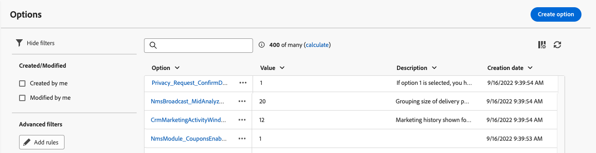
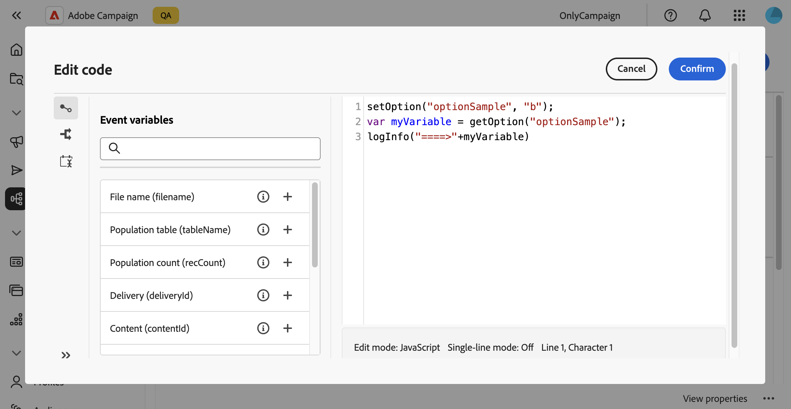
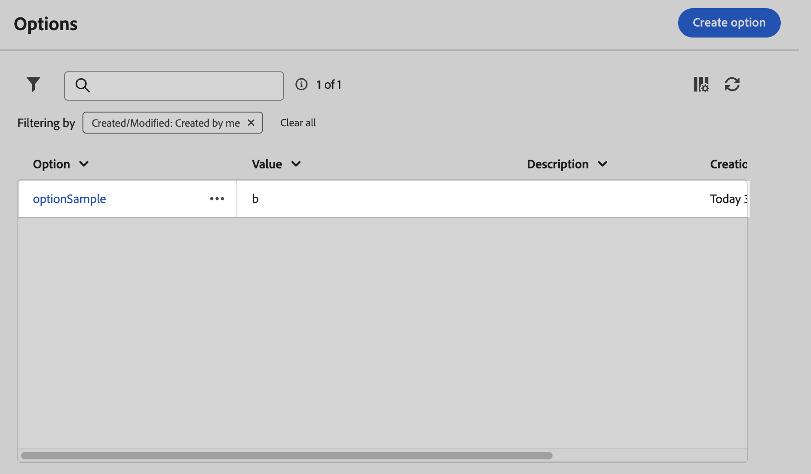

# Configurar opções do [!DNL Campaign] {#options}

>[!CONTEXTUALHELP]
>id="acw_options_list"
>title="Opções"
>abstract="Opções"

>[!CONTEXTUALHELP]
>id="acw_options_create"
>title="Criar opção"
>abstract="Criar opção"

O Adobe Campaign Web inclui opções técnicas que permitem configurar o aplicativo mais especificamente. Algumas dessas opções são incorporadas, enquanto outras podem ser adicionadas manualmente, conforme necessário.

>[!IMPORTANT]
>As opções integradas são pré-configuradas e só devem ser modificadas por usuários avançados. Em caso de dúvidas ou solicitações, entre em contato com o representante da Adobe.

## Acessar opções do Campaign {#access}

Opções disponíveis no menu **[!UICONTROL Administração]** / **[!UICONTROL Opções]**. Use o painel de filtros para restringir a lista e localizar rapidamente a opção necessária.

\
[Lista de opções exibida no menu Administração/Opções]

>[!NOTE]
>Embora o local do menu de opções seja diferente entre o console do Adobe Campaign e a interface do usuário da Web, a lista é idêntica e funciona como um espelho. Para obter mais detalhes sobre as opções disponíveis, consulte a lista de opções na [documentação do Campaign v7](https://experienceleague.adobe.com/en/docs/campaign-classic/using/installing-campaign-classic/appendices/configuring-campaign-options){target="_blank"}.

Na lista de opções, é possível:

* **Duplique ou exclua uma opção**: clique no botão de reticências e selecione a ação desejada.
* **Modificar uma opção**: clique no nome da opção para abrir suas propriedades. Faça as alterações e salve.
* **Criar uma opção personalizada**: clique no botão **[!UICONTROL Criar opção]**.

## Criar uma opção {#create}

A interface da Web do Adobe Campaign permite criar opções personalizadas para atender aos seus requisitos. Isso é particularmente útil ao trabalhar com atividades de fluxo de trabalho de **[!UICONTROL código JavaScript]** para armazenar dados intermediários.

Para criar uma opção:

1. Acesse a lista de opções e clique em **[!UICONTROL Criar opção]**.
1. Insira um nome para a opção, selecione seu tipo e defina o valor desejado.
1. Clique em **[!UICONTROL Criar]** para criar a opção.

As opções podem atuar como armazenamento temporário para dados, oferecendo os seguintes benefícios:

* Valores digitados: as opções são compatíveis com tipos de dados específicos, como datas, números inteiros, cadeias de caracteres etc.
* Flexibilidade: as opções permitem que os usuários armazenem e recuperem dados com eficiência sem a sobrecarga do gerenciamento de tabelas de banco de dados.

No exemplo abaixo, uma opção personalizada chamada `sampleOption` é criada com o valor inicial &quot;a&quot;. Uma atividade **[!UICONTROL JavaScript code]** em um fluxo de trabalho modifica o valor desta opção e o armazena em uma variável. O valor atualizado é exibido nos logs de fluxo de trabalho e refletido no menu **[!UICONTROL Opções]**.

1. Crie a opção.

   

1. Configure uma atividade **[!UICONTROL JavaScript code]** e inicie o fluxo de trabalho.

   

1. Execute o workflow para ver o valor atualizado nos logs de workflow.

   

1. O valor atualizado agora está visível no menu **[!UICONTROL Opções]**.

   

## Restringir o endereço de email do remetente para entregas {#restrict-sender-address}

Por padrão, os profissionais de marketing podem digitar qualquer endereço no campo **[!UICONTROL Do email]** de uma entrega de email. Para restringir esse campo a uma lista predefinida de endereços, crie ou edite a opção `NmsDelivery_senderAddressMask` interna e defina seu valor como uma lista separada por vírgulas dos endereços de remetente permitidos, por exemplo `abc@adobe.com,bcd@adobe.com`.

Depois que esta opção tiver um valor, o campo **[!UICONTROL Do email]** se tornará uma lista suspensa contendo apenas esses endereços, em vez de um campo de texto livre. Se a opção não existir ou seu valor estiver vazio, o campo permanecerá como texto livre, como antes.

Essa restrição é global. Ela se aplica a todas as marcas e modelos de entrega e não aceita campos de personalização, somente endereços estáticos.

Para obter mais informações sobre o campo **[!UICONTROL Do email]**, consulte [Configurar o conteúdo do email](../email/edit-content.md#edit-content).
