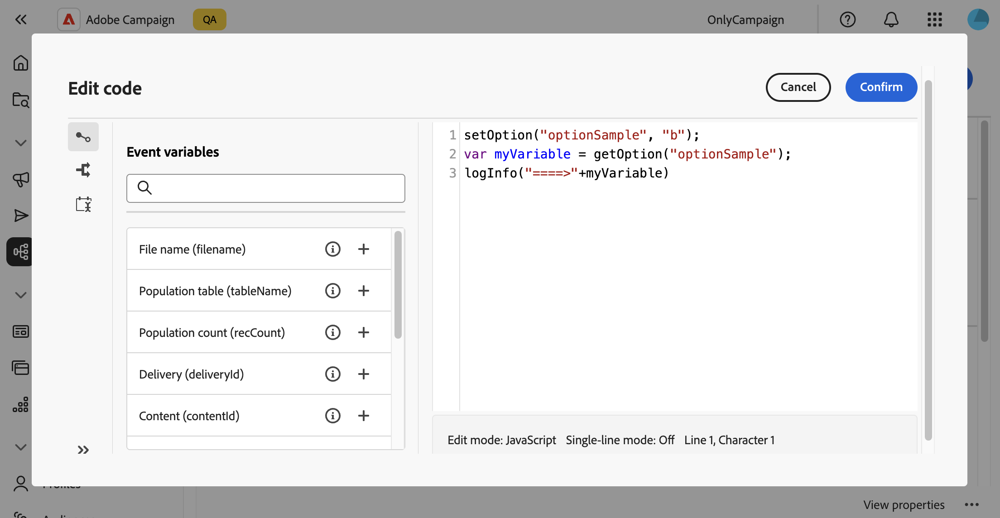
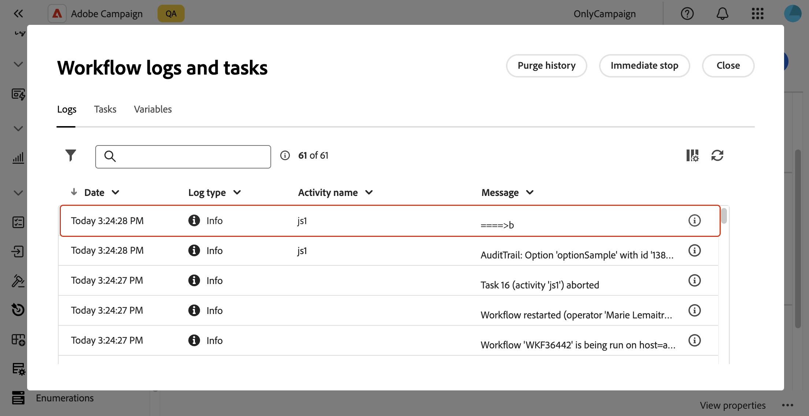

# Configurar opções do [!DNL Campaign] {#options}

>[!CONTEXTUALHELP]
>id="acw_options_list"
>title="Opções"
>abstract="Opções"

>[!CONTEXTUALHELP]
>id="acw_options_create"
>title="Criar opção"
>abstract="Criar opção"

O Adobe Campaign Web vem com opções técnicas que permitem configurar o aplicativo mais especificamente. Algumas dessas opções são incorporadas, enquanto outras podem ser adicionadas manualmente, conforme necessário.

>[!IMPORTANT]
>
>As opções integradas são pré-configuradas e só devem ser modificadas por usuários avançados. Caso tenha alguma dúvida ou solicitação, entre em contato com o representante da Adobe.

## Acessar opções do Campaign {#access}

Opções disponíveis no menu **[!UICONTROL Administração]** / **[!UICONTROL Opções]**. Use o painel de filtros para restringir a lista e encontrar rapidamente a opção necessária.

>[!NOTE]
>
>Embora o local do menu de opções seja diferente entre o console do Adobe Campaign e a interface do usuário da Web, a lista é idêntica e funciona como um espelho. Para obter mais informações sobre as opções disponíveis, consulte a lista de opções na [documentação do Campaign v7](https://experienceleague.adobe.com/en/docs/campaign-classic/using/installing-campaign-classic/appendices/configuring-campaign-options){target="_blank"}

Na lista de opções, é possível:

* **Duplique ou exclua uma opção**: clique no botão de reticências e selecione a ação desejada.
* **Modificar uma opção**: clique no nome da opção para abrir suas propriedades. Faça as alterações e salve.
* **Criar uma opção personalizada**: clique no botão **[!UICONTROL Criar opção]**.

## Criar uma opção {#create}

A interface da Web do Adobe Campaign permite criar suas próprias opções personalizadas para atender às suas necessidades. Isso é particularmente útil ao trabalhar com atividades de fluxo de trabalho **[!UICONTROL JavaScript code]** para armazenar dados intermediários.

Para criar uma opção:

1. Acesse a lista de opções e clique em **[!UICONTROL Criar opção]**.
1. Insira um nome para a opção, selecione seu tipo e defina o valor desejado.
1. Clique em **[!UICONTROL Criar]** para criar a opção.

   

As opções podem atuar como um espaço de armazenamento temporário para dados, oferecendo os seguintes benefícios:

* Valores digitados: as opções suportam tipos de dados específicos, como datas, números inteiros, sequências de caracteres...
* Flexibilidade: as opções permitem que os usuários armazenem e recuperem dados com eficiência sem a sobrecarga do gerenciamento de tabelas de banco de dados.

No exemplo abaixo, criamos uma opção personalizada chamada `sampleOption` com o valor inicial &quot;a&quot;. Uma atividade **[!UICONTROL JavaScript code]** em um fluxo de trabalho modifica o valor desta opção e o armazena em uma variável. O valor atualizado é exibido nos logs de fluxo de trabalho e refletido no menu **[!UICONTROL Opções]**.

1. Crie a opção.

   

1. Configure uma atividade **[!UICONTROL JavaScript code]** e inicie o fluxo de trabalho.

   

1. Execute o workflow para ver o valor atualizado nos logs de workflow.

   

1. O valor atualizado agora está visível no menu **[!UICONTROL Opções]**.

   
