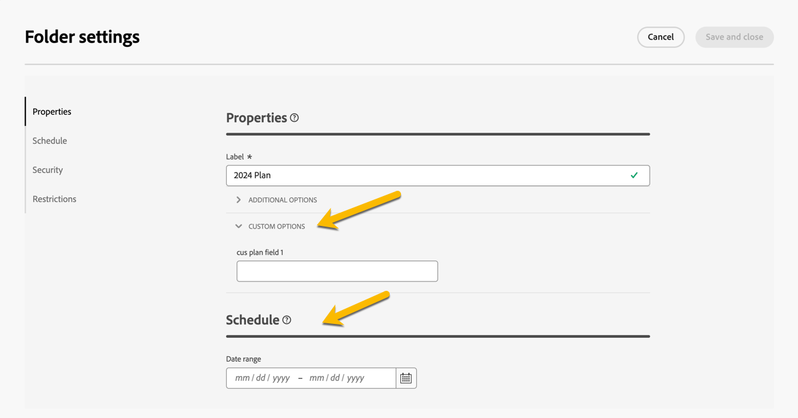
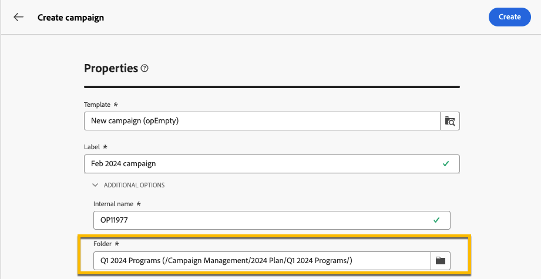

# Planos e programas {#plan-and-programs}

O Adobe Campaign permite configurar uma hierarquia de pastas para planos e programas de marketing.

Para organizá-los melhor, o Adobe recomenda a seguinte hierarquia: Plan `>` Programs `>` Campaigns

* Um **plano** pode conter vários programas. Define objetivos estratégicos por um período.
* Um **programa** pode conter outros programas, assim como campanhas, fluxos de trabalho e páginas de aterrissagem.
* Uma **campanha** pode conter entregas, fluxos de trabalho e páginas de aterrissagem.

## Criar e configurar um plano {#create-plan}

Para criar um plano, você precisa criar uma pasta com o tipo de pasta **[!UICONTROL Plano]** [Saiba mais sobre como criar uma pasta](../get-started/work-with-folders.md).

{zoomable="yes"}

Vá para as **[!UICONTROL Configurações de pasta]** do seu plano para gerenciá-lo.

{zoomable="yes"}

Você pode definir **[!UICONTROL Opções personalizadas]** e definir a data de agendamento do seu plano.

{zoomable="yes"}

Para gerenciar as **[!UICONTROL Opções personalizadas]**:

1. Navegue até os **[!UICONTROL Esquemas]**
1. Escolha os esquemas **[!UICONTROL Editáveis]** nos filtros
1. Clique no ícone de **[!UICONTROL Editar detalhes personalizados]**

{zoomable="yes"}

Você pode configurá-los:

{zoomable="yes"}

## Criar e configurar um programa

Para criar um programa em seu plano ([Saiba mais sobre como criar um plano](#create-plan)), você precisa estar em seu plano e criar uma pasta com o tipo de pasta **[!UICONTROL Programa]** [Saiba mais sobre como criar uma pasta](../get-started/work-with-folders.md).

{zoomable="yes"}

Vá para as **[!UICONTROL Configurações de pasta]** do seu programa para gerenciá-lo.

{zoomable="yes"}

Você pode definir **[!UICONTROL Opções personalizadas]** e definir a data de agendamento do seu programa.

{zoomable="yes"}

Para gerenciar as **[!UICONTROL Opções personalizadas]**:

1. Navegue até os **[!UICONTROL Esquemas]**
1. Escolha os esquemas **[!UICONTROL Editáveis]** nos filtros
1. Clique no ícone de **[!UICONTROL Editar detalhes personalizados]**

{zoomable="yes"}

Você pode configurá-los:

{zoomable="yes"}

## Como vincular uma campanha a um programa

Há duas maneiras de vincular uma campanha a um programa:

### Way #1: Você já tem um programa e deseja criar uma campanha vinculada a ele

Para vincular uma nova campanha ao seu programa, crie uma campanha diretamente no programa:

{zoomable="yes"}

As configurações de **[!UICONTROL Pasta]** serão automaticamente arquivadas com o caminho para o seu programa.

{zoomable="yes"}

### Way #2: você já tem uma campanha existente e deseja vinculá-la a um programa existente

Vá para o botão **[!UICONTROL Configurações]** da campanha que deseja vincular ao seu programa:

{zoomable="yes"}

Em suas **[!UICONTROL Propriedades]**, clique no ícone **[!UICONTROL Pasta]** nas configurações de **[!UICONTROL Pasta]** para escolher sua pasta **[!UICONTROL Programa]**.

{zoomable="yes"}

Selecione a pasta **[!UICONTROL Programa]** e clique no botão **[!UICONTROL Confirmar]** e depois no botão **[!UICONTROL Salvar e Fechar]**.

{zoomable="yes"}

Sua campanha agora está listada em seu programa:

{zoomable="yes"}
