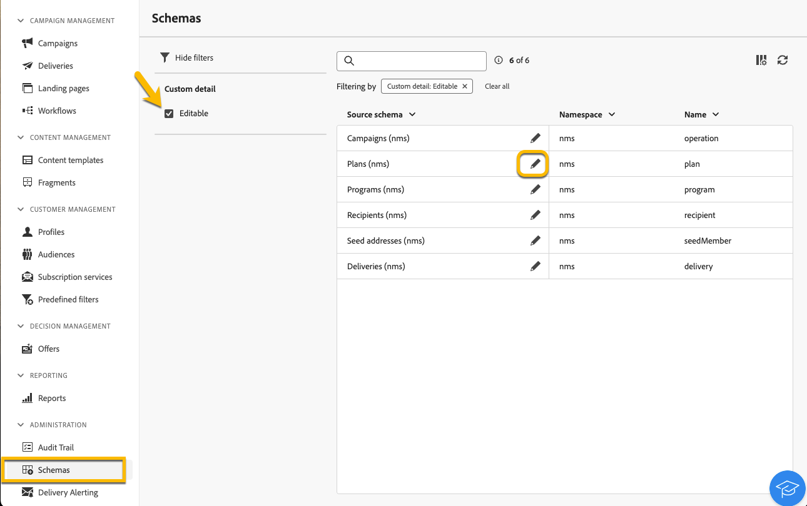
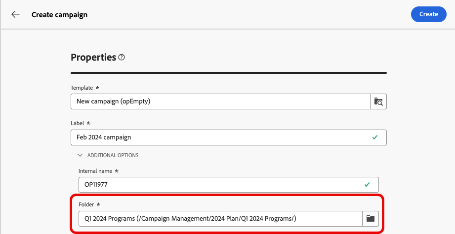

# Planos e programas {#plan-and-programs}

O Adobe Campaign permite configurar uma hierarquia de pastas para planos e programas de marketing.

Para organizar melhor esses componentes, a Adobe recomenda a seguinte hierarquia: Planejar `>` Programas `>` Campanhas.

* Um **plano** pode conter vários programas. Define objetivos estratégicos para um período específico.
* Um **programa** pode conter outros programas, assim como campanhas, fluxos de trabalho e páginas de destino.
* Uma **campanha** pode conter entregas, fluxos de trabalho e páginas de aterrissagem.

## Criar e configurar um plano {#create-plan}

Para criar um plano, crie uma pasta do tipo **[!UICONTROL Plano]**. [Saiba mais sobre como criar uma pasta](../get-started/work-with-folders.md)

{zoomable="yes"}

Vá para as **[!UICONTROL Configurações de pasta]** do seu plano para gerenciá-lo.

{zoomable="yes"}

Defina as **[!UICONTROL Opções personalizadas]** e defina a data de agendamento do seu plano.

{zoomable="yes"}

Para gerenciar as **[!UICONTROL Opções personalizadas]**:

1. Navegue até **[!UICONTROL Esquemas]**.
1. Escolha os esquemas **[!UICONTROL Editáveis]** nos filtros.
1. Clique no schema.

{zoomable="yes"}

1. Clique no botão **[!UICONTROL Edição de tela]**.

   {zoomable="yes"}

Configure as opções personalizadas:

{zoomable="yes"}

## Criar e configurar um programa {#create-program}

Os programas estão disponíveis no menu de navegação esquerdo, de modo semelhante às exibições de lista para campanhas, deliveries e workflows. A entrada **[!UICONTROL Programas]** permite criar um programa em um programa existente, não em um plano.

Para criar seu primeiro programa de nível superior em um plano, navegue até o plano no Explorer (consulte esta [seção](#create-plan)) e crie uma pasta com o tipo de pasta **[!UICONTROL Programa]**. [Saiba mais sobre como criar uma pasta](../get-started/work-with-folders.md).

Para criar um programa em um programa existente, siga as etapas abaixo:

1. Navegue até a entrada **[!UICONTROL Programas]** no menu de navegação esquerdo. Essa visualização lista todos os programas e permite pesquisar e filtrar. Clicar em um programa o abre na exibição do Explorer.

   {zoomable="yes"}

1. Clique em **[!UICONTROL Criar programa]** e configure as seguintes opções:

   {zoomable="yes"}

   * Insira um **[!UICONTROL Rótulo]**.
   * Selecione o programa existente a ser usado como a **[!UICONTROL Pasta pai]**.
   * Opcionalmente, defina um **[!UICONTROL Intervalo de datas]** na seção **[!UICONTROL Agendamento]**.

   >[!TIP]
   >
   >Se você criar um programa na visualização do Explorer, a pasta principal será automaticamente definida como o programa atual.

1. Clique novamente em **[!UICONTROL Criar programa]** para salvar as alterações e criar o programa. O programa é exibido na visualização do Explorer. Você pode renomeá-la, excluí-la e acessar suas configurações, como qualquer outra pasta. Você também pode criar subprogramas dentro deste programa.

   {zoomable="yes"}

As opções personalizadas de um programa são configuradas da mesma forma que para um plano. Consulte [Criar e configurar um plano](#create-plan).

## Como vincular uma campanha a um programa

Há duas maneiras de vincular uma campanha a um programa:

### Way #1: Você já tem um programa e deseja criar uma campanha vinculada a ele

Para vincular uma nova campanha ao seu programa, crie a campanha diretamente no programa.

{zoomable="yes"}

As configurações de **[!UICONTROL Pasta]** serão preenchidas automaticamente com o caminho para o seu programa.

{zoomable="yes"}

### Way #2: você já tem uma campanha existente e deseja vinculá-la a um programa existente

Vá para o botão **[!UICONTROL Configurações]** da campanha que deseja vincular ao seu programa.

{zoomable="yes"}

Em suas **[!UICONTROL Propriedades]**, clique no ícone **[!UICONTROL Pasta]** nas configurações de **[!UICONTROL Pasta]** para escolher sua pasta **[!UICONTROL Programa]**.

{zoomable="yes"}

Selecione a pasta **[!UICONTROL Programa]**, clique no botão **[!UICONTROL Confirmar]** e clique no botão **[!UICONTROL Salvar e Fechar]**.

{zoomable="yes"}

Sua campanha agora está listada em seu programa.

{zoomable="yes"}