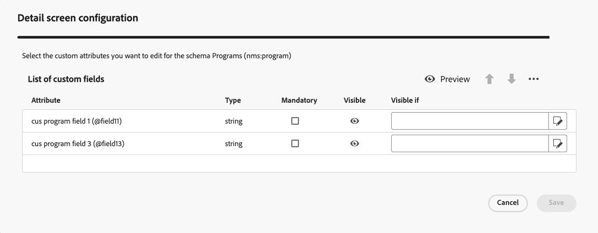

# Planos e programas {#plan-and-programs}

>[!CONTEXTUALHELP]
>id="acw_homepage_welcome_rn2"
>title="Planos e programas"
>abstract="Agora você pode configurar a hierarquia de pastas para planos e programas de marketing na interface do usuário do Campaign Web."
>additional-url="https://experienceleague.adobe.com/docs/campaign-web/v8/release-notes/release-notes.html?lang=pt-BR" text="Consulte as notas de versão"

O Adobe Campaign permite configurar a hierarquia de pastas para planos de marketing e programas.

Para organizá-los melhor, Adobe recomenda a seguinte hierarquia: Plan `>` Programas `>` Campanhas

* A **plano** pode conter vários programas. Define objetivos estratégicos por um período.
* A **programa** pode conter outros programas, assim como campanhas, fluxos de trabalho e páginas de aterrissagem.
* A **campaign** pode conter deliveries, workflows e landing pages.

## Criar e configurar um plano {#create-plan}

Para criar um plano, é necessário criar uma pasta com o tipo de pasta **[!UICONTROL Plano]** [Saiba mais sobre como criar uma pasta](create-manage-folder.md).

{zoomable="yes"}

Vá para a **[!UICONTROL Configurações da pasta]** do seu plano para gerenciá-lo.

{zoomable="yes"}

Você pode definir **[!UICONTROL Opções personalizadas]** e para definir a data de agendamento do seu plano.

{zoomable="yes"}

Para gerenciar o  **[!UICONTROL Opções personalizadas]**:

1. Navegue até o **[!UICONTROL Esquemas]**
1. Escolha o **[!UICONTROL Editável]** esquemas nos filtros
1. Clique no ícone de **[!UICONTROL Editar detalhes personalizados]**

{zoomable="yes"}

Você pode configurá-los:

{zoomable="yes"}

## Criar e configurar um programa

Para criar um programa em seu plano ([Saiba mais sobre como criar um plano](#create-plan)), você precisa estar em seu plano e criar uma pasta com o tipo de pasta **[!UICONTROL Programa]** [Saiba mais sobre como criar uma pasta](create-manage-folder.md).

{zoomable="yes"}

Vá para a **[!UICONTROL Configurações da pasta]** do seu programa para gerenciá-lo.

{zoomable="yes"}

Você pode definir **[!UICONTROL Opções personalizadas]** e para definir a data de agendamento do seu programa.

{zoomable="yes"}

Para gerenciar o  **[!UICONTROL Opções personalizadas]**:

1. Navegue até o **[!UICONTROL Esquemas]**
1. Escolha o **[!UICONTROL Editável]** esquemas nos filtros
1. Clique no ícone de **[!UICONTROL Editar detalhes personalizados]**

{zoomable="yes"}

Você pode configurá-los:

{zoomable="yes"}

## Como vincular uma campanha a um programa

Há duas maneiras de vincular uma campanha a um programa:

### Way #1 : Você já tem um programa e deseja criar uma campanha vinculada a ele

Para vincular uma nova campanha ao seu programa, crie a campanha diretamente no programa:

{zoomable="yes"}

A variável **[!UICONTROL Pasta]** as configurações serão automaticamente arquivadas com o caminho para o seu programa.

{zoomable="yes"}

### Way #2 : você já tem uma campanha existente e deseja vinculá-la a um programa existente

Vá para a **[!UICONTROL Configurações]** da campanha que deseja vincular ao seu programa:

{zoomable="yes"}

No seu **[!UICONTROL Propriedades]**, clique no link **[!UICONTROL Pasta]** ícone no **[!UICONTROL Pasta]** configurações, para escolher o seu **[!UICONTROL Programa]** pasta.

{zoomable="yes"}

Selecione o **[!UICONTROL Programa]** e clique em **[!UICONTROL Confirmar o]** e depois em **[!UICONTROL Salvar e fechar]** botão.

{zoomable="yes"}

Sua campanha agora está listada em seu programa:

{zoomable="yes"}
