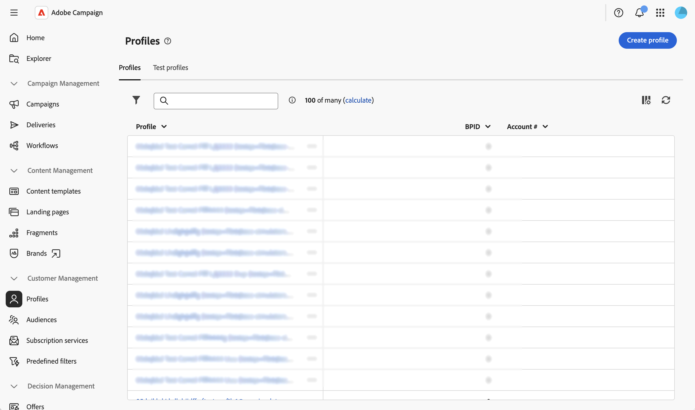

# Configurar colunas da lista {#list-columns}

>[!CONTEXTUALHELP]
>id="acw_schema_inventory_list_configuration"
>title="Configuração da lista de inventário"
>abstract="Configure quais colunas são exibidas por padrão nas exibições de lista. Cada coluna mostra seu rótulo e o atributo correspondente. Adicione filtros personalizados para exibir campos de filtro de acesso rápido no painel de filtros da exibição de lista."
>additional-url="https://experienceleague.adobe.com/docs/campaign-web/v8/conf/schemas/schemas-custom-filters.html?lang=pt-BR" text="Adicionar filtros personalizados"

A seção **[!UICONTROL Configuração da lista de inventário]** permite configurar quais colunas são exibidas por padrão nos modos de exibição de lista. Cada coluna mostra seu rótulo e o atributo correspondente.

Para obter mais informações sobre a tela de definição de tela e como acessá-la, consulte a seção [Acessar a definição de tela](schemas-browse-access.md#screen-def).

Para adicionar novas colunas à lista padrão:

1. Navegue até o menu **[!UICONTROL Esquemas]** e localize os esquemas editáveis usando os filtros.

1. Selecione o nome do esquema na lista para abri-lo e clique no botão **[!UICONTROL Edição da tela]** na exibição de detalhes do esquema para acessar a definição da tela.

1. Clique no ícone de reticências (três pontos).
1. Escolha **[!UICONTROL Selecionar colunas]**.
   

1. Selecione os atributos que deseja exibir nas exibições de lista e confirme.

   

1. Navegue até o menu **Perfis** para acessar a exibição da lista de perfis. Você observa que as novas guias são exibidas. Você pode adicionar mais colunas, se necessário.

   

>[!NOTE]
>
>Você também pode adicionar campos de filtro de acesso rápido no painel Filtros da exibição em lista. Para obter mais informações, consulte [Adicionar filtros personalizados](schemas-custom-filters.md).
