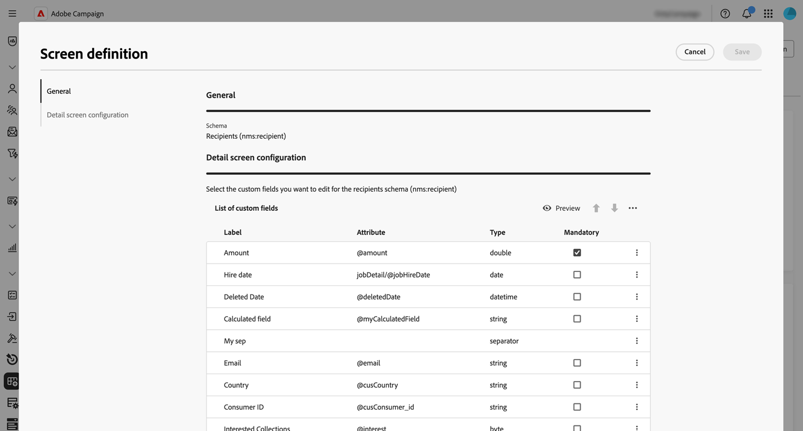

# Trabalhar com esquemas {#schemas}

>[!CONTEXTUALHELP]
>id="acw_schema"
>title="Esquemas"
>abstract="O **[!DNL Adobe Campaign]** usa esquemas baseados em XML para definir a estrutura física e lógica dos dados no aplicativo. Nesta tela, você pode ver todos os esquemas existentes e acessar os detalhes de um esquema selecionando seu nome na lista. Os filtros estão disponíveis para ajudar a refinar a lista, por exemplo, para exibir apenas esquemas editáveis."

## Sobre schemas {#about}

O **[!DNL Adobe Campaign]** usa esquemas baseados em XML para definir a estrutura física e lógica dos dados no aplicativo. Um esquema é um documento XML vinculado a uma tabela de banco de dados que define:

* A estrutura da tabela SQL, incluindo nome da tabela, campos e relacionamentos.
* A estrutura de dados XML, incluindo elementos, atributos, hierarquia, tipos, valores padrão e rótulos.

Os esquemas desempenham um papel fundamental em:

* Mapeamento de dados do aplicativo para tabelas do banco de dados.
* Definição de relações entre objetos de dados.
* Especificação da estrutura e das propriedades de cada campo.

Cada entidade no Adobe Campaign tem um esquema dedicado, garantindo a consistência e a organização dos dados.

Informações detalhadas sobre esquemas estão disponíveis na [documentação do console do Campaign](https://experienceleague.adobe.com/en/docs/campaign/campaign-v8/developer/shemas-forms/schemas){target="_blank"}.

## Acessar esquemas na Interface do Usuário da Web {#access}

Os esquemas podem ser acessados no menu **[!UICONTROL Administração]** > **[!UICONTROL Esquemas]**.

Nessa tela, você pode exibir todos os esquemas existentes. Os filtros estão disponíveis para ajudar a refinar a lista, por exemplo, para exibir apenas esquemas editáveis.

Para abrir um esquema, selecione seu nome. Uma visualização detalhada do esquema é exibida.

### Visão geral do esquema {#overview}

A guia **[!UICONTROL Visão geral]** fornece uma exibição geral do esquema:

* A seção **[!UICONTROL Propriedades]** exibe informações importantes, como o nome do esquema, o namespace e o nome da tabela associada.

* A seção **[!UICONTROL Definição de esquema]** mostra detalhes sobre a definição de esquema, incluindo a chave primária usada para reconciliação de dados e seus links com outras tabelas.

  Clique no botão **[!UICONTROL Visualização do esquema]** para exibir os diferentes campos e links que compõem o esquema. Isso permite verificar a estrutura completa de um esquema. Se o esquema tiver sido estendido com campos personalizados, você poderá visualizar todas as suas extensões.

* A seção **[!UICONTROL Content]** exibe o conteúdo XML do esquema, permitindo que você alterne entre a fonte e a sintaxe gerada.

### Dados do esquema {#data}

A guia **[!UICONTROL Dados]** fornece informações sobre os dados do esquema.

## Configurar a definição da tela {#screen-definition}

### Editar campos personalizados {#fields}

Os campos personalizados são atributos adicionais adicionados a esquemas prontos para uso por meio do console do Adobe Campaign. Eles permitem que você personalize esquemas, incluindo novos atributos para atender às necessidades da sua organização.

Campos personalizados podem ser exibidos em várias telas, como detalhes do perfil na interface da Web do Campaign. Você pode controlar quais campos estão visíveis e como eles aparecem na interface. Para fazer isso, clique no botão **[!UICONTROL Edição de tela]** no menu **[!UICONTROL Esquemas]**.

Clique em **[!UICONTROL Visualizar]** para exibir os campos personalizados em uma tela de exemplo.

Para obter informações detalhadas sobre como editar campos personalizados em um esquema, consulte esta seção: [Configurar campos personalizados](../administration/custom-fields.md).

### Adicionar listas de coleções {#collection-lists}

Esta seção **Lista de listas personalizadas** permite definir links de coleção, como compras. Os dados relacionados são exibidos nas telas de perfil por meio de uma guia dedicada.

>[!NOTE]
>
>No momento, esse recurso só está disponível para o schema de Recipients.

1. Para adicionar uma lista de coleções à interface, clique no botão de reticências e escolha **Selecionar listas personalizadas**.

   

1. Selecione uma das listas personalizadas disponíveis, como compras, e clique em **Confirmar**.

   

1. Navegue até o menu **Perfis** e filtre os perfis que fizeram compras.

   

1. Clique em um perfil. Você observa que a nova guia é exibida. Você pode adicionar mais colunas, se necessário.

   
