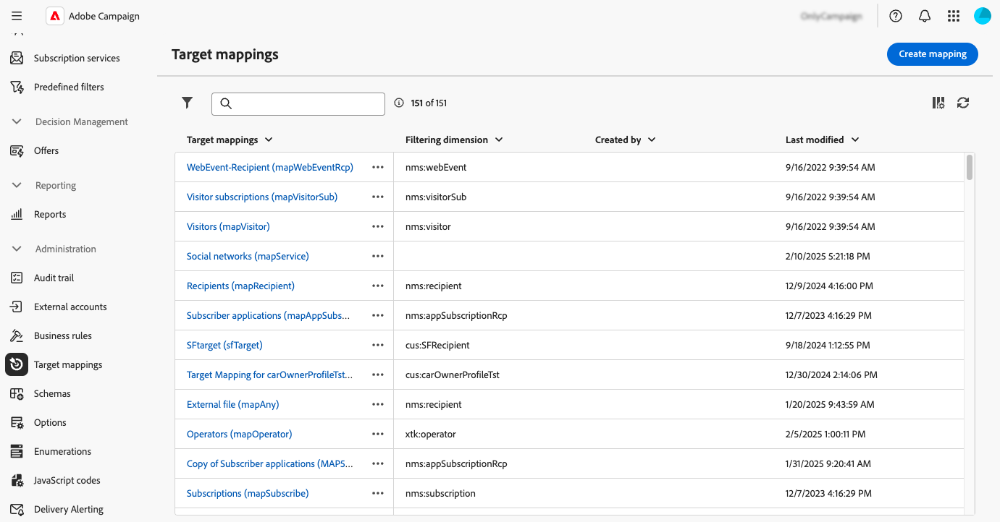

# Gerenciar target mappings {#target-mappings}

>[!CONTEXTUALHELP]
>id="acw_homepage_welcome_rn2"
>title="Target mappings"
>abstract="Agora é possível criar target mappings na interface do Campaign Web. Os target mappings definem como diferentes canais de entrega (email, SMS, notificações por push) se vinculam aos campos de dados de um esquema."
>additional-url="https://experienceleague.adobe.com/docs/campaign-web/v8/release-notes/release-notes.html?lang=pt-BR" text="Consulte as notas de versão"

>[!CONTEXTUALHELP]
>id="acw_targetmapping_list"
>title="Target mappings "
>abstract="Target mappings"

## Sobre target mappings {#about}

Cada canal de comunicação usa um target mapping padrão para direcionar seus recipients. Por exemplo, por padrão, os modelos de delivery de email e SMS são direcionados a **[!UICONTROL Recipients]**. O target mapping, portanto, usa os campos da tabela **nms:recipient.** Para notificações por push, o target mapping padrão é **Aplicativos do assinante (nms:appSubscriptionRcp)**, que está vinculado à tabela de destinatários.

Os mapeamentos de destino podem ser acessados no menu **[!UICONTROL Administração]** > **[!UICONTROL Mapeamentos de destino]**. Nessa tela, você pode acessar detalhes sobre cada target mapping ou criar novos target mappings para atender às suas necessidades.

Para obter mais informações sobre os mapeamentos de destino incorporados fornecidos com o Adobe Campaign, consulte a [documentação do console do cliente do Campaign v8](https://experienceleague.adobe.com/docs/campaign/campaign-v8/audience/add-profiles/target-mappings.html?lang=pt-BR){target="_blank"}.

## Criar um target mapping {#create-mapping}

>[!CONTEXTUALHELP]
>id="acw_targetmapping_properties"
>title="Propriedades do target mapping"
>abstract="A seção **[!UICONTROL Propriedades]** permite definir configurações genéricas para o target mapping e a população de destino."

>[!CONTEXTUALHELP]
>id="acw_targetmapping_mapping"
>title="Mapeamento do target mapping"
>abstract="A seção **[!UICONTROL Mapeamento]** permite identificar quais atributos do esquema de target mapping você deve usar para os vários campos de endereço de entrega."

>[!CONTEXTUALHELP]
>id="acw_targetmapping_denylist"
>title="Lista de bloqueios do target mapping"
>abstract="Lista de bloqueios do target mapping"

>[!CONTEXTUALHELP]
>id="acw_targetmapping_storage"
>title="Armazenamento do target mapping"
>abstract="A seção **[!UICONTROL Armazenamento]** permite identificar onde os logs devem ser armazenados."

Para criar um novo target mapping, acesse o menu **[!UICONTROL Administração]** > **[!UICONTROL Mapeamentos de destino]**. Clique no botão **[!UICONTROL Criar mapeamento]** e siga as etapas detalhadas nas seções abaixo.

1. Na seção **[!UICONTROL Propriedades]**, digite um **[!UICONTROL Rótulo]** para o target mapping.

1. Expanda a seção **[!UICONTROL Opções adicionais]** para definir configurações avançadas, como o nome interno, a pasta de armazenamento e a descrição do target mapping.

1. Selecione a população do target. É possível:

   * **[!UICONTROL Usar a dimensão de direcionamento diretamente]**: selecione a dimensão a ser direcionada diretamente na lista de dimensões disponíveis.
   * **[!UICONTROL Usar dados vinculados]**: comece com uma dimensão de direcionamento (por exemplo, assinaturas) e alterne para a dimensão de direcionamento que deseja direcionar (por exemplo, destinatários).

   

1. Se a dimensão selecionada ainda não for usada por um target mapping existente, esquemas para armazenar os logs precisarão ser criados. Opções adicionais estão disponíveis na seção **[!UICONTROL Armazenamento]**. Expanda a seção abaixo para obter mais detalhes.

   +++Opções de armazenamento para novos targeting dimensions

   1. **[!UICONTROL Namespace]**: identifique o namespace que será usado para criar os logs.
   1. **[!UICONTROL Sufixo do esquema de extensão]**: forneça um sufixo para o novo esquema.

      No exemplo abaixo, o nome do catálogo será &quot;cusbroadlogSupplier&quot;.

      

   1. **[!UICONTROL Logs de entrega]**: ative as opções desta seção para enriquecer os logs de envio com um campo de código de segmento ou um campo que contenha o endereço IP de entrega. Por exemplo, salve um código de segmento calculado durante o workflow nos logs de envio para refinar o target posteriormente. Isso permite direcionar perfis com esse código de segmento específico.

   1. **[!UICONTROL Exclusões]**: especifique como armazenar os logs de exclusões.

   1. **[!UICONTROL Logs de rastreamento]**: ative a opção **[!UICONTROL Gerar um esquema para rastreamento]** para gerar um esquema de armazenamento para logs de rastreamento.

+++

1. Use a seção **[!UICONTROL Mapping]** para identificar quais atributos do esquema do target mapping devem ser usados para cada campo de endereço de entrega. Para cada campo, selecione o atributo desejado a ser mapeado. Também é possível criar uma expressão para identificar o campo. Por exemplo, aplique uma função inferior ao atributo address.

   

1. Quando o target mapping estiver pronto, clique no botão **[!UICONTROL Criar]**. O sistema cria automaticamente o target mapping e todos os esquemas relacionados para os logs.

Depois que o target mapping for criado, duas seções adicionais serão exibidas na tela:

* **[!UICONTROL lista de bloqueios]**: esta seção permite que você identifique os atributos do esquema do target mapping a serem usados para Incluir na lista de bloqueios.

  

* **[!UICONTROL Armazenamento]**: esta seção permite que você identifique as tabelas a serem usadas para armazenar logs.

  

   * **[!UICONTROL Esquema de mensagem]**: identifica o esquema a ser usado para armazenar os logs de envio.
   * **[!UICONTROL Mensagens excluídas]**: especifica como gerenciar o armazenamento de logs de entrega e exclusão.

      * **[!UICONTROL Armazenar exclusões e mensagens na mesma tabela]**
      * **[!UICONTROL Armazenar somente mensagens]**: não armazenar exclusões.
      * **[!UICONTROL Armazenar exclusões e mensagens em tabelas separadas]**: selecione o esquema a ser usado para armazenar logs de exclusão no campo **[!UICONTROL Esquema de rejeição]**.

   * **[!UICONTROL Logs de rastreamento]**: escolha onde armazenar os logs de rastreamento e a fonte de tráfego padrão.
   * **[!UICONTROL Campos adicionais]**: especifique uma lista de campos adicionais a serem armazenados nos logs de entrega. Esses campos podem armazenar permanentemente informações sobre membros individuais do destino (por exemplo, `recipient/@firstName`) ou armazenar dados adicionais calculados durante o fluxo de trabalho (por exemplo, `[targetData/@offeCode]`).

     Para fazer isso, selecione **[!UICONTROL Adicionar campo]**. Identifique as informações a serem salvas no campo **[!UICONTROL Source]** e o atributo a ser usado nos logs de envio para salvar essas informações no campo **[!UICONTROL Destino]**.

     {width="50%" zoomable="yes"}