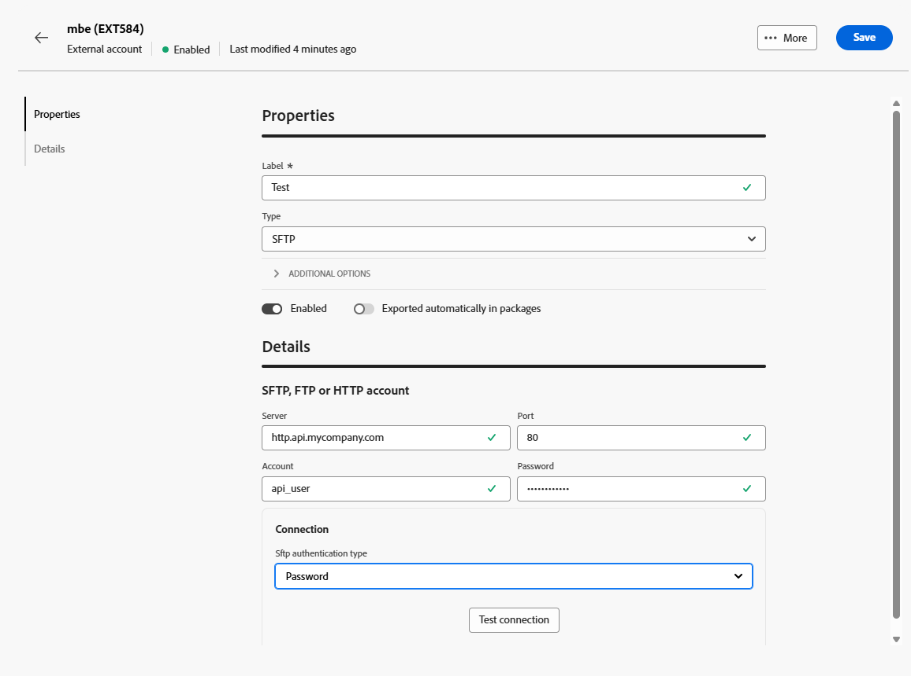

# Contas externas de Dados de Transferência {#transfer-external-account}

## Serviço de armazenamento simples Amazon (S3) {#amazon-simple-storage-service--s3--external-account}

O conector do Serviço de Armazenamento Simples da Amazon (S3) pode ser usado para importar ou exportar dados para o Adobe Campaign. Ele pode ser configurado em uma atividade de fluxo de trabalho. Para obter mais informações, consulte [esta página](https://experienceleague.adobe.com/en/docs/campaign-web/v8/wf/design-workflows/transfer-file){target=_blank}.

Como você está configurando essa nova conta externa, é necessário fornecer os seguintes detalhes:

* **[!UICONTROL AWS S3 Account Server]**

  A URL do seu servidor deve ser preenchida da seguinte maneira:

  `  <S3bucket name>.s3.amazonaws.com/<s3object path>`

* **[!UICONTROL AWS access key ID]**

  Para saber onde encontrar a ID da chave de acesso AWS, consulte esta [página](https://docs.aws.amazon.com/general/latest/gr/aws-sec-cred-types.html#access-keys-and-secret-access-keys).

* **[!UICONTROL Secret access key to AWS]**

  Para saber onde encontrar a chave de acesso secreta para o AWS, consulte esta [página](https://aws.amazon.com/fr/blogs/security/wheres-my-secret-access-key/).

* **[!UICONTROL AWS Region]**

  Para saber mais sobre a região do AWS, consulte esta [página](https://aws.amazon.com/about-aws/global-infrastructure/regions_az/).

* A caixa de seleção **[!UICONTROL Use server side encryption]** permite armazenar o arquivo no modo criptografado S3.

Para saber onde encontrar a ID da chave de acesso e a chave de acesso secreta, consulte a [documentação](https://docs.aws.amazon.com/general/latest/gr/aws-sec-cred-types.html#access-keys-and-secret-access-keys) dos serviços Web da Amazon.

## Armazenamento Azure Blob {#azure-blob-external-account}

A conta externa **[!UICONTROL Armazenamento Azure Blob]** pode ser usada para importar ou exportar dados para a Adobe Campaign usando uma atividade de fluxo de trabalho **[!UICONTROL Transferir arquivo]**. Para obter mais informações, consulte [esta seção](https://experienceleague.adobe.com/en/docs/campaign-web/v8/wf/design-workflows/transfer-file){target=_blank}.

Para configurar a **[!UICONTROL conta externa do Azure]** para funcionar com a Adobe Campaign, você precisa fornecer os seguintes detalhes:

* **[!UICONTROL Server]**

  URL do seu servidor de armazenamento Azure Blob.

* **[!UICONTROL Encryption]**

  Tipo de criptografia escolhida entre **[!UICONTROL None]** ou **[!UICONTROL SSL]**.

* **[!UICONTROL Access key]**

  Para saber onde encontrar sua **[!UICONTROL Chave de acesso]**, consulte esta [página](https://docs.microsoft.com/en-us/azure/storage/common/storage-account-keys-manage?tabs=azure-portal).

## SFTP

A conta externa SFTP permite configurar e testar o acesso a um servidor fora do Adobe Campaign.

Para configurar a conta externa **[!UICONTROL SFTP]**, preencha os seguintes campos:

* **[!UICONTROL Server]**

  Insira o nome ou endereço do servidor SFTP.

* **[!UICONTROL Port]**

  Especifique o número da porta de conexão SFTP. A porta padrão é 22.

* **[!UICONTROL Account]**

  Digite o nome de usuário usado para se conectar ao servidor SFTP.

* **[!UICONTROL Password]**

  Digite a senha da conta SFTP.

* **[!UICONTROL Tipo de autenticação SFTP]**

  Escolha o método para autenticar com o servidor SFTP. As opções incluem:

   * **[!UICONTROL Senha]**: autenticar usando a senha da conta.

   * **[!UICONTROL Chave pública]**: faça a autenticação usando um par de chaves SSH (chave privada e pública).

Se a autenticação **[!UICONTROL Chave pública]** for selecionada, os seguintes campos precisarão ser preenchidos:

* **[!UICONTROL Arquivo de chave privada]**

  Especifique o arquivo de chave SSH privada usado para autenticação.

* **[!UICONTROL Arquivo de chave pública]**

  Especifique a chave SSH pública correspondente registrada no servidor SFTP.

* **[!UICONTROL Senha da chave SSH]**

  Insira a senha para descriptografar a chave privada se estiver protegida.

## HTTP

A conta externa HTTP permite configurar e testar o acesso a um servidor fora do Adobe Campaign.

Para configurar a conta externa do **[!UICONTROL HTTP]**, preencha os seguintes campos:

* **[!UICONTROL Server]**

  Insira o nome ou o endereço do servidor HTTP.

* **[!UICONTROL Port]**

  Especifique o número da porta de conexão HTTP. A porta padrão é 80.

* **[!UICONTROL Account]**

  Digite o nome de usuário para autenticação.

* **[!UICONTROL Password]**

  Insira a senha associada à conta de usuário.

* **[!UICONTROL Tipo de autenticação SFTP]**

  Selecione o tipo de autenticação da conexão. As opções incluem:

   * Senha
   * Chave pública

Se você estiver usando a autenticação de **[!UICONTROL Chave pública]**, no menu **[!UICONTROL Autenticação de &lbrace;PublicKey]**, insira os valores necessários para:

* **[!UICONTROL Senha]**: a senha que protege a chave privada, se aplicável.

* **[!UICONTROL Chave privada]**: a chave privada usada para autenticar a conta do Snowflake.

## FTP

A conta externa FTP permite configurar e testar o acesso a um servidor fora do Adobe Campaign.

Para configurar a conta externa do **[!UICONTROL FTP]**, preencha os seguintes campos:

* **[!UICONTROL Server]**

  Insira o nome ou endereço do servidor FTP.

* **[!UICONTROL Port]**

  Especifique o número da porta de conexão FTP. A porta padrão é 21.

* **[!UICONTROL Account]**

  Digite o nome de usuário para autenticação.

* **[!UICONTROL Password]**

  Insira a senha associada à conta de usuário.

* **[!UICONTROL Criptografia]**

  Selecione o tipo de criptografia para a conexão. As opções incluem:

   * Por padrão
   * POP3 + STARTTLS
   * POP3 não seguro
   * POP3 seguro