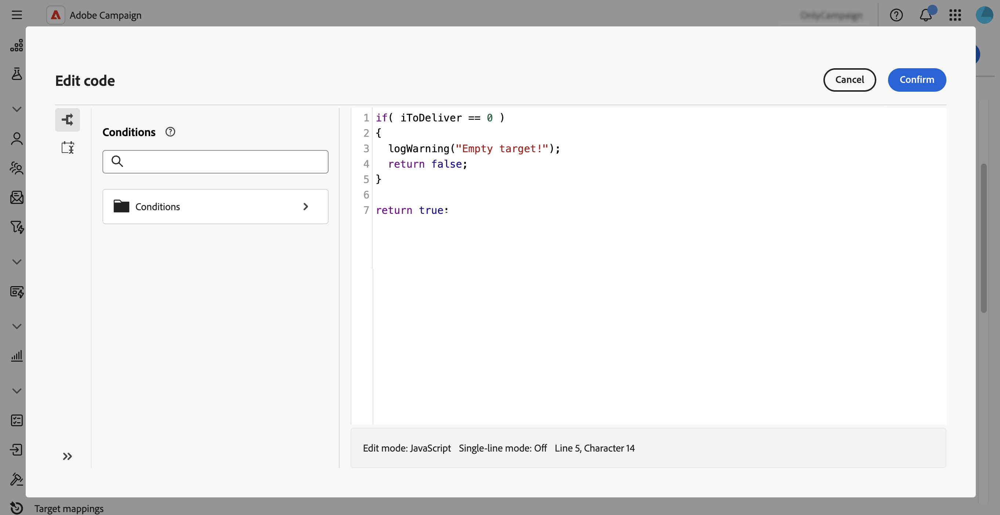

# Trabalhar com regras de negócios (tipologias) {#typologies}

>[!CONTEXTUALHELP]
>id="acw_homepage_welcome_rn4"
>title="Regras de negócios"
>abstract="Agora é possível criar tipologias e regras de tipologia na interface do Adobe Campaign Web. As tipologias permitem controlar, filtrar e priorizar o envio de entregas."
>additional-url="https://experienceleague.adobe.com/docs/campaign-web/v8/release-notes/release-notes.html?lang=pt-BR" text="Consulte as notas de versão"

>[!CONTEXTUALHELP]
>id="acw_business_rules"
>title="Tipologias e regras de tipologia"
>abstract="As tipologias permitem padronizar práticas comerciais em todas as entregas. Uma tipologia é uma coleção de regras de tipologia que permitem controlar, filtrar e priorizar o envio de entregas. Os perfis que correspondem aos critérios em uma regra de tipologia são excluídos dos públicos-alvo da entrega na fase de preparação."

>[!CONTEXTUALHELP]
>id="acw_business_rules_typology_rules_type"
>title="Filtragem"
>abstract=" Dois tipos de regras de tipologia estão disponíveis: as regras de   **controle** que garantem a qualidade e a validade da mensagem antes do envio, como, por exemplo: exibição de caracteres, comprimento de SMS, formato de endereço ou redução de URL. As regras de   **filtragem** que excluem segmentos do público-alvo com base em critérios específicos, como idade, local, país ou números de telefone. "

## Sobre tipologias

As tipologias permitem padronizar práticas comerciais em todas as entregas. Uma **tipologia** é uma coleção de **regras de tipologia** que permite controlar, filtrar e priorizar o envio de entregas. Os perfis que correspondem aos critérios em uma regra de tipologia são excluídos dos públicos-alvo da entrega na fase de preparação.

As tipologias garantem que seus deliveries sempre contenham determinados elementos, como um link de cancelamento de subscrição ou uma linha de assunto, ou regras de filtragem para excluir grupos do público-alvo pretendido, como clientes que não assinam, concorrentes ou clientes que não são de fidelidade.

As tipologias podem ser acessadas pelo menu **[!UICONTROL Administração]** > **[!UICONTROL Regras de negócio]**. Nessa tela, acesse todas as tipologias e regras de tipologia existentes ou crie novas com base nas suas necessidades.

>[!NOTE]
>
>A lista de **[!UICONTROL Regras de tipologia]** exibe todas as regras existentes criadas até o momento na Interface do Usuário da Web ou no Console do Cliente. Entretanto, somente as regras **Controle** e **Filtragem** podem ser criadas na Interface do Usuário da Web. Para criar outros tipos de regras de tipologia, como regras de Pressão ou Capacidade, use o console do cliente do Campaign v8. [Saiba como criar regras de tipologia no console do cliente](https://experienceleague.adobe.com/pt-br/docs/campaign/automation/campaign-optimization/campaign-typologies){target="_blank"}

As principais etapas para aplicar tipologias às suas mensagens são as seguintes:

1. [Criar uma tipologia](#typology).
1. [Criar regras de tipologia](#typology-rules).
1. [Regras de tipologia de referência na tipologia](#add-rules).
1. [Aplicar a tipologia a uma mensagem](#message).

## Criar uma tipologia {#typology}

>[!CONTEXTUALHELP]
>id="acw_business_rules_typology_properties"
>title="Propriedades de tipologia"
>abstract="Defina as propriedades da tipologia e expanda a seção **[!UICONTROL Opções adicionais]** para acessar as configurações avançadas. Use o campo **[!UICONTROL Afinidade de IP]** para associar afinidades de IP a tipologias. Isso permite controlar melhor o tráfego SMTP de saída, definindo quais endereços IP específicos podem ser usados para cada afinidade."

>[!CONTEXTUALHELP]
>id="acw_business_rules_typology_ip_affinity"
>title="Afinidade de IP"
>abstract="O gerenciamento de afinidades com endereços IP habilita um melhor controle do tráfego SMTP de saída, associando diferentes endereços IP a cada tipo de tráfego, dependendo da tipologia da ação de entrega."

Para criar uma tipologia, siga estas etapas:

1. Navegue até o menu **[!UICONTROL Regras de negócio]** e selecione a guia **[!UICONTROL Tipologia]**.

1. Clique no botão **[!UICONTROL Criar tipologia]** e digite um **[!UICONTROL Rótulo]** para a tipologia.

1. Expanda a seção **[!UICONTROL Opções adicionais]** para definir configurações avançadas, como o nome interno da tipologia, a pasta de armazenamento e a descrição.

   

   >[!NOTE]
   >
   >O campo **[!UICONTROL Afinidade de IP]** permite associar afinidades de IP a tipologias. Isso permite um melhor controle do tráfego SMTP de saída, definindo quais endereços IP específicos podem ser usados para cada afinidade. Você pode, por exemplo, usar uma afinidade por país ou subdomínio. Em seguida, é possível criar uma tipologia por país e vincular cada afinidade à tipologia correspondente.

1. Clique em **[!UICONTROL Criar]** para confirmar a criação da tipologia.

Os detalhes da tipologia são abertos. Nessa tela, faça referência direta às regras de tipologia existentes ou crie novas regras de tipologia para fazer referência posteriormente:
* [Saiba como criar uma regra de tipologia](#add-rules)
* [Saiba como fazer referência a regras em uma tipologia](#add-rules)

## Criar uma regra de tipologia {#typology-rule}

>[!CONTEXTUALHELP]
>id="acw_business_rules_typology_rules_properties"
>title="Propriedades da regra de tipologia"
>abstract="Defina as propriedades da regra de tipologia. As regras de **controle** analisam a qualidade e a validade da mensagem antes do envio, enquanto que as regras de **filtragem** excluem segmentos do público-alvo com base em critérios específicos.  Também é possível alterar a ordem de execução da regra para gerenciar a sequência em que as regras de tipologia serão executadas quando várias regras do mesmo tipo forem executadas durante a mesma fase de processamento de mensagens."

Para criar uma regra de tipologia, navegue até o menu **[!UICONTROL Regras de negócio]** e selecione a guia **[!UICONTROL Regras de tipologia]**.

Clique no botão **[!UICONTROL Criar regra de tipologia]** e siga as etapas detalhadas abaixo.

### Definir as propriedades da regra de tipologia {#properties}

Defina as propriedades da regra de tipologia:

1. Insira um **[!UICONTROL Rótulo]** para a regra.

   

1. Selecione o **[!UICONTROL Tipo]** da regra de tipologia:

   * **Controle**: garante a qualidade e a validade da mensagem pré-envio, como exibição de caracteres, comprimento de SMS, formato de endereço ou redução de URL. Essas regras são criadas usando uma interface de script para definir uma lógica complexa para verificações e modificações de conteúdo.

   * **Filtragem**: exclui segmentos do público-alvo com base em critérios específicos, como idade, local, país ou números de telefone. Essas regras estão vinculadas a uma targeting dimension.

   >[!NOTE]
   >
   >Atualmente, somente as regras de tipologia **Controle** e **Filtragem** podem ser criadas a partir da Interface do Usuário da Web. Para criar outros tipos de regras, use o Console do cliente. [Saiba como criar regras de tipologia no console do cliente](https://experienceleague.adobe.com/pt-br/docs/campaign/automation/campaign-optimization/campaign-typologies){target="_blank"}

1. Selecione um **[!UICONTROL Canal]** para associar à regra.

1. Desative a opção **[!UICONTROL Ativo]** se não quiser que a regra fique ativa imediatamente após sua criação.

1. Defina a **[!UICONTROL Ordem de execução]** da regra.

   Por padrão, a ordem das regras de tipologia é definida como 50. Adapte esse valor para gerenciar a sequência em que as regras de tipologia serão executadas quando várias regras do mesmo tipo forem executadas durante a mesma fase de processamento de mensagens. Por exemplo, uma regra de filtragem com uma ordem de execução de 20 é executada antes de uma regra de filtragem com uma ordem de execução de 30.

1. Expanda a seção **[!UICONTROL Opções adicionais]** para acessar configurações avançadas, como o nome interno da regra, o armazenamento da pasta e a descrição.

1. Para regras de controle, dois campos adicionais estão disponíveis nas opções adicionais. Especifique quando a regra deve ser aplicada e seu nível de alerta:

   * **[!UICONTROL Fase]**: especifique em qual ponto do ciclo de vida da entrega a regra será aplicada. Selecione o valor na lista suspensa **[!UICONTROL Fase]**. Expanda a seção abaixo para obter mais detalhes sobre os valores possíveis.

   +++Fases das regras de controle:

   **[!UICONTROL No início do direcionamento]**: impedir que a etapa de personalização seja executada em caso de erros.

   **[!UICONTROL Após o direcionamento]**: selecione esta fase se precisar saber o volume do destino para aplicar a regra de controle. Por exemplo, a regra de controle **[!UICONTROL Verificar tamanho da prova]** se aplica após cada estágio do targeting. Essa regra impede a personalização da mensagem se houver muitos recipients de prova.

   **[!UICONTROL No início da personalização]**: selecione essa fase se o controle envolver a aprovação da personalização da mensagem. A personalização da mensagem é realizada durante a fase de análise.

   **[!UICONTROL No final da análise]**: aplicar verificações que exigem a personalização completa da mensagem.

+++

   * **[!UICONTROL Nível]**: especifique o nível de alerta para a regra. Expanda a seção abaixo para obter mais informações.

   +++Níveis de regras de controle:

   **[!UICONTROL Erro]**: parar a preparação da mensagem.

   **[!UICONTROL Aviso]**: exibir um aviso nos logs de preparação.

   **[!UICONTROL Informações]**: exibir informações nos logs de preparação.

   **[!UICONTROL Detalhado]**: exibir informações nos logs do servidor.

+++

### Criar o conteúdo da regra {#build}

>[!CONTEXTUALHELP]
>id="acw_business_rules_typology_rules_filtering"
>title="Filtragem"
>abstract="As regras de **filtragem** excluem segmentos do público-alvo com base em critérios específicos, como idade, local, país ou números de telefone. Selecione a dimensão de direcionamento da regra de tipologia e clique em **[!UICONTROL Adicionar regras]** para acessar o modelador de consultas e criar a regra."

>[!CONTEXTUALHELP]
>id="acw_business_rules_typology_rules_code"
>title="Código"
>abstract="As regras de **controle** analisam a qualidade e a validade da mensagem antes do envio, tendo como exemplo: exibição de caracteres, comprimento do SMS, formato de endereço e redução de URL. Essas regras são criadas usando código JavaScript."

Depois que as propriedades da regra de tipologia forem definidas, crie o conteúdo da regra.

* Para **Regras de controle**, clique no botão **Editar código** e insira a lógica da regra usando o JavaScript. No exemplo abaixo, uma regra é criada para exibir um aviso nos logs se o target estiver vazio.

  

* Para **Regras de filtragem**, selecione a targeting dimension e clique no botão **[!UICONTROL Adicionar regras]** para definir os critérios de filtragem usando o [modelador de consultas](../query/query-modeler-overview.md).

  

Quando a regra estiver pronta, clique no botão **[!UICONTROL Criar]** para criar a regra de tipologia. Referencie a regra em uma tipologia para aplicá-la a mensagens.

## Regras de tipologia de referência em uma tipologia {#add-rules}

Para referenciar uma ou várias regras em uma tipologia, siga estas etapas:

1. Navegue até a guia **[!UICONTROL Tipologia]** e abra a tipologia onde deseja fazer referência à(s) regra(s).

1. Selecione a guia **[!UICONTROL Regras de tipologia]** e clique no botão **[!UICONTROL Adicionar regra de tipologia]**.

   

1. Selecione uma ou várias regras de tipologia para associar à tipologia e confirmar.

   

1. Clique em **[!UICONTROL Salvar]**.

Agora você pode aplicar a tipologia a mensagens. Depois de concluído, todas as regras de tipologia selecionadas serão executadas para executar as verificações definidas.

## Aplicar tipologias a mensagens {#message}

Para aplicar uma tipologia a uma mensagem ou a um template de mensagem, selecione a tipologia nas configurações de mensagem. [Saiba como definir as configurações de entrega](../advanced-settings/delivery-settings.md#typology)

Depois de aplicadas, as regras de tipologia incluídas na tipologia são executadas para verificar a validade do delivery durante a preparação da mensagem. Os perfis que correspondem aos critérios em uma regra de tipologia são excluídos dos públicos-alvo do delivery.