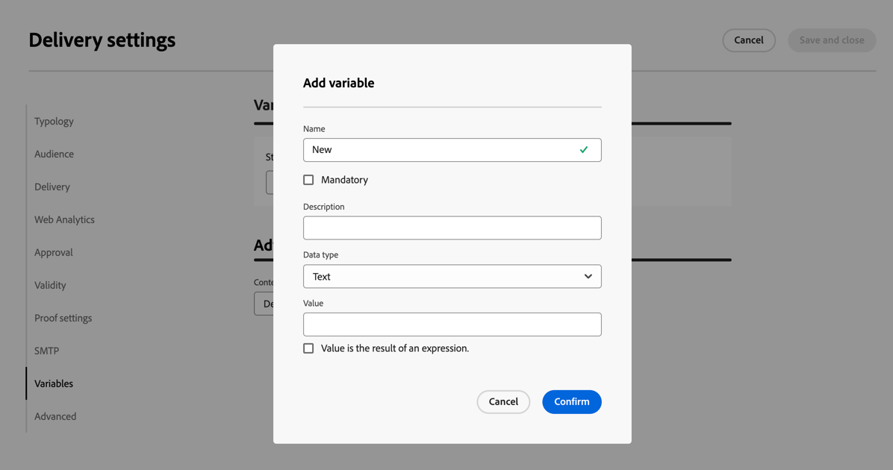

# Definir as configurações de entrega {#del-settings}

As configurações de entrega são **parâmetros técnicos de entrega** definidos no modelo de entrega. Eles podem ser sobrecarregados para cada delivery. Essas configurações estão disponíveis no botão **Configurações**, disponível ao editar uma entrega ou um modelo de entrega.

>[!CAUTION]
>
>Essas configurações estão descritas somente para suas informações. Algumas delas dependem de sua configuração e permissões. Elas não devem ser modificadas nesta versão do produto.

## Configurações de tipologia {#typology}

>[!CONTEXTUALHELP]
>id="acw_email_settings_typology"
>title="Tipologia"
>abstract="As regras de tipologia permitem que os profissionais de marketing padronizem práticas comerciais em todas as entregas. Uma tipologia é uma coleção de regras de tipologia que permitem controlar, filtrar e priorizar o envio de entregas. Os perfis que correspondem aos critérios em uma regra de tipologia são excluídos dos públicos-alvo da entrega na fase de preparação. As tipologias e regras de tipologia são criadas no Console do cliente do Campaign."

>[!CONTEXTUALHELP]
>id="acw_delivery_template_settings_typology"
>title="Configurações de tipologia para a entrega"
>abstract="As regras de tipologia permitem que os profissionais de marketing padronizem práticas comerciais em todas as entregas. Uma tipologia é uma coleção de regras de tipologia que permitem controlar, filtrar e priorizar o envio de entregas. Os perfis que correspondem aos critérios em uma regra de tipologia são excluídos dos públicos-alvo da entrega na fase de preparação. As tipologias e regras de tipologia são criadas no Console do cliente do Campaign."

As tipologias são conjuntos de **regras de tipologia** que são executadas durante a fase de preparação para aplicar facilmente várias regras de filtragem a uma entrega de uma vez. Elas permitem que os profissionais de marketing padronizem práticas comerciais em todas as entregas, pois possibilitam controlar, filtrar e priorizar o envio de entregas.

Ao associar uma tipologia a uma mensagem ou a um template de mensagem, as regras de tipologia incluídas na tipologia são executadas para verificar a validade do delivery durante a preparação da mensagem. Os perfis que correspondem aos critérios em uma regra de tipologia são excluídos dos públicos-alvo do delivery.

As tipologias permitem que você garanta que seus deliveries sempre contenham determinados elementos (como um link de unsubscription ou uma linha de assunto) ou regras de filtragem para excluir grupos do target pretendido (como unsubscribers, concorrentes ou clientes não fidelizados).

{zoomable="yes"}

>[!NOTE]
>
>As tipologias e regras de tipologia são criadas no console do cliente do Campaign. Saiba mais sobre as regras de pressão e como configurar o gerenciamento de fadiga na [documentação do Campaign v8 (console do cliente)](https://experienceleague.adobe.com/docs/campaign/automation/campaign-optimization/campaign-typologies.html?lang=pt-BR){target="_blank"}.

### Parâmetros de pressão {#pressure-parameters}

>[!CONTEXTUALHELP]
>id="acw_email_settings_pressure_parameters"
>title="Parâmetros de pressão da entrega"
>abstract="Os pesos das entregas permitem identificar entregas de alta prioridade dentro da estrutura do gerenciamento de fadiga. As mensagens com o peso mais alto têm prioridade."

>[!CONTEXTUALHELP]
>id="acw_delivery_template_settings_delivery_weight"
>title="Peso da entrega"
>abstract="Os pesos das entregas permitem identificar entregas de alta prioridade dentro da estrutura do gerenciamento de pressão. As mensagens com o peso mais alto têm prioridade."

Nesta seção, os parâmetros de pressão permitem definir um **limite** para configurar regras de gerenciamento de fadiga, que é o número máximo de mensagens que podem ser enviadas para um perfil em um determinado período.

Depois que esse limite for atingido, não poderá ocorrer mais entregas até o final do período considerado. Esse processo permite excluir automaticamente um perfil de uma entrega, caso uma mensagem exceder o limite definido, evitando assim um excesso de solicitações.

Os valores do limite podem ser constantes ou variáveis. Isso significa que, para um determinado período, os limites podem variar de um perfil para o outro, ou até mesmo para o mesmo perfil.

No campo **[!UICONTROL Tipo de peso]**, três opções estão disponíveis:

* **[!UICONTROL Constante]**
* **[!UICONTROL Depende do destinatário]**
* **[!UICONTROL Definido em cada regra]**

Use o campo **[!UICONTROL Peso da entrega]** para definir a prioridade de entrega. Cada entrega tem um peso que representa seu nível de prioridade. Por padrão, o peso de uma entrega é definido como 5. As regras de pressão permitem definir o peso das entregas às quais são aplicadas. Os pesos podem ser definidos ou calculados por meio de uma fórmula para se adequar aos destinatários. Por exemplo, você pode definir o peso de uma entrega com base nos interesses do destinatário.

Use o campo **[!UICONTROL Modo de entrega]** para selecionar o modo de avaliação de destino.

Três modos estão disponíveis:

* **[!UICONTROL Estimativa do público-alvo e personalização de mensagens]**
* **[!UICONTROL Estimativa e aprovação do público-alvo provisório]**
* **[!UICONTROL Avaliação de público-alvo]**

>[!NOTE]
>
>O gerenciamento de fadiga e as regras de pressão são configurados no console do cliente do Campaign. Saiba mais na [documentação do Campaign v8 (console do cliente)](https://experienceleague.adobe.com/docs/campaign/automation/campaign-optimization/pressure-rules.html?lang=pt-BR){target="_blank"}.

### Configurações de capacidade {#capacity-settings}

>[!CONTEXTUALHELP]
>id="acw_email_settings_capacity_settings"
>title="Configurações de capacidade da entrega"
>abstract="Antes de enviar mensagens, use regras de capacidade para garantir que sua organização possa processar a entrega, as mensagens de entrada que a entrega pode gerar e o número de chamadas a serem feitas para entrar em contato com assinantes, por exemplo. As regras de capacidade são definidas no Console do Adobe Campaign v8. Nesta tela, selecione uma regra associada ao canal."

>[!CONTEXTUALHELP]
>id="acw_delivery_template_settings_recipient_importance"
>title="Importância do destinatário"
>abstract="A importância do destinatário é uma fórmula usada para determinar quais perfis são mantidos quando as regras de tipologia de capacidade são excedidas."

Nesta seção, você pode selecionar uma regra de capacidade definida no console do Adobe Campaign v8. Essa regra está associada ao canal.

O campo **[!UICONTROL Importância do destinatário]** é uma fórmula usada para determinar quais perfis são mantidos quando as regras de tipologia de capacidade são excedidas.

>[!NOTE]
>
>As regras de tipologia são configuradas no console do cliente do Campaign. Saiba mais na [documentação do Campaign v8 (console do cliente)](https://experienceleague.adobe.com/docs/campaign/automation/campaign-optimization/consistency-rules.html?lang=pt-BR){target="_blank"}.

## Configurações de público-alvo {#audience}

>[!CONTEXTUALHELP]
>id="acw_email_settings_audience"
>title="Configurações do público-alvo da entrega"
>abstract="Selecione um **target mapping** entre os disponíveis. Os target mappings são definidos no console do Adobe Campaign v8. Também é possível definir os parâmetros de exclusão da entrega."

Nesta seção, você pode selecionar uma **mapeamento de público-alvo** entre aquelas disponíveis. Os target mappings são definidos no console do Adobe Campaign v8. O target mapping é o tipo de dados que uma operação está tratando. Ele permite definir a população direcionada: recipients, beneficiários de contrato, operadores, assinantes etc. [Saiba mais sobre os target mappings](../audience/targeting-dimensions.md).

No campo **[!UICONTROL Exclusão]**, você pode optar por excluir perfis que não desejam mais ser contatados ou que estão em quarentena. [Saiba mais](https://experienceleague.adobe.com/docs/campaign/campaign-v8/send/failures/quarantines.html){target="_blank"}

## Entrega {#delivery}

>[!CONTEXTUALHELP]
>id="acw_email_settings_delivery"
>title="Configurações da entrega"
>abstract="Os parâmetros de entrega são configurações técnicas que se aplicam à sua entrega. Você pode alterar os modos de entrega e rotina, ativar a cópia oculta (CCO) de email, enviar por meio de ondas, bem como escolher o formato das mensagens de email enviadas. Essas opções são restritas apenas a usuários especialistas."

Os parâmetros de **[!UICONTROL Entrega]** são configurações técnicas que se aplicam à sua entrega.

{zoomable="yes"}

A conta externa **[!UICONTROL Roteamento]** integrada é fornecida por padrão. Ela contém os parâmetros técnicos que permitem ao aplicativo enviar deliveries.

Você pode definir as configurações de **[!UICONTROL Envio]** abaixo.

* **[!UICONTROL Prioridade de entrega]**: use esta opção para alterar a ordem de envio das suas entregas definindo o nível de prioridade (normal, alto ou baixo).

* **[!UICONTROL Quantidade do lote de mensagens]**: use esta opção para definir o número de mensagens agrupadas no mesmo pacote de entrega XML. Se o parâmetro for definido como 0, as mensagens serão automaticamente agrupadas. O tamanho do pacote é definido pelo cálculo `<delivery size>/1024`, com no mínimo 8 e no máximo 256 mensagens por pacote.

  >[!IMPORTANT]
  >
  >Quando a entrega é criada duplicando uma existente, esse parâmetro é redefinido.

* **[!UICONTROL Testar entrega SMTP]** (canal de email): esta opção é usada para testar o envio via SMTP. O email é processado até a conexão com o servidor SMTP, mas não é enviado: para cada recipient do email, o Campaign se conecta ao servidor do provedor SMTP, executa o comando SMTP RCPT TO e fecha a conexão antes do comando SMTP DATA.

* **[!UICONTROL Email Cco]** (canal de email): esta opção é usada para armazenar emails em um sistema externo por meio do CCO simplesmente adicionando um endereço de email de CCO ao destino da sua mensagem. Saiba mais na [documentação do Campaign v8 (console do cliente)](https://experienceleague.adobe.com/docs/campaign/campaign-v8/send/emails/email-bcc.html){target="_blank"}.

Na seção **[!UICONTROL Wave definition]**, selecione a opção **[!UICONTROL Send using multiple waves]** para aumentar progressivamente o volume enviado usando ondas. Esse aumento evitará que sua mensagem seja marcada como spam ou pode ser usado quando você quiser restringir o número de mensagens diárias. Ao usar ondas, você pode dividir as entregas em vários lotes, em vez de enviar grandes volumes de mensagens ao mesmo tempo. [Saiba mais](send-using-waves.md)

Para emails, você também pode alterar os **[!UICONTROL formatos de email]** das mensagens enviadas conforme detalhado abaixo.

* **[!UICONTROL Usar preferências do destinatário]** (modo padrão): o formato do email é definido de acordo com os dados armazenados no perfil do destinatário. Se um recipient desejar receber emails em um determinado formato, esse será o formato enviado. Se o campo não estiver preenchido, um email multipart-alternative será enviado (veja abaixo).

* **[!UICONTROL Permitir que o cliente de email do destinatário escolha o formato mais apropriado]**: O email contém ambos os formatos: texto e HTML. O formato exibido no recebimento depende da configuração do software de email do destinatário (multipart-alternative).

  >[!IMPORTANT]
  >
  >Essa opção inclui ambas as versões do documento. Portanto, isso afeta a taxa de delivery, pois o tamanho do email é maior.

* **[!UICONTROL Enviar todas as mensagens no formato de texto]**: o email é enviado no formato de texto. O formato HTML não será enviado, mas usado somente para a mirror page quando o recipient clicar no email.

## Análise da web {#web-analytics}

>[!CONTEXTUALHELP]
>id="acw_email_settings_webanalytics"
>title="Configurações de análise da web da entrega"
>abstract="Selecione uma conta de análise da web. Essa conta é configurada no Console do cliente do Campaign. Também é possível definir as tags compartilhadas com a ferramenta de análise utilizada."

Nesta seção, você pode selecionar uma conta do Web Analytics. Essa conta é configurada no console do cliente do Campaign.

Também é possível definir as tags compartilhadas com a ferramenta de análise utilizada.

>[!NOTE]
>
>Os recursos do Web Analytics são configurados no console do Campaign Client. Saiba mais na [documentação do Campaign v8 (console do cliente)](https://experienceleague.adobe.com/docs/campaign/campaign-v8/connect/ac-aa.html#external-account-ac){target="_blank"}.

## Tentativas {#retries}

>[!CONTEXTUALHELP]
>id="acw_delivery_template_settings_retries"
>title="Número máximo de tentativas"
>abstract="Se uma mensagem falhar devido a um erro temporário, as tentativas serão executadas até o fim da duração da entrega."

<!--Currently not visible in UI > ??-->

As mensagens temporariamente não entregues devido a um erro Suave ou Ignorado estão sujeitas a uma repetição automática. Por padrão, cinco tentativas são agendadas para o primeiro dia do delivery com um intervalo mínimo de uma hora distribuída pelas 24 horas do dia.

## Aprovação (canal de email) {#approval}

>[!CONTEXTUALHELP]
>id="acw_email_settings_approval"
>title="Modo de aprovação da entrega"
>abstract="Selecione o modo de aprovação. Se os avisos forem gerados durante a preparação da entrega, você pode configurar a entrega para definir se ela ainda deverá ou não ser executada."

>[!CONTEXTUALHELP]
>id="acw_delivery_template_settings_approval"
>title="Modo de aprovação das entregas"
>abstract="Selecione o modo de aprovação para entregas com base neste modelo. Se os avisos forem gerados durante a preparação da entrega, você pode configurar a entrega para definir se ela ainda deverá ou não ser executada."

Se os avisos forem gerados durante uma preparação de delivery de email, você poderá configurar o delivery para definir se ele ainda deverá ou não ser executado. Por padrão, o usuário deve confirmar o envio de emails no final da fase de análise: esta é a validação **manual**.

Você pode selecionar outro modo de aprovação no campo apropriado. Os modos disponíveis são:

* **[!UICONTROL Manual]**: no final da fase de análise, o usuário deverá confirmar a entrega para começar a enviar.
* **[!UICONTROL Semiautomático]**: o envio começa automaticamente se a fase de análise não gerar mensagens de advertência.
* **[!UICONTROL Automático]**: o envio começa automaticamente no fim da fase de análise, independentemente do resultado.

## Validade {#validity}

>[!CONTEXTUALHELP]
>id="acw_email_settings_validity"
>title="Validade das configurações"
>abstract="O campo **Delivery duration** permite inserir o limite de novas tentativas de entrega globais. Isso significa que o Adobe Campaign envia as mensagens começando na data de início e, em seguida, para mensagens que retornam somente um erro, tentativas regulares e configuráveis são executadas até que o limite de validade seja atingido. O campo **Limite da validade dos recursos** é usado para recursos enviados por upload, como mirror page ou imagens. Quando o limite for atingido, os recursos não estarão mais disponíveis."

>[!CONTEXTUALHELP]
>id="acw_delivery_template_settings_resources_validity"
>title="Limite da validade de recursos"
>abstract="O campo **Limite da validade dos recursos** é usado para recursos enviados por upload, como a mirror page ou imagens. Esses recursos são válidos por um tempo limitado: quando o limite é atingido, os recursos não estarão mais disponíveis."

>[!CONTEXTUALHELP]
>id="acw_delivery_template_settings_delivery_duration"
>title="Duração da entrega"
>abstract="O campo **Delivery duration** permite inserir o limite de novas tentativas de entrega globais. Isso significa que o Adobe Campaign envia as mensagens começando na data de início e, em seguida, para mensagens que retornam somente um erro, tentativas regulares e configuráveis são executadas até que o limite de validade seja atingido."

<!--
>[!CONTEXTUALHELP]
>id="acw_email_settings_resources_validity"
>title="Resources validity limit"
>abstract="The Validity limit field is used for uploaded resources, such as the mirror page or images. These resources are valid for a limited time: once the limit is reached, resources are no longer available."
-->

### Período de validade {#validity-period}

O campo **[!UICONTROL Delivery duration]** permite inserir o limite de novas tentativas de entrega globais. Isso significa que o Adobe Campaign envia as mensagens começando na data de início e, em seguida, para mensagens que retornam somente um erro, tentativas regulares e configuráveis são executadas até que o limite de validade seja atingido.

Você também poderá optar por especificar datas. Para fazer isso, selecione **[!UICONTROL Explicitly set validity dates]**. Nesse caso, as datas de entrega e limite de validade também permitem especificar o tempo. O tempo atual é usado por padrão, mas você poderá modificar isso diretamente no campo de entrada.

O **[!UICONTROL limite da validade de recursos]** é usado para recursos carregados, principalmente para mirror pages e imagens. Os recursos dessa página são válidos por um tempo limitado (para economizar espaço em disco). Após esse limite, esses recursos não estarão mais disponíveis.

{zoomable="yes"}

<!--Change screenshot to be consistent with prod > not sure which version is correct-->

Saiba mais sobre o período de validade da entrega na [documentação do Campaign v8 (console do cliente)](https://experienceleague.adobe.com/docs/campaign/campaign-v8/campaigns/send/failures/delivery-failures.html?lang=pt-BR#validity-period){target="_blank"}.

### Gerenciamento de mirror page (canal de email) {#mirror}

A mirror page é uma página HTML acessível online através de um navegador da Web. Seu conteúdo é idêntico ao email. Por padrão, a mirror page é gerada se o link for inserido no conteúdo do email.

Além do modo padrão, as seguintes opções também estão disponíveis:

* **[!UICONTROL Forçar a geração da mirror page]**: use este modo para gerar a mirror page mesmo se nenhum link para a mirror page for inserido no email.
* **[!UICONTROL Não gerar a mirror page]**: use esse modo para evitar a geração de uma mirror page, mesmo se o link estiver presente no email.
* **[!UICONTROL Gera uma mirror page acessível somente por meio do identificador de mensagem]**: quando o link de mirror page não está presente no conteúdo do email, use esta opção para habilitar o acesso ao conteúdo da mirror page, na janela de log de entrega, no console do cliente.

### Rastreamento {#tracking}

<!--
>[!CONTEXTUALHELP]
>id="acw_email_settings_tracking_validity"
>title="Validity period"
>abstract="This option defines the duration for which the tracking is activated on the URLs."
-->

>[!CONTEXTUALHELP]
>id="acw_delivery_template_settings_tracking_validity"
>title="Período de validade"
>abstract="O período de validade define a duração para a qual o rastreamento estará ativado nos URLs da mensagem."

Os parâmetros **[!UICONTROL Tracking]** são definidos na seção relacionada. As opções possíveis são:

* **[!UICONTROL Limite da validade de rastreamento]**: use esta opção para alterar a duração para a qual o rastreamento é ativado nas URLs.
* **[!UICONTROL URL de substituição para URLs expirados]**: use esta opção para inserir uma URL para uma página da Web de fallback: ela será exibida após a expiração do rastreamento.

## Configurações de prova {#test-setttings}

>[!CONTEXTUALHELP]
>id="acw_email_settings_testsettings"
>title="Definir as configurações de prova para a entrega"
>abstract="Selecione os parâmetros de exclusão e personalize o rótulo das provas."

<!--Test to be replaced with Proof everywhere - currently not consistent within UI > changed to Proof to reflect UI here but not consistent in documentation either-->

Você pode definir os parâmetros de exclusão nesta seção. As opções disponíveis são:

* **[!UICONTROL Keep doubles]** permite autorizar várias entregas a perfis que atendem a vários critérios de direcionamento.
* **[!UICONTROL Manter endereços incluídos na lista de bloqueios]** permite manter do público-alvo os perfis que não estão mais sendo direcionados para entrega, como após um cancelamento de subscrição (opt-out).
* **[!UICONTROL Manter endereços na quarentena]** permite excluir do público-alvo qualquer perfil com endereço que não responda.

Você também pode personalizar o rótulo das provas:

* Use o **[!UICONTROL Manter o código de entrega da prova]** para associar à prova o mesmo código de entrega que o definido para a entrega com a qual ela está relacionada.
* Por padrão, o assunto da prova tem o prefixo &#39;PROOF #&#39;, onde # é o número da prova. É possível alterar esse prefixo no campo **[!UICONTROL Rotular prefixo]**.

## Configurações SMTP para entrega de email {#smtp}

>[!CONTEXTUALHELP]
>id="acw_email_settings_smtp"
>title="Parâmetros SMTP"
>abstract="Você pode adicionar parâmetros SMTP adicionais ao seu delivery de email."

Você pode adicionar parâmetros SMTP adicionais ao seu delivery de email. Você pode fazer isso na guia SMTP das configurações de delivery.

{zoomable="yes"}

### Codificação de caracteres {#character-encoding}

A seção **[!UICONTROL Codificação de caractere]** permite definir uma codificação específica. A codificação padrão é UTF-8, que funciona para a maioria dos caracteres. No entanto, alguns provedores de email podem não exibir caracteres especiais corretamente se não oferecerem suporte à codificação padrão UTF-8.

Por exemplo, se você quiser enviar um email com caracteres japoneses, é melhor usar uma codificação que ofereça suporte especificamente a esses caracteres, para que o público-alvo no Japão possa ver tudo corretamente.

Para fazer isso, ative a opção **[!UICONTROL Forçar a codificação usada para mensagens]** e selecione a codificação correta na lista que suporta seus caracteres especiais.

{zoomable="yes"}

### Rejeitar emails {#bounce-emails}

A guia **[!UICONTROL SMTP]** das configurações de entrega também permite configurar a gestão de emails devolvidos.

* **[!UICONTROL Endereço para erros]**: se você ativar a opção **[!UICONTROL Usar o endereço de erro padrão definido para a plataforma]**, os emails devolvidos serão recebidos na caixa de erro padrão da plataforma. Se não ativá-lo, você poderá definir um endereço de erro específico para o delivery.

* **[!UICONTROL Endereço de devolução]**: você também pode definir outro endereço para o qual os emails devolvidos não processados serão encaminhados. Esse endereço permite investigar os motivos para a rejeição quando os emails não puderam ser qualificados automaticamente pelo aplicativo.

Esses dois campos podem ser personalizados conforme descrito em [esta seção](../personalization/gs-personalization.md).

{zoomable="yes"}

### Cabeçalhos SMTP adicionais {#smtp-headers}

Você pode adicionar **[!UICONTROL cabeçalhos SMTP]** à sua entrega de email, na guia SMTP das configurações de entrega.

O script inserido nessa janela deve referenciar um cabeçalho por linha no seguinte formulário: name:value.

Os valores são codificados automaticamente se necessário.

{zoomable="yes"}

>[!IMPORTANT]
>
>Adicionar um script para inserir cabeçalhos SMTP adicionais é apenas para usuários avançados. A sintaxe desse script deve estar em conformidade com os requisitos desse tipo de conteúdo: não há espaço não utilizado, nenhuma linha vazia etc.

## Adição de variáveis {#variables-delivery}

>[!CONTEXTUALHELP]
>id="acw_delivery_settings_variable"
>title="Variáveis"
>abstract="Você pode adicionar variáveis ao seu delivery, o que pode ser útil para rastreamento e personalização. Essas variáveis podem ser acessadas no conteúdo do delivery e nos fluxos de trabalho."

Você pode adicionar variáveis ao seu delivery, o que pode ser útil para rastreamento e personalização. Essas variáveis podem ser acessadas no conteúdo do delivery e nos fluxos de trabalho.

Para adicionar uma variável, navegue até a guia **[!UICONTROL Variáveis]**, conforme mostrado abaixo.

{zoomable="yes"}

Clique no botão **[!UICONTROL Adicionar variáveis]** para inserir os detalhes da variável e clique em **[!UICONTROL Confirmar]** para salvar as alterações.

{zoomable="yes"}
