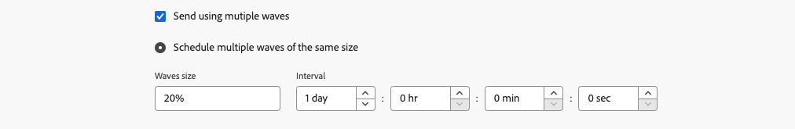

# Enviar usando ondas {#send-using-waves}

>[!CONTEXTUALHELP]
>id="acw_deliveries_waves_definition"
>title="Divida as entregas em vários lotes"
>abstract="Em vez de enviar grandes volumes de mensagens ao mesmo tempo, defina ondas para dividir as entregas em vários lotes. Você pode configurar várias ondas do mesmo tamanho ou definir um calendário para o envio de diferentes ondas."

>[!CONTEXTUALHELP]
>id="acw_deliveries_waves_size"
>title="Defina o tamanho de cada onda"
>abstract="Você deve inserir um tamanho para todas as ondas que estiver adicionando. Insira um valor numérico (número de mensagens para cada onda) ou uma porcentagem (0-100%)."

Para equilibrar a carga, você pode dividir deliveries de email em vários lotes. Configure o número de lotes e sua proporção com relação ao delivery inteiro, bem como o intervalo entre duas ondas.

>[!NOTE]
>
>Você só poderá definir o tamanho e o atraso entre duas ondas consecutivas. Os critérios de seleção de recipient para cada onda não podem ser ajustados.

Para enviar deliveries usando ondas, siga as etapas abaixo.

1. Abra as [configurações de entrega](delivery-settings.md#retries).

1. Navegue até a seção **[!UICONTROL Entrega]**.

1. Selecione a opção **[!UICONTROL Enviar usando várias ondas]**.

1. Para configurar ondas, você pode:

   * [Agendar várias ondas do mesmo tamanho](#waves-same-size)
   * [Agendar ondas de acordo com um calendário](#waves-calendar)

1. Prepare e envie seu delivery como de costume. [Saiba mais](../msg/gs-deliveries.md)

   >[!CAUTION]
   >
   >Certifique-se de que as últimas ondas não excedam o prazo do delivery, definido na guia [Validity](delivery-settings.md#validity), caso contrário, algumas mensagens podem não ser enviadas. Uma regra de controle de tipologia específica, **[!UICONTROL Wave scheduling check]**, garante que a última onda seja planejada antes do limite da validade da entrega. Saiba mais sobre regras de controle na [documentação do Campaign v8 (console do cliente)](https://experienceleague.adobe.com/docs/campaign/automation/campaign-optimization/control-rules.html?lang=pt-BR).
   >
   >Você também deverá permitir tempo suficiente para novas tentativas ao configurar as últimas ondas. [Saiba mais](delivery-settings.md#retries)

1. Para monitorar seus envios, vá para os [logs do delivery](../monitor/delivery-logs.md). Você pode ver as entregas que já foram enviadas nas ondas processadas (status **[!UICONTROL Sent]**) e as entregas a serem enviadas nas ondas restantes (status **[!UICONTROL Pending]**).

## Agendar várias ondas do mesmo tamanho {#waves-same-size}

Se você selecionar essa opção, todas as ondas terão o mesmo tamanho (exceto a última) e o atraso entre cada onda será sempre o mesmo.

{zoomable="yes"}

* Especifique o tamanho de todas as ondas nas quais você está dividindo o delivery. Você pode inserir uma porcentagem ou um valor numérico. Somente a última onda pode variar de tamanho, pois deve incluir o número restante de mensagens.

  Por exemplo, se você inserir **[!UICONTROL 30%]** no campo **[!UICONTROL Tamanho das ondas]**, as três primeiras ondas representarão 30% de todas as mensagens incluídas no delivery, e a quarta representará os 10% restantes.

* Na seção **[!UICONTROL Interval]**, especifique o atraso entre o início de duas ondas consecutivas. Por exemplo, se você inserir **[!UICONTROL 2 dias]**, a primeira onda começará imediatamente, a segunda onda começará em dois dias, a terceira onda em quatro dias e assim por diante.

Um caso de uso comum para usar várias ondas do mesmo tamanho é com uma central de atendimento envolvida. Ao gerenciar uma campanha de fidelidade por telefone, sua organização tem uma capacidade limitada para processar o número de chamadas para contatar os assinantes.

Usando ondas, você poderá restringir o número de mensagens a 20 por dia, que é a capacidade diária de processamento de uma central de atendimento.

Para fazer isso, selecione a opção **[!UICONTROL Schedule multiple waves of the same size]**. Insira **[!UICONTROL 20]** como o tamanho das ondas e **[!UICONTROL 1 dia]** no campo **[!UICONTROL Intervalo]**.

{zoomable="yes"}

## Agendar ondas de acordo com um calendário {#waves-calendar}

Se você selecionar essa opção, será necessário definir o dia/hora de início de cada onda enviada, bem como o tamanho de cada onda.

* Nos campos **[!UICONTROL Start]**, especifique o atraso entre o início de duas ondas consecutivas.

* Na coluna **[!UICONTROL Size]**, insira um número fixo ou uma porcentagem.

Adicione quantas ondas desejar. Você pode reorganizá-los de acordo com suas necessidades.

>[!NOTE]
>
>Se você estiver usando porcentagens, o total de todas as ondas não deverá exceder 100%.

No exemplo abaixo, a primeira onda representa 25% do número total de mensagens incluídas no delivery e começa imediatamente. As próximas duas ondas completam a entrega e são definidas para começar em intervalos de seis horas.

{zoomable="yes"}

Um caso de uso comum para usar várias ondas de acordo com um calendário é durante o processo de aumento.

Quando os emails são enviados usando uma nova plataforma, os provedores de serviços de Internet (ISPs) suspeitam de endereços IP que não são reconhecidos. Se grandes volumes de emails forem enviados repentinamente, os ISPs freqüentemente os marcam como spam.

Para evitar ser marcado como spam, você poderá aumentar progressivamente o volume enviado usando ondas. Isso deve garantir o desenvolvimento suave da fase de inicialização e permitir que você reduza a taxa geral de endereços inválidos.

Para fazer isso, use a opção **[!UICONTROL Schedule waves according to a calendar]**. Por exemplo, defina a primeira onda para 10%, a segunda para 15%, a terceira para 20% e assim por diante.

{zoomable="yes"}
