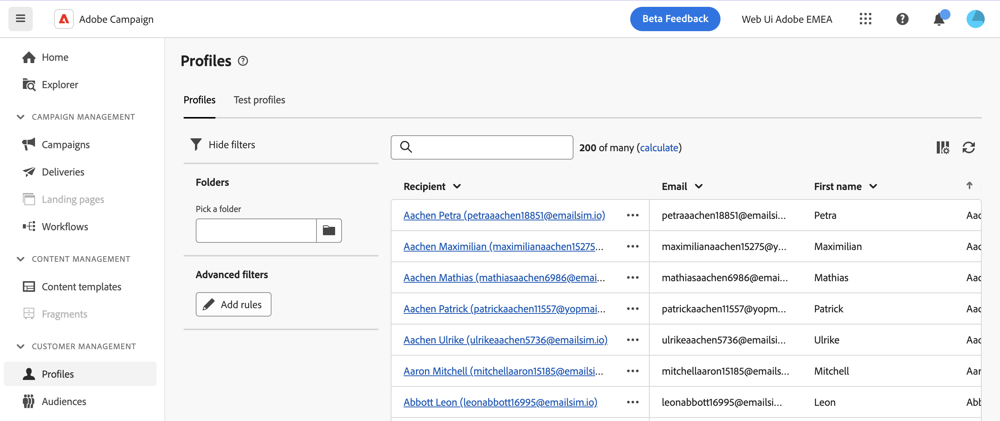
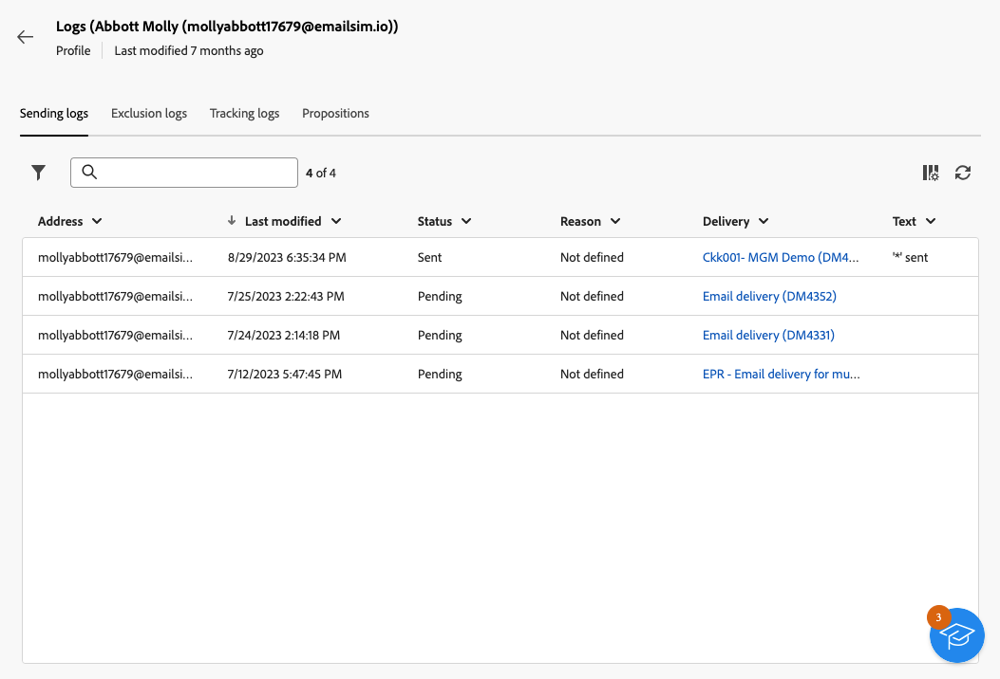

# Monitorar e editar perfis {#profiles}

>[!CONTEXTUALHELP]
>id="acw_homepage_rn4"
>title="Visualização 360 dos seus perfis"
>abstract="Crie novos perfis e monitore-os com ferramentas e relatórios avançados. Acesse os atributos, as interações e os logs dos perfis. Use as opções de filtro para navegar na lista de perfis, editar e atualizar seus perfis."
>additional-url="https://experienceleague.adobe.com/docs/campaign-web/v8/whats-new.html" text="Consulte as notas de versão"

>[!CONTEXTUALHELP]
>id="acw_recipients_list"
>title="Perfis"
>abstract="Um perfil é um indivíduo selecionado para receber mensagens enviadas pelo Adobe Campaign. Nessa lista, é possível visualizar os detalhes dos perfis com base nas suas permissões. Use as opções de filtro para navegar nesta lista. É possível editar e atualizar um pequeno conjunto de atributos de seus perfis."

## Introdução a perfis {#gs}

Um perfil na Adobe Campaign Web é um indivíduo armazenado no banco de dados, atuando como um componente chave para criar públicos-alvo para deliveries e adicionar dados de personalização ao seu conteúdo.

Outros tipos de perfis são armazenados no banco de dados, como **[!UICONTROL Perfis de teste]**, que são projetados para testar seus deliveries antes que sejam enviados ao público final. [Saiba como trabalhar com perfis de teste](test-profiles.md)

Os perfis podem ser criados somente no console do cliente do Adobe Campaign - [saiba como](https://experienceleague.adobe.com/docs/campaign/campaign-v8/audience/add-profiles/create-profiles.html){target="_blank"}. No entanto, elas podem ser acessadas e editadas no Adobe Campaign Web pelo **[!UICONTROL Gerenciamento de clientes]** > **Perfis** no painel de navegação esquerdo.

>[!NOTE]
>
>Dependendo das suas permissões, talvez você não tenha acesso à lista completa de perfis armazenados no banco de dados. Saiba mais sobre permissões [nesta seção](../get-started/permissions.md).

* É possível filtrar a variável **[!UICONTROL Perfis]** usando o campo de pesquisa ou os filtros disponíveis no **Mostrar filtros** botão. É possível restringir os resultados a um [pasta](../get-started/permissions.md#folders) usando a lista suspensa ou adicione regras usando o [modelador de consultas](../query/query-modeler-overview.md).

  

* Para excluir um perfil, selecione a opção correspondente na **[!UICONTROL Mais ações]** menu.

* Para editar um perfil, clique no item desejado na lista. [Saiba mais](#access)

Também é possível acessar os perfis por meio da **[!UICONTROL Explorer]** exibir, no **[!UICONTROL Perfis e destinos]** > **[!UICONTROL Destinatários]** nó.

Ali é possível navegar, criar e gerenciar pastas ou subpastas, bem como verificar permissões associadas. [Saiba como criar pastas](../get-started/permissions.md#folders)

No **[!UICONTROL Explorer]** visualização você também pode filtrar, excluir e [editar](#access) perfis.

## Acessar e editar atributos dos perfis {#access}

>[!CONTEXTUALHELP]
>id="acw_recipients_creation_details"
>title="Detalhes básicos"
>abstract="Esta seção oferece insights sobre os detalhes básicos do perfil. Para modificar qualquer informação, faça as alterações diretamente no respectivo campo e clique no **Salvar** localizado no canto superior direito da tela."

>[!CONTEXTUALHELP]
>id="acw_recipients_creation_contactinformation"
>title="Informações de contato"
>abstract="Esta seção oferece insights sobre as informações de contato do perfil. Para modificar qualquer informação, faça as alterações diretamente no respectivo campo e clique no **Salvar** localizado no canto superior direito da tela."

>[!CONTEXTUALHELP]
>id="acw_recipients_creation_address"
>title="Endereço"
>abstract="Esta seção oferece informações sobre o endereço postal do perfil e a qualidade do endereço. Para modificar qualquer informação, faça as alterações diretamente no respectivo campo e clique no **Salvar** localizado no canto superior direito da tela."

>[!CONTEXTUALHELP]
>id="acw_recipients_creation_account"
>title="Detalhes da conta"
>abstract="Esta seção oferece insights sobre os detalhes da conta do perfil. Para modificar qualquer informação, faça as alterações diretamente no respectivo campo e clique no **Salvar** localizado no canto superior direito da tela."

>[!CONTEXTUALHELP]
>id="acw_recipients_creation_nolongercontact"
>title="Destinatários Não contatar mais"
>abstract="Esta seção oferece informações sobre as preferências de contato do perfil. Para modificar qualquer informação, faça as alterações diretamente no respectivo campo e clique no **Salvar** localizado no canto superior direito da tela."

>[!CONTEXTUALHELP]
>id="acw_recipients_creation_customfields"
>title="Campos personalizados"
>abstract="Os campos personalizados são atributos específicos adaptados às suas necessidades que foram configuradas para sua instância. Para modificar qualquer informação, faça as alterações diretamente no respectivo campo e clique no **Salvar** localizado no canto superior direito da tela."

>[!CONTEXTUALHELP]
>id="acw_recipients_creation_othersfields"
>title="Outros"
>abstract="Esta seção fornece atributos incorporados adicionais. Para modificar qualquer informação, faça as alterações diretamente no respectivo campo e clique no **Salvar** localizado no canto superior direito da tela."

>[!CONTEXTUALHELP]
>id="acw_recipients_subscription_list"
>title="Lista de assinaturas dos destinatários"
>abstract="Esta guia lista todos os serviços que o perfil assinou."

Para acessar os detalhes de um perfil e editá-los, siga as etapas abaixo.

1. Navegue até **[!UICONTROL Gerenciamento de clientes]** > **[!UICONTROL Perfis]**.

1. Clique no item desejado na guia **[!UICONTROL Perfis]** lista. As informações detalhadas sobre o perfil são exibidas.

   

1. A variável **[!UICONTROL Detalhes]** permite navegar pelos atributos incorporados e personalizados do perfil. Para editar um atributo, faça as alterações no campo desejado e clique no **[!UICONTROL Salvar]** botão.

   1. Por padrão, os perfis são armazenados no **[!UICONTROL Destinatários]** pasta. Você pode alterá-la navegando até o local desejado. [Saiba como trabalhar com pastas](../get-started/permissions.md#folders)

      

   1. No **[!UICONTROL Informações de contato]** é possível atualizar o endereço de email e outros dados relevantes. O endereço de email é exibido entre colchetes após o rótulo do perfil.

      

   1. Verifique a **[!UICONTROL Não contatar mais]** opções e atualizá-las, se necessário. Quando qualquer uma dessas opções for selecionada, o perfil estará em incluir na lista de bloqueios. Essas informações serão adicionadas aos dados de contato se o recipient clicar em um link de cancelamento de subscrição em um boletim informativo, por exemplo. Esse recipient não é mais direcionado para os canais selecionados. [Saiba mais](https://experienceleague.adobe.com/docs/campaign/campaign-v8/send/failures/quarantines.html){target="_blank"}

      

   1. Se houver **[!UICONTROL Campos personalizados]**, você poderá atualizar os valores conforme necessário. Os campos personalizados são atributos adicionais adicionados à **[!UICONTROL Perfis]** esquema por meio do console Adobe Campaign. [Saiba mais](https://experienceleague.adobe.com/docs/campaign/campaign-v8/developer/shemas-forms/extend-schema.html){target="_blank"}

      

1. Clique em **[!UICONTROL Assinaturas]** para acessar informações sobre os serviços aos quais o perfil está inscrito. [Saiba como trabalhar com serviços de assinatura](manage-services.md)

1. Clique em **[!UICONTROL Logs]** botão localizado no canto superior direito da tela para exibir o histórico das interações do perfil por meio de envio, exclusão e logs de rastreamento, bem como as ofertas apresentadas ao perfil. [Saiba mais sobre logs do delivery](../monitor/delivery-logs.md)

   
