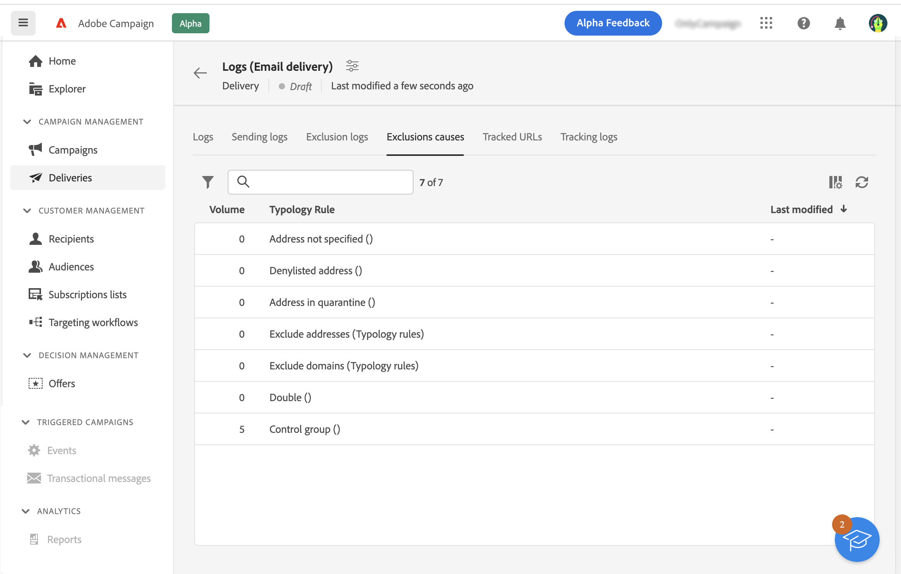

# Definir um grupo de controle {#control-group}

Você pode usar grupos de controle para evitar o envio de mensagens para uma parte do público para medir o impacto das campanhas.

Para fazer isso, crie um grupo de controle ao definir o público do delivery. Perfis são adicionados ao grupo de controle aleatoriamente, filtrados ou não, ou baseados em critérios. Você pode então comparar o comportamento da população do target que recebeu a mensagem com o comportamento dos contatos que não foram direcionados.

O grupo de controle pode ser extraído do público-alvo principal e/ou vir de uma população específica. Consequentemente, há duas maneiras principais de definir um grupo de controle:

* Extrair vários perfis do público-alvo principal.
* Excluir alguns perfis com base em critérios definidos em uma query.

Você pode usar ambos os métodos ao definir um grupo de controle.

Todos os perfis que fazem parte do grupo de controle na etapa de preparação do delivery são removidos do público-alvo principal. Eles não recebem a mensagem.

Para criar um grupo de controle, clique no botão **[!UICONTROL Definir Grupo de Controle]** botão , do **Público** seção do assistente de criação de delivery.

## Extrair do público-alvo {#extract-target}

>[!CONTEXTUALHELP]
>id="acw_deliveries_email_controlgroup_target"
>title="Extrair do público-alvo"
>abstract="Para definir um grupo de controle, você pode optar por extrair, aleatoriamente ou com base em uma classificação, uma porcentagem ou um número fixo de perfis da população do público-alvo."

Para definir um grupo de controle, você pode optar por extrair, aleatoriamente ou com base em uma classificação, uma porcentagem ou um número fixo de perfis da população do público-alvo.

Primeiro, defina como os perfis são extraídos do público-alvo: aleatoriamente ou com base em uma classificação.

Em **Extrair do destino** escolha uma **Tipo de exclusão**:

* **Random**: ao preparar o delivery, o Adobe Campaign extrai aleatoriamente um número de perfis correspondente à porcentagem ou ao número máximo definido como o limite de tamanho.

   

* **Classificado por atributo(s)**: essa opção permite excluir um conjunto de perfis com base em atributos específicos em uma ordem de classificação específica.

   

Em seguida, defina a variável **Limite de tamanho**: você deve definir como limitar o número de perfis extraídos do público-alvo principal.

**Exemplo**

Você pode visualizar os logs para verificar e identificar os perfis excluídos. Vejamos o exemplo de uma exclusão aleatória em cinco perfis.

Após a preparação do delivery, é possível exibir as exclusões nas seguintes telas:

* O **Para excluir** KPI no painel do delivery, antes do envio.

   

* O **Logs de exclusão** exibir cada perfil e a exclusão relacionada **Motivo**.

   

* O **Causas da exclusão** exibir o número de perfis excluídos para cada regra de tipologia.

   

Para obter mais informações sobre logs do delivery, consulte esta seção [seção](../monitor/delivery-logs.md).

## População extra {#extra-population}

>[!CONTEXTUALHELP]
>id="acw_deliveries_email_controlgroup_extra"
>title="População extra"
>abstract="Outra maneira de definir um grupo de controle é excluir uma população específica do público-alvo usando um público-alvo existente ou definindo um query."

Outra maneira de definir um grupo de controle é excluir uma população específica do público-alvo usando um público-alvo existente ou definindo um query.

No **População extra** da seção **Grupo de controle** na tela de definição, clique no botão **[!UICONTROL Selecionar público-alvo]** botão.

* Para usar um público-alvo existente, clique em **Seleção do público-alvo**. Consulte esta [seção](add-audience.md).

* Para definir uma nova consulta, selecione **Crie seu próprio** e defina os critérios de exclusão usando o construtor de regras. Consulte esta [seção](segment-builder.md).

Os perfis incluídos no público-alvo ou que correspondem ao resultado do query são excluídos do público-alvo.