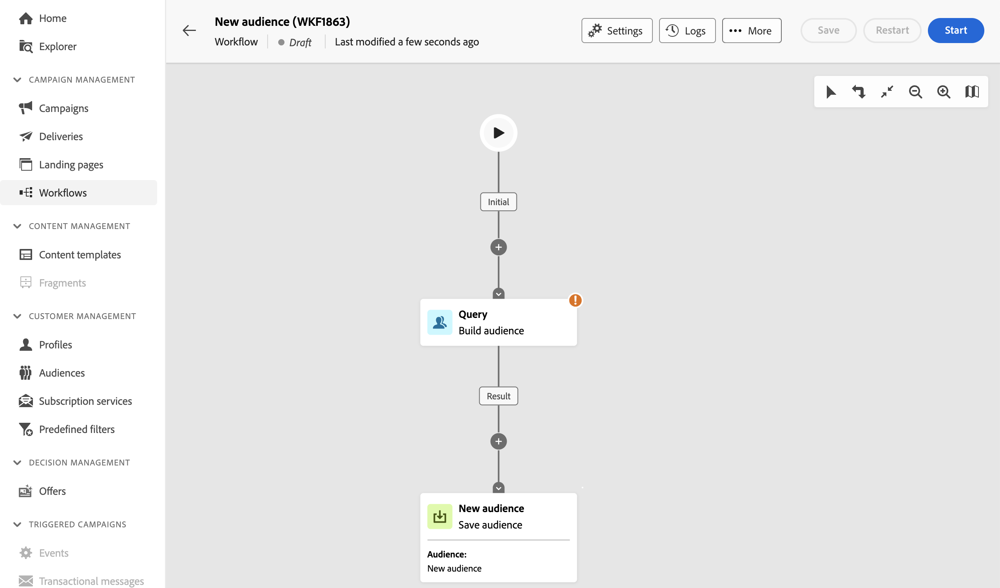
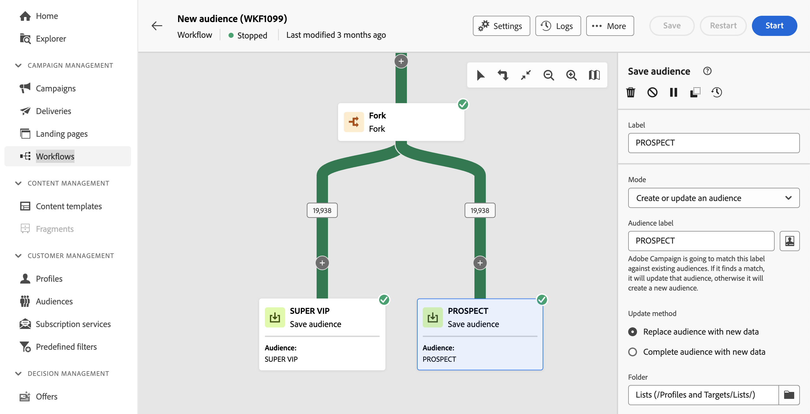

# Criar públicos-alvo {#create-audiences}

>[!CONTEXTUALHELP]
>id="acw_homepage_welcome_rn1"
>title="Composição de público-alvo"
>abstract="Crie novos públicos-alvo em uma tela de fluxo de trabalho intuitiva. Além de criar um público-alvo simples do zero, você também pode aproveitar as atividades do fluxo de trabalho para refinar seu público-alvo. Combine vários públicos-alvo em um único público-alvo, enriqueça-o com atributos externos ou divida-o em vários públicos-alvo com base em regras de sua escolha."
>additional-url="https://experienceleague.adobe.com/docs/campaign-web/v8/whats-new.html?lang=pt-BR" text="Consulte as notas de versão"

<!--TO REMOVE BELOW-->

>[!CONTEXTUALHELP]
>id="acw_homepage_rn1"
>title="Composição de público-alvo"
>abstract="Crie novos públicos-alvo em uma tela de fluxo de trabalho intuitiva. Além de criar um público-alvo simples do zero, você também pode aproveitar as atividades do fluxo de trabalho para refinar seu público-alvo. Combine vários públicos-alvo em um único público-alvo, enriqueça-o com atributos externos ou divida-o em vários públicos-alvo com base em regras de sua escolha."
>additional-url="https://experienceleague.adobe.com/docs/campaign-web/v8/whats-new.html?lang=pt-BR" text="Consulte as notas de versão"

<!--TO REMOVE ABOVE-->

>[!CONTEXTUALHELP]
>id="acw_audiences_list"
>title="Públicos-alvo"
>abstract="Nessa tela, é possível acessar a lista de todos os públicos-alvo que podem ser direcionados em suas entregas. Clique em **Criar** para criar novos públicos-alvo em uma tela visual usando várias atividades de fluxo de trabalho, como **Dividir** ou **Excluir**."

>[!CONTEXTUALHELP]
>id="acw_audiences_create_settings"
>title="Configurações de público-alvo"
>abstract="Insira o nome do público-alvo e as opções adicionais, e clique no botão **Criar público-alvo**."

O Campaign Web permite criar novos públicos-alvo em uma tela de fluxo de trabalho visual. Além de criar um público-alvo simples do zero, você também pode aproveitar as atividades do fluxo de trabalho para refinar seu público-alvo. Por exemplo, você pode combinar vários públicos-alvo em um único, enriquecer o público-alvo com atributos externos ou dividi-lo em vários públicos-alvo com base em regras de sua escolha.

Depois de criar o fluxo de trabalho, os públicos resultantes são automaticamente armazenados no banco de dados do Campaign junto com os existentes. Esses públicos-alvo podem ser direcionados em workflows ou deliveries independentes.

➡️ [Descubra este recurso no vídeo](#video)

## Criar seu primeiro público-alvo {#create}

Para criar um público-alvo, siga estas etapas:

1. Navegue até a **[!UICONTROL Públicos-alvo]** e clique no botão **[!UICONTROL Criar público-alvo]** localizado no canto superior direito.

1. Um novo fluxo de trabalho é criado automaticamente, permitindo combinar atividades para gerar seu público. Por padrão, a tela contém duas atividades principais:

   * A variável &quot;Query&quot; **[!UICONTROL Criar público-alvo]** A atividade é o ponto de partida do fluxo de trabalho, permitindo criar um público-alvo e usá-lo como base para ele.

   * O &quot;Novo público-alvo&quot; **[!UICONTROL Salvar público-alvo]** A atividade representa a etapa final no fluxo de trabalho, permitindo salvar os resultados como um novo público-alvo.

   {zoom=&quot;yes&quot;}

   >[!IMPORTANT]
   >
   >Os fluxos de trabalho do público-alvo são armazenados no **Fluxos de trabalho** juntamente com os outros workflows do Campaign. Eles são especificamente projetados para construir públicos e são identificáveis por sua tela vertical.

1. Para melhorar a compreensão, recomendamos alterar o nome do workflow nas configurações do workflow **Rótulo** campo. [Saiba como definir configurações de fluxo de trabalho](../workflows/workflow-settings.md)

1. Abra o **[!UICONTROL Criar público-alvo]** atividade e usar o modelador de consultas para definir a população a ser incluída no público-alvo filtrando os dados contidos no banco de dados. [Saiba como configurar uma atividade Criar público-alvo](../workflows/activities/build-audience.md)

1. Se você quiser executar operações adicionais no público direcionado para o workflow, adicione quantas atividades forem necessárias e conecte-as. Para obter mais informações sobre como configurar atividades de workflow, consulte [documentação de workflows](../workflows/activities/about-activities.md).

   >[!NOTE]
   >
   >As atividades de canal não estão disponíveis para uso em fluxos de trabalho de público.

   {zoom=&quot;yes&quot;}

1. Configure o **[!UICONTROL Salvar público-alvo]** atividade para especificar como você deseja salvar a população computada upstream no workflow. [Saiba como configurar uma atividade Salvar público](../workflows/activities/save-audience.md)

1. Quando o workflow estiver pronto, clique em **[!UICONTROL Início]** para executá-lo.

O workflow é salvo na variável **[!UICONTROL Fluxos de trabalho]** lista, enquanto os públicos resultantes estão acessíveis na **[!UICONTROL Públicos-alvo]** com o rótulo definido na variável **Salvar público-alvo** atividade. Saiba como monitorar e gerenciar públicos-alvo no [nesta seção](manage-audience.md)

Agora você pode usar esse público-alvo como o principal alvo de uma entrega. [Saiba mais](add-audience.md)

## Exemplo de fluxo de trabalho de público {#example}

O exemplo abaixo mostra um fluxo de trabalho de público-alvo configurado para direcionar clientes do sexo feminino que moram em Nova York e criar dois novos públicos-alvo, dependendo de sua compra mais recente (Yoga ou Running gear).

{zoom=&quot;yes&quot;}

1. A variável **[!UICONTROL Criar público-alvo]** A atividade segmenta todas as perfis femininas que vivem em Nova York.
1. A variável **[!UICONTROL Enriquecimento]** A atividade de enriquece o público-alvo com informações da tabela Purchases para identificar o tipo de produto que os clientes compraram.
1. A variável **[!UICONTROL Split]** A atividade divide o fluxo de trabalho em dois caminhos com base na compra mais recente dos clientes.
1. A variável **[!UICONTROL Salvar público-alvo]** as atividades no final de cada caminho criam dois novos públicos-alvo no banco de dados, incluindo a população calculada em cada caminho.

## Editar um público {#edit}

Você pode modificar um público-alvo gerado por um fluxo de trabalho sempre que necessário, executando novamente o fluxo de trabalho correspondente. Isso permite atualizar facilmente os dados do público ou refiná-lo ajustando a consulta para atender às suas necessidades.

1. Navegue até a **Públicos-alvo** e abra o público-alvo que deseja editar.
1. No **Visão geral** , a guia **Último fluxo de trabalho** fornece um link para o workflow usado para gerar o público. Clique nele para acessar o workflow.
1. Faça as alterações desejadas e clique no link **Início** para executar o fluxo de trabalho novamente. Após a conclusão, o público-alvo resultante do fluxo de trabalho é atualizado automaticamente com os resultados mais recentes do fluxo de trabalho.

Por padrão, a nova execução de um fluxo de trabalho de público-alvo substitui todo o conteúdo do público-alvo por novos dados, causando a perda de dados anteriores.

Se preferir não substituir os resultados existentes do público, configure o **Salvar público-alvo** atividades para se alinhar aos seus requisitos. Por exemplo, você pode alterar a variável **Rótulo de público** para armazenar os novos resultados em um novo público ou adicionar os novos resultados ao conteúdo do público existente sem apagar os dados anteriores. [Saiba como configurar uma atividade Salvar público](../workflows/activities/save-audience.md)

{zoom=&quot;yes&quot;}

## Vídeo explicativo {#video}

Saiba como criar e gerenciar públicos-alvo, selecionar públicos-alvo para uma entrega e definir grupos de controle.

>[!VIDEO](https://video.tv.adobe.com/v/3425861?quality=12)
