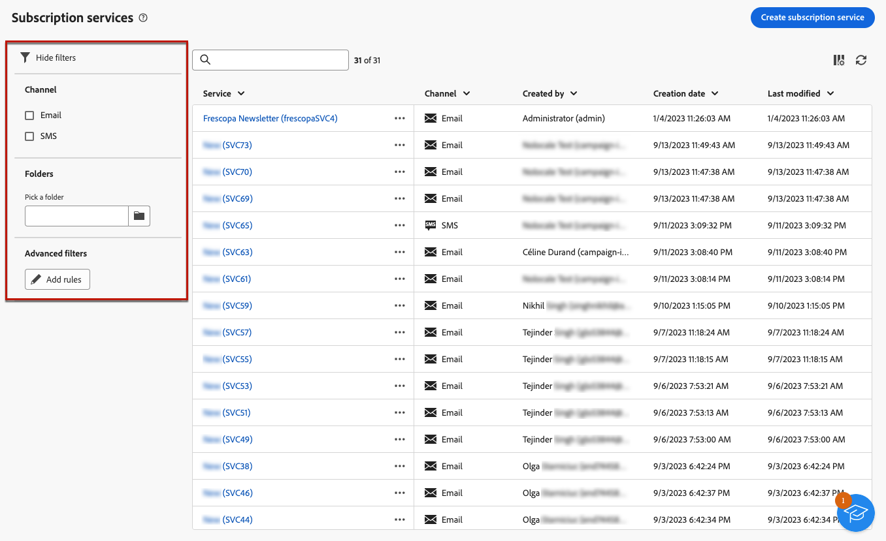

# Trabalhar com serviços de assinatura {#create-services}

>[!CONTEXTUALHELP]
>id="acw_subscriptions_list"
>title="Criar e gerenciar seus serviços"
>abstract="Use o Adobe Campaign para criar e monitorar seus serviços, como boletins informativos, e verificar as assinaturas/cancelamentos de assinaturas desses serviços. As assinaturas se aplicam somente ao email e à entrega de SMS."

Use a Web do Adobe Campaign para gerenciar e criar serviços, como boletins informativos, e para verificar as assinaturas/cancelamentos de assinaturas desses serviços.

>[!NOTE]
>
>As assinaturas se aplicam somente ao email e à entrega de SMS.

Vários serviços podem ser definidos em paralelo, por exemplo: boletins informativos para categorias de produtos específicas, temas ou áreas de um site, assinaturas para vários tipos de mensagens de alerta e notificações em tempo real.

Para saber mais sobre como gerenciar assinaturas e cancelamentos de assinaturas, consulte o [Documentação do Campaign v8 (console do cliente)](https://experienceleague.adobe.com/docs/campaign/campaign-v8/audience/subscriptions.html){target="_blank"}.

## Acessar serviços de assinatura {#access-services}

Para acessar os serviços de assinatura disponíveis para sua plataforma, navegue até o **[!UICONTROL Serviços de assinatura]** no painel de navegação esquerdo.

A lista de todos os serviços de assinatura existentes é exibida. Você pode pesquisar os serviços e filtrar o canal, a pasta ou usar filtros avançados.

Para editar um serviço existente, clique em seu respectivo nome.

## Criar seu primeiro serviço de assinatura {#create-service}

>[!CONTEXTUALHELP]
>id="acw_subscriptions_list_properties"
>title="Propriedades do serviço de assinaturas"
>abstract="Insira o rótulo do serviço de assinatura e defina opções adicionais."

>[!CONTEXTUALHELP]
>id="acw_subscriptions_list_confirm"
>title="Mensagens de confirmação do serviço de assinaturas"
>abstract="Quando um usuário assina um serviço ou cancela a assinatura de um serviço, é possível enviar uma mensagem de confirmação. Selecione os modelos a serem usados nessas mensagens."

Para criar um serviço de assinatura, siga estas etapas:

1. Selecione o **[!UICONTROL Criar serviço de assinatura]** botão.

   

1. Selecione um canal: **[!UICONTROL E-mail]** ou **[!UICONTROL SMS]**.

1. Nas propriedades do serviço, insira um rótulo e defina opções adicionais conforme desejado.

   

1. Por padrão, as subscrições são ilimitadas. Você pode desativar o **[!UICONTROL Período de validade ilimitado]** opção para definir uma duração de validade do serviço. <!--The duration can be specified in days or months.TBC-->

   

1. Quando um usuário assina ou cancela a assinatura de um serviço, é possível enviar uma mensagem de confirmação. Selecione os modelos a serem usados para essa mensagem de acordo com seu caso de uso.

   

1. Clique em **[!UICONTROL Save]**. O novo serviço é adicionado à variável **[!UICONTROL Serviços de assinatura]** lista.

<!--
## Reporting

You can measure the effectiveness of your subscription services for SMS and email channels.

1. Select an existing service from the **[!UICONTROL Subscription services]** list.

1. From the service dashboard, click More > Reports?

1. Check the following indicators:

* Total numbers of subscribers

* Area graph with subscriptions and unsubscriptions. Use the dropwdown to change the time range. (24h, 48h, 1 week, 2 weeks, 1 month, 6 months)

* The breakdown by period. including subs, unsub, evolution in numbers and % and loyalty.
* Last updated / Next refresh time: these values are retrieved from the execution and schedule of the tracking workflow
-->

