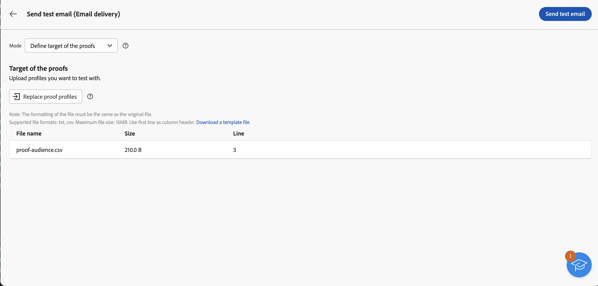

# Carregar um público-alvo de email a partir de um arquivo {#audience-from-file}

>[!CONTEXTUALHELP]
>id="acw_audience_fromfile_select"
>title="Seleção de arquivo"
>abstract="Selecione o arquivo local a ser enviado. Os formatos compatíveis são TXT e CSV. Alinhe o formato de arquivo com o arquivo de amostra do link abaixo."

>[!CONTEXTUALHELP]
>id="acw_audience_fromfile_columns"
>title="Definição de colunas"
>abstract="Verifique o formato das colunas no arquivo externo."

>[!CONTEXTUALHELP]
>id="acw_audience_fromfile_formatting"
>title="Parâmetros de formatação"
>abstract="Especifique como o arquivo externo está formatado para garantir que os dados sejam importados corretamente."

>[!CONTEXTUALHELP]
>id="acw_audience_fromfile_preview"
>title="Visualizar seu arquivo"
>abstract="Verifique a visualização das colunas do arquivo externo. Essa tela mostra um máximo de 30 registros."

Você pode direcionar perfis armazenados em um arquivo externo. Os perfis não são adicionados ao banco de dados, mas todos os campos no arquivo de entrada estão disponíveis para [personalização](../personalization/gs-personalization.md). Os formatos de arquivo compatíveis são: texto (TXT) e valor separado por vírgula (CSV). Este artigo descreve como carregar um perfil externo ao criar um delivery de email independente. Para carregar dados de um arquivo em um workflow, consulte [esta página](../workflows/activities/load-file.md).

>[!CAUTION]
>
>* Esse recurso só está disponível para **deliveries de email**. Ele não pode ser usado com deliveries SMS ou Push.
>
>* Não é possível usar [grupos de controle](control-group.md) ao carregar a população alvo a partir de um arquivo externo.
>
>* Os perfis não são adicionados ao banco de dados e apenas são carregados e disponibilizados para esse delivery de email independente específico.

## Selecionar e configurar seu arquivo {#upload}

Para direcionar perfis de um arquivo local diretamente da interface de email, siga estas etapas:

1. Abrir um delivery de email existente, ou [criar um novo delivery de email](../email/create-email.md).
1. Na janela de criação da entrega de email, na seção **Público-alvo**, clique no botão **Selecionar público-alvo** e escolha a opção **Selecionar do arquivo**.

   {zoomable=&quot;yes&quot;}

1. Selecione o arquivo local a ser usado. O formato deve estar alinhado com o [arquivo de amostra](#sample-file).
1. Visualize e verifique como os dados estão mapeados na seção central da tela.
1. Escolha a coluna que contém o endereço de email do menu suspenso **Campo de endereço**. Também é possível selecionar a coluna lista de bloqueios se tiver essas informações no arquivo de entrada.
1. Ajuste as configurações da coluna e como formatar os dados a partir das opções disponíveis.
1. Clique em **Confirmar** assim que as configurações estiverem corretas.

Ao criar e personalizar o conteúdo da mensagem, você pode selecionar campos do arquivo de entrada na [Editor de personalização](../personalization/gs-personalization.md).

{zoomable=&quot;yes&quot;}

## Arquivo de amostra {#sample-file}

>[!CONTEXTUALHELP]
>id="acw_audience_fromfile_samplefile"
>title="Carregar um público-alvo de um arquivo"
>abstract="Os formatos de arquivo compatíveis são TXT e CSV. Usar a primeira linha como cabeçalho da coluna. Alinhe seu formato de arquivo com o arquivo de amostra fornecido no link abaixo."

Os formatos compatíveis são TXT e CSV. A primeira linha é o cabeçalho da coluna.

Alinhe o formato de arquivo com o arquivo de amostra abaixo:

```javascript
{
lastname,firstname,city,birthdate,email,denylist
Smith,Hayden,Paris,23/05/1985,hayden.smith@example.com,0
Mars,Daniel,London,17/11/1999,danny.mars@example.com,0
Smith,Clara,Roma,08/02/1979,clara.smith@example.com,0
Durance,Allison,San Francisco,15/12/2000,allison.durance@example.com,1
}
```

## Pré-visualizar e testar o email {#test}

O Campaign Web permite visualizar e enviar provas ao usar um público-alvo carregado de um arquivo. Para fazer isso, siga estes passos:

1. Clique em **[!UICONTROL Botão Simular conteúdo]** na tela de edição de conteúdo do delivery e clique no link **[!UICONTROL Adicionar perfil(s) de teste]** botão.

1. Os perfis contidos no arquivo carregado são exibidos. Selecione os perfis que deseja usar para visualizar o conteúdo e clique em **[!UICONTROL Selecionar]**.

1. Uma pré-visualização do conteúdo do delivery é exibida no painel direito da tela. Os elementos personalizados são substituídos pelos dados do perfil selecionado no painel esquerdo. [Saiba mais sobre pré-visualização de conteúdo de delivery](../preview-test/preview-content.md)

   {zoomable=&quot;yes&quot;}

1. Para enviar provas, clique no link **[!UICONTROL Enviar prova]** botão.

1. Clique em **[!UICONTROL Carregar perfis de prova]** e selecione o arquivo .txt ou .csv que contém os recipients de prova.

   >[!CAUTION]
   >
   >Verifique se o formato do arquivo corresponde ao usado para fazer upload do seu público-alvo. Quaisquer erros de formato exibirão um alerta.

1. Quando os perfis de prova forem adicionados e você estiver pronto para enviar as provas, clique no link **[!UICONTROL Enviar prova]** e confirme o envio.

   {zoomable=&quot;yes&quot;}

1. É possível monitorar o envio da prova usando o **[!UICONTROL Exibir provas]** a qualquer momento. [Saiba mais sobre o monitoramento de provas](../preview-test/test-deliveries.md#access-test-deliveries)
