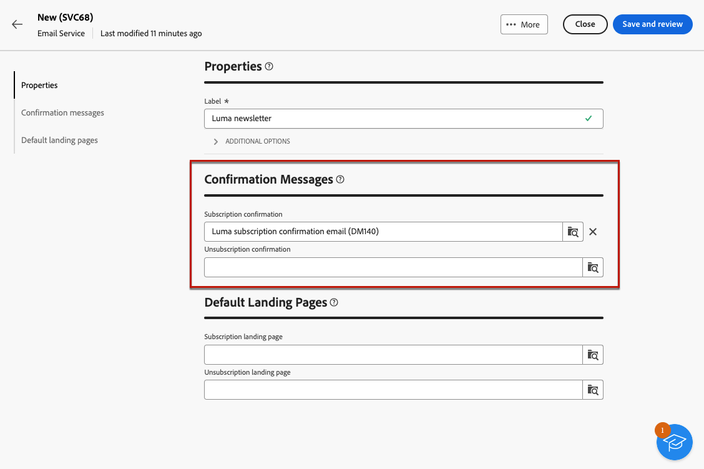
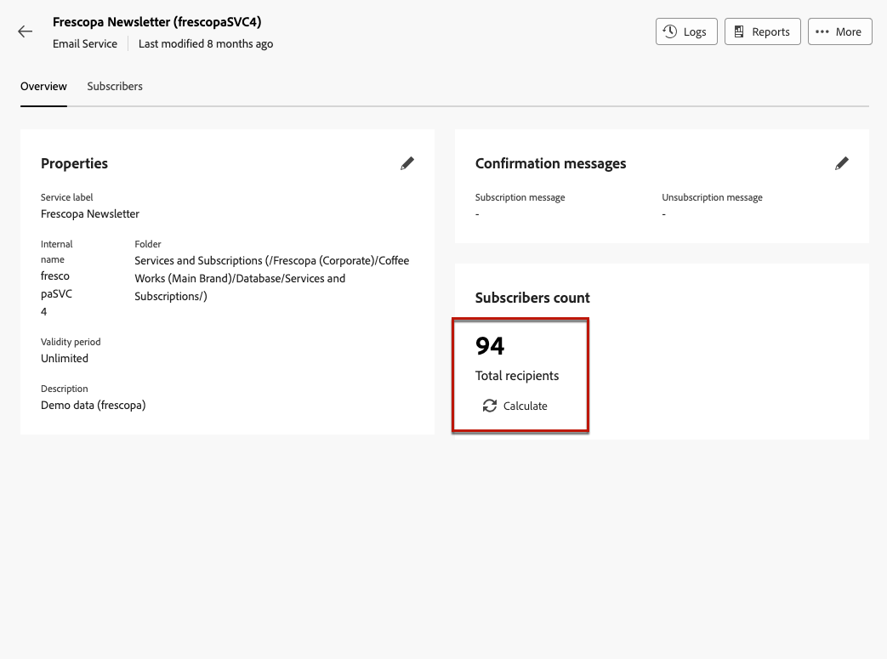

# Trabalhar com serviços de assinatura {#manage-services}

>[!CONTEXTUALHELP]
>id="acw_subscriptions_list"
>title="Criar e gerenciar seus serviços"
>abstract="Use o Adobe Campaign para criar e monitorar seus serviços, como boletins informativos, e para verificar as assinaturas ou cancelamentos de assinaturas desses serviços. As assinaturas se aplicam somente ao email e à entrega de SMS."

Use a Web do Adobe Campaign para gerenciar e criar serviços, como boletins informativos, e para verificar as assinaturas ou cancelamentos de assinaturas desses serviços.

>[!NOTE]
>
>As assinaturas se aplicam somente ao email e à entrega de SMS.

Vários serviços podem ser definidos em paralelo, por exemplo: boletins informativos para categorias de produtos específicas, temas ou áreas de um site, assinaturas para vários tipos de mensagens de alerta e notificações em tempo real.

Para saber mais sobre como gerenciar assinaturas e cancelamentos de assinaturas, consulte o [Documentação do Campaign v8 (console do cliente)](https://experienceleague.adobe.com/docs/campaign/campaign-v8/audience/subscriptions.html){target="_blank"}.

## Acessar serviços de assinatura {#access-services}

Para acessar os serviços de assinatura disponíveis para sua plataforma, siga as etapas abaixo.

1. Navegue até o **[!UICONTROL Serviços de assinatura]** no painel de navegação esquerdo.

   

1. A lista de todos os serviços de assinatura existentes é exibida. Você pode pesquisar os serviços e filtrar o canal, a pasta ou usar filtros avançados.

   

1. Para editar um serviço existente, clique em seu respectivo nome.

1. É possível excluir ou duplicar qualquer serviço usando o ícone de três pontos ao lado desse nome de serviço.<!--so all subscribers are unsuibscribed - need to mention?-->

## Criar seu primeiro serviço de assinatura {#create-service}

>[!CONTEXTUALHELP]
>id="acw_subscriptions_list_properties"
>title="Definir as propriedades do serviço"
>abstract="Insira o rótulo do serviço de assinatura e defina opções adicionais, como um período de validade para seu serviço."

>[!CONTEXTUALHELP]
>id="acw_subscriptions_list_confirm"
>title="Selecionar uma mensagem de confirmação"
>abstract="Quando um usuário assina ou cancela a assinatura de um serviço, é possível enviar uma mensagem de confirmação. Selecione os modelos a serem usados para essa mensagem."

Para criar um serviço de assinatura, siga as etapas abaixo.

1. Selecione o **[!UICONTROL Criar serviço de assinatura]** botão.

   

1. Selecione um canal: **[!UICONTROL E-mail]** ou **[!UICONTROL SMS]**.

1. Nas propriedades do serviço, insira um rótulo e defina opções adicionais conforme desejado.

   

1. Por padrão, as subscrições são ilimitadas. Você pode desativar o **[!UICONTROL Período de validade ilimitado]** opção para definir uma duração de validade do serviço.

   No exemplo abaixo, após 20 dias:
   * Nenhum destinatário poderá assinar mais este serviço.
   * Todos os assinantes deste serviço terão suas assinaturas canceladas automaticamente após 20 dias. [Saiba mais](#automatic-unsubscription)

   

1. Quando um usuário assina ou cancela a assinatura de um serviço, é possível enviar uma mensagem de confirmação. Selecione os modelos a serem usados para essa mensagem de acordo com seu caso de uso. Esses templates devem ser configurados com o **[!UICONTROL Assinaturas]** target mapping. [Saiba mais](#create-confirmation-message)

   

1. Clique em **[!UICONTROL Salvar e revisar]**. O novo serviço é adicionado à variável **[!UICONTROL Serviços de assinatura]** lista.

## Criar uma mensagem de confirmação {#create-confirmation-message}

Para enviar mensagens de confirmação aos usuários que assinam ou cancelam a assinatura do seu serviço, você deve criar um template do delivery com o **[!UICONTROL Assinaturas]** target mapping, sem um destino definido. Para isso, siga as etapas abaixo.

1. Crie um template do delivery para a confirmação da assinatura. [Saiba como](../msg/delivery-template.md)

1. Não selecione um público para esta entrega. Em vez disso, acesse o **[!UICONTROL Configurações de entrega]**, vá para a [Público](../advanced-settings/delivery-settings.md#audience) e selecione a guia **[!UICONTROL Assinaturas]** target mapping da lista.

   

   >[!NOTE]
   >
   >Se você não selecionar a opção  **[!UICONTROL Assinaturas]** target mapping, seus assinantes não receberão a mensagem de confirmação. Os mapeamentos de públicos-alvo são definidos no console do Campaign v8. Saiba mais sobre [Documentação do Adobe Campaign v8](https://experienceleague.adobe.com/docs/campaign/campaign-v8/audience/add-profiles/target-mappings.html?lang=pt-BR){target="_blank"}.

1. Edite o conteúdo do template do delivery, salve-o e feche-o.

   

   >[!NOTE]
   >
   >Saiba mais sobre os canais de entrega e como definir um conteúdo de entrega no [Canal de email](../email/create-email.md) e [Canal SMS](../sms/create-sms.md) seções.

1. Repita as etapas acima para criar um template do delivery para a confirmação do cancelamento da assinatura.

Agora você pode selecionar essas mensagens quando [criação de um serviço de assinatura](#create-service). Os usuários que assinarem ou cancelarem a assinatura desse serviço receberão as mensagens de confirmação selecionadas.

## Monitore seus serviços de assinatura {#logs-and-reports}

Para medir a eficácia de seus serviços de assinatura para canais de SMS e email, você pode acessar os logs e relatórios de um determinado serviço.

1. Selecione um serviço existente na **[!UICONTROL Serviços de assinatura]** lista. Clique em **[!UICONTROL Calcular]** o obtém o número total de assinantes.

   

1. No painel de serviço, selecione **[!UICONTROL Logs]** para exibir a lista de assinantes deste serviço. É possível verificar o número total de assinantes, o nome e o endereço de cada recipient e quando eles assinaram ou cancelaram a assinatura. Também é possível filtrá-los.

   

1. No painel de serviço, selecione **[!UICONTROL Relatórios]**. Verifique os seguintes indicadores:

   * A variável **[!UICONTROL Número total de assinantes]** é exibido.

   * É possível exibir o número de subscrições e unsubscriptions durante um período selecionado. Use a lista suspensa para alterar o intervalo de tempo.

     

   * A variável **[!UICONTROL Evolução geral das assinaturas]** o gráfico mostra o detalhamento por período, incluindo assinaturas, cancelamentos de assinaturas, a evolução dos números e a porcentagem de fidelidade.<!--what is Registered?-->

1. Use o **[!UICONTROL Recarregar]** botão para recuperar os últimos valores da execução e da programação do workflow de rastreamento.

