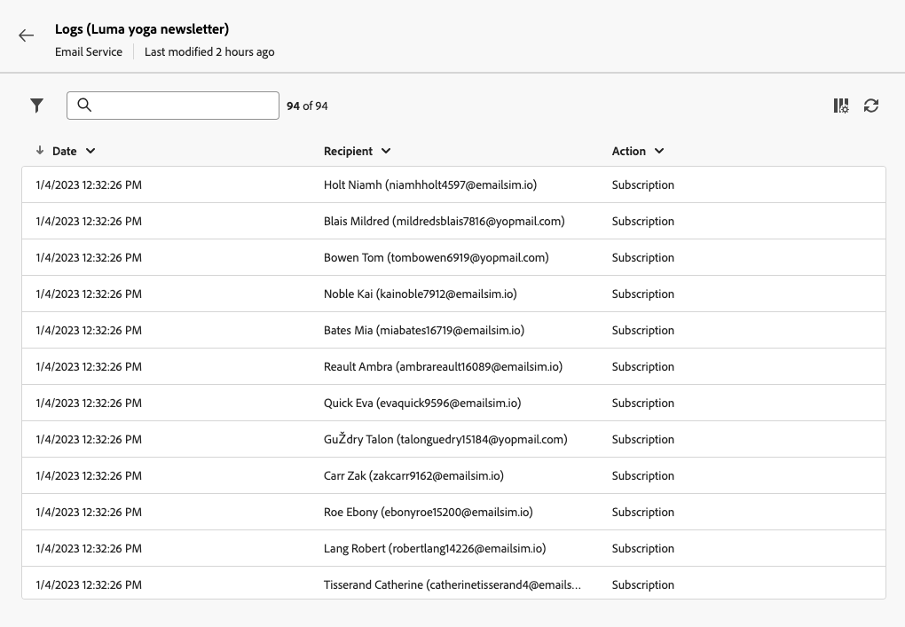

# Criar e gerenciar serviços de assinatura {#manage-services}

>[!CONTEXTUALHELP]
>id="acw_subscriptions_list"
>title="Criar e gerenciar serviços"
>abstract="Use o Adobe Campaign para criar e monitorar os seus serviços, como informativos, e verificar as assinaturas e o cancelamento delas nesses serviços. As assinaturas aplicam-se somente a entregas por email e SMS."

Use o Adobe Campaign Web para gerenciar e criar serviços, como boletins informativos, e para verificar as assinaturas ou cancelamentos de assinaturas desses serviços.

Vários serviços podem ser definidos em paralelo, por exemplo: boletins informativos para categorias de produtos específicas, temas ou áreas de um site, assinaturas para vários tipos de mensagens de alerta e notificações em tempo real.

>[!NOTE]
>
>As assinaturas aplicam-se somente a entregas por email e SMS.

## Acessar serviços de assinatura {#access-services}

Para acessar os serviços de assinatura disponíveis para sua plataforma, siga as etapas abaixo.

1. Navegue até o **[!UICONTROL Serviços de assinatura]** no painel de navegação esquerdo.

   {zoomable=&quot;yes&quot;}

1. A lista de todos os serviços de assinatura existentes é exibida. Pesquise os serviços e filtre no canal, na pasta ou adicione regras usando o [modelador de consultas](../query/query-modeler-overview.md).

   {zoomable=&quot;yes&quot;}

1. Para editar um serviço existente, clique em seu respectivo nome.

1. É possível excluir ou duplicar qualquer serviço usando o ícone de três pontos ao lado do nome do serviço.<!--so all subscribers are unsubscribed - need to mention?-->

## Criar seu primeiro serviço de assinatura {#create-service}

>[!CONTEXTUALHELP]
>id="acw_subscriptions_list_properties"
>title="Definir as propriedades do serviço"
>abstract="Insira o rótulo do serviço de assinatura e defina opções adicionais, como um período de validade para o seu serviço."

>[!CONTEXTUALHELP]
>id="acw_subscriptions_list_confirm"
>title="Selecione uma mensagem de confirmação"
>abstract="Quando um usuário(a) assina ou cancela a assinatura de um serviço, é possível enviar uma mensagem de confirmação. Selecione os modelos a serem usados nessas mensagens."

Para criar um serviço de assinatura, siga as etapas abaixo.

1. Selecione o **[!UICONTROL Criar serviço de assinatura]** botão.

   {zoomable=&quot;yes&quot;}

1. Selecione um canal: **[!UICONTROL E-mail]** ou **[!UICONTROL SMS]**.

1. Nas propriedades do serviço, insira um rótulo e defina **[!UICONTROL Opções adicionais]** conforme desejado.

   {zoomable=&quot;yes&quot;}

1. Por padrão, os serviços são armazenados no **[!UICONTROL Serviços e assinaturas]** pasta. Você pode alterá-la navegando até o local desejado. [Saiba como trabalhar com pastas](../get-started/permissions.md#folders)

1. Por padrão, as subscrições são ilimitadas.

   Você pode desativar o **[!UICONTROL Período de validade ilimitado]** opção para definir uma duração de validade do serviço. Quando o período de validade terminar:
   * Nenhum destinatário pode assinar mais este serviço
   * Todos os assinantes deste serviço têm suas assinaturas canceladas automaticamente

   {zoomable=&quot;yes&quot;}

1. Quando um usuário(a) assina ou cancela a assinatura de um serviço, é possível enviar uma mensagem de confirmação. Selecione os modelos a serem usados para essa mensagem de acordo com seu caso de uso. Esses templates devem ser configurados com o **[!UICONTROL Assinaturas]** target mapping. [Saiba mais](#create-confirmation-message)

   {zoomable=&quot;yes&quot;}

1. Clique em **[!UICONTROL Salvar e revisar]**. O novo serviço é adicionado à variável **[!UICONTROL Serviços de assinatura]** lista.

Agora você pode:

* Adicione assinantes a este serviço e cancele a assinatura dos recipients. [Saiba mais](../msg/send-to-subscribers.md)

* Enviar mensagens aos assinantes deste serviço. [Saiba como](../msg/send-to-subscribers.md)

## Criar uma mensagem de confirmação {#create-confirmation-message}

>[!CONTEXTUALHELP]
>id="acw_subscriptions_delivery_template"
>title="Selecione o modelo de entrega de assinaturas"
>abstract="Para enviar mensagens de confirmação a usuários que assinam seu serviço, é necessário selecionar um modelo de entrega específico com base no target mapping **[!UICONTROL Assinaturas]**, sem um público-alvo definido."

>[!CONTEXTUALHELP]
>id="acw_unsubscriptions_delivery_template"
>title="Selecione o modelo de entrega de cancelamento de assinatura"
>abstract="Para enviar mensagens de confirmação a usuários que cancelaram a assinatura do seu serviço, você deve selecionar um modelo de entrega específico com base no target mapping **[!UICONTROL Assinaturas]**, sem público-alvo definido."

Para enviar mensagens de confirmação aos usuários que assinam ou cancelam a assinatura do seu serviço, você deve criar um template do delivery com o **[!UICONTROL Assinaturas]** target mapping, sem um destino definido. Para isso, siga as etapas abaixo:

1. Crie um template do delivery para a confirmação da assinatura. [Saiba como criar um modelo](../msg/delivery-template.md)

1. Não selecione um público para esta entrega. Em vez disso, acesse o delivery **[!UICONTROL Configurações]**, vá para a [Público](../advanced-settings/delivery-settings.md#audience) e selecione a guia **[!UICONTROL Assinaturas]** target mapping da lista.

   {zoomable=&quot;yes&quot;}

   >[!NOTE]
   >
   >Se você não selecionar a opção  **[!UICONTROL Assinaturas]** target mapping, seus assinantes não receberão a mensagem de confirmação. Saiba mais sobre target mappings em [nesta seção](../audience/targeting-dimensions.md) .

1. Edite o conteúdo do template do delivery, salve-o e feche-o.

   {zoomable=&quot;yes&quot;}

   >[!NOTE]
   >
   >Saiba mais sobre os canais de entrega e como definir um conteúdo de entrega no [Canal de email](../email/create-email.md) e [Canal SMS](../sms/create-sms.md) seções.

1. Repita as etapas acima para criar um template do delivery para a confirmação do cancelamento da assinatura.

Agora você pode selecionar essas mensagens quando [criação de um serviço de assinatura](#create-service). Os usuários que assinarem ou cancelarem a assinatura desse serviço receberão as mensagens de confirmação selecionadas.

## Monitorar seus serviços de assinatura {#logs-and-reports}

>[!CONTEXTUALHELP]
>id="acw_subscriptions_totalnumber_subscribers"
>title="Contagem de assinantes"
>abstract="Clique em **Calcular** para obter o número total de assinantes deste serviço."

>[!CONTEXTUALHELP]
>id="acw_subscriptions_totalnumber_subscribers_report"
>title="Número total de assinantes"
>abstract="O Indicador principal de desempenho (KPI) fornece uma visão abrangente da base de assinantes, mostrando a contagem total de indivíduos que assinaram esse serviço."

>[!CONTEXTUALHELP]
>id="acw_subscriptions_overtheperiod_subscribers"
>title="Número de assinaturas no período"
>abstract="Use a lista suspensa para alterar o intervalo de tempo e exibir o número de assinaturas e cancelamentos de assinaturas durante o período selecionado."

>[!CONTEXTUALHELP]
>id="acw_subscriptions_overallevolution_subscribers"
>title="Evolução geral das assinaturas"
>abstract="Este gráfico mostra o detalhamento por período, incluindo assinaturas, cancelamentos de assinaturas, a evolução em números e a porcentagem de fidelidade."

Para medir a eficácia de seus serviços de assinatura para canais de SMS e email, você pode acessar os logs e relatórios de um determinado serviço.

1. Selecione um serviço existente na **[!UICONTROL Serviços de assinatura]** lista. Clique em **[!UICONTROL Calcular]** o obtém o número total de assinantes.

   {zoomable=&quot;yes&quot;}

1. No painel de serviço, selecione **[!UICONTROL Logs]** para exibir a lista de assinantes deste serviço.

   É possível verificar o número total de assinantes, o nome e o endereço de cada recipient e quando eles assinaram ou cancelaram a assinatura. Também é possível filtrá-los.

   {zoomable=&quot;yes&quot;}

1. No painel de serviço, selecione **[!UICONTROL Relatórios]**. Verifique os seguintes indicadores:

   * A variável **[!UICONTROL Número total de assinantes]** é exibido.

   * É possível exibir o número de subscrições e unsubscriptions durante um período selecionado. Use a lista suspensa para alterar o intervalo de tempo.

     {zoomable=&quot;yes&quot;}

   * A variável **[!UICONTROL Evolução geral das assinaturas]** o gráfico mostra o detalhamento por período, incluindo assinaturas, cancelamentos de assinaturas, a evolução dos números e a porcentagem de fidelidade.<!--what is Registered?-->

1. Use o **[!UICONTROL Recarregar]** botão para recuperar os últimos valores da execução e da programação do workflow de rastreamento.
