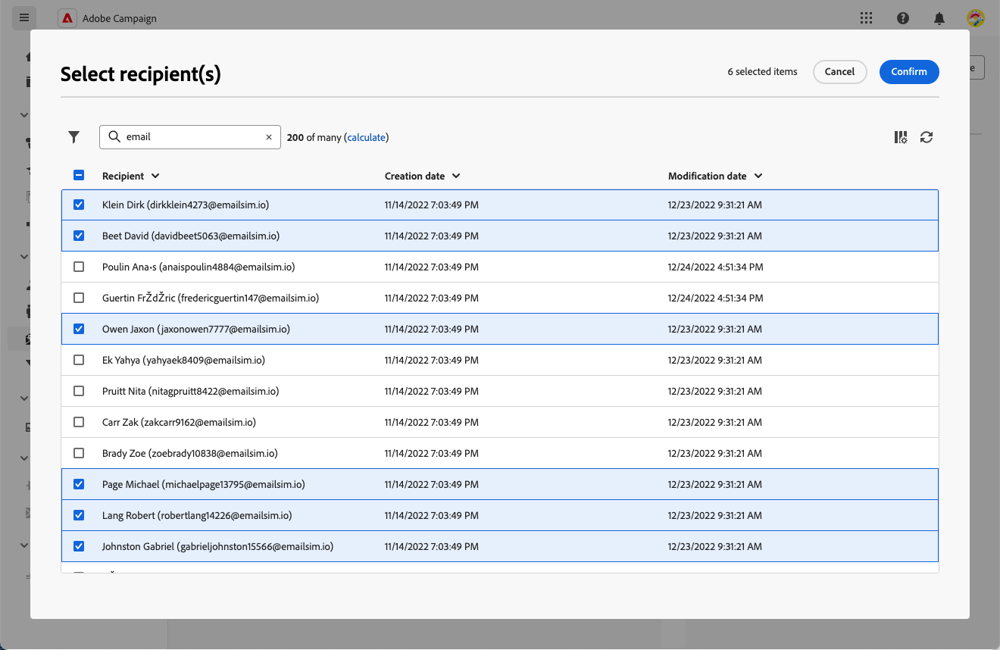

# Gerenciar os assinantes de um serviço {#manage-subscribers}

Uma vez que [criou um serviço](manage-services.md#create-service), você pode adicionar assinantes, cancelar a assinatura de destinatários e entregar aos assinantes desse serviço.

## Adicionar assinantes ao seu serviço {#add-subscribers}

Para adicionar assinantes manualmente, siga as etapas abaixo.

1. Selecione um serviço existente na **[!UICONTROL Serviços de assinatura]** lista.

1. Selecione o **[!UICONTROL Assinantes]** e clique em **[!UICONTROL Adicionar perfis]**.

   

1. Selecione os perfis que deseja adicionar na lista e clique em **[!UICONTROL Confirmar o]**.

   

1. Clique em **[!UICONTROL Enviar]**.<!--if you click cancel, does it mean that no message is sent but recipients are still subscribed, or they are not subscribed? it's 2 different actions in the console)--> Os destinatários selecionados receberão a assinatura [mensagem de confirmação](manage-services.md#create-confirmation-message) que você selecionou quando [criação do serviço](manage-services.md#create-service).

   

Os perfis adicionados são exibidos no **[!UICONTROL Assinantes]** lista. Agora eles estão subscritos no seu serviço.

## Remover assinantes do seu serviço {#remove-subscribers}

### Cancelar inscrição de destinatários manualmente {#manual-unsubscription}

Uma vez que [assinantes adicionados](#add-subscribers) ao seu serviço, você pode cancelar manualmente a assinatura de cada um deles. Siga as etapas abaixo.

1. Selecione um serviço existente na **[!UICONTROL Serviços de assinatura]** lista.

1. Clique no ícone de três pontos ao lado do nome do recipient desejado e selecione **[!UICONTROL Excluir]**.

   

1. Confirme a exclusão e clique **[!UICONTROL Enviar]**. O recipient selecionado receberá o cancelamento de subscrição [mensagem de confirmação](manage-services.md#create-confirmation-message) que você selecionou quando [criação do serviço](manage-services.md#create-service).

   

O recipient é removido do **[!UICONTROL Assinantes]** e não está mais inscrito no seu serviço.

### Cancelar automaticamente a inscrição de destinatários {#automatic-unsubscription}

Um serviço de assinatura pode ter uma duração limitada. Os recipients são automaticamente cancelados quando o período de validade expira.

Este período é especificado quando [criação do serviço](manage-services.md#create-service). No **[!UICONTROL Opções adicionais]**, desative o **[!UICONTROL Período de validade ilimitado]** e definir um período de validade do serviço.

Após a expiração da duração especificada, todos os assinantes terão a subscrição cancelada automaticamente desse serviço.

## Entregar aos assinantes de um serviço

Uma vez que [criou um serviço de assinatura](manage-services.md#create-service), o pode direcionar os assinantes em um delivery. Siga as etapas abaixo.

1. [Criar um público](../audience/create-audience.md) incluindo os assinantes do serviço criado:

   * No **[!UICONTROL Criar público-alvo]** atividade, exibir os atributos avançados e selecionar **[!UICONTROL Recipient]** > **[!UICONTROL Assinaturas]** > **[!UICONTROL Serviço]**.

   * Neste exemplo, selecione os usuários que assinaram o serviço que tem a **Informativo da Luma** rótulo.

   

1. [Criar um delivery](../msg/gs-messages.md#create-delivery) e selecione o público criado acima.

   

1. Edite o conteúdo da mensagem conforme desejado e envie o delivery.

   

Seu delivery é enviado somente aos assinantes desse serviço.
