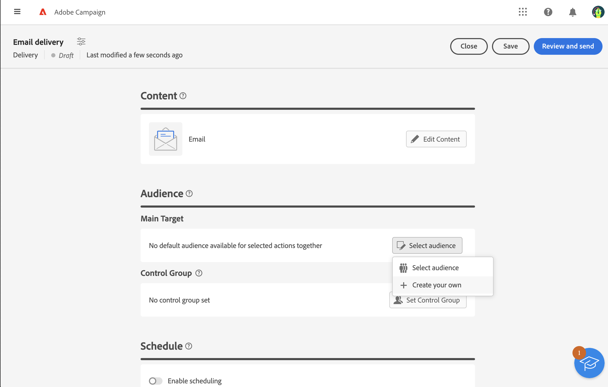

# Criar um público-alvo único {#one-time}

Esta seção descreve como criar um público-alvo ao criar um novo delivery. Nesse caso, os perfis a serem incluídos no público-alvo do delivery são direcionados consultando o banco de dados com o modelador de query. O público resultante é usado apenas uma vez para essa entrega. Ela não é salva na lista de públicos-alvo.

Ao definir o target principal de um delivery, você também pode:
* [Selecione um público-alvo](add-audience.md) na lista **[!UICONTROL Públicos-alvo]**.
* [Carregar um público de um arquivo externo](file-audience.md) (somente para emails).

Para criar um novo público-alvo único para um delivery, siga estas etapas:

1. Na seção **Público**, do assistente de criação de entrega, clique no botão **[!UICONTROL Selecionar público-alvo]**.

   {zoomable="yes"}

1. Selecione **Criar seu próprio** para abrir o modelador de consultas, que permite definir a população direcionada filtrando os dados contidos no banco de dados. [Saiba como usar o modelador de consultas](../query/query-modeler-overview.md)

   {zoomable="yes"}

1. Quando a consulta estiver pronta, clique em **Confirmar** para usar o público-alvo resultante como o principal destino da sua entrega.

   Você também pode definir um grupo de controle para medir o impacto de suas campanhas. O grupo de controle não recebe a mensagem. Isso permite comparar o comportamento da população que recebeu a mensagem com o comportamento dos contatos que não a receberam. [Saiba mais](control-group.md)
