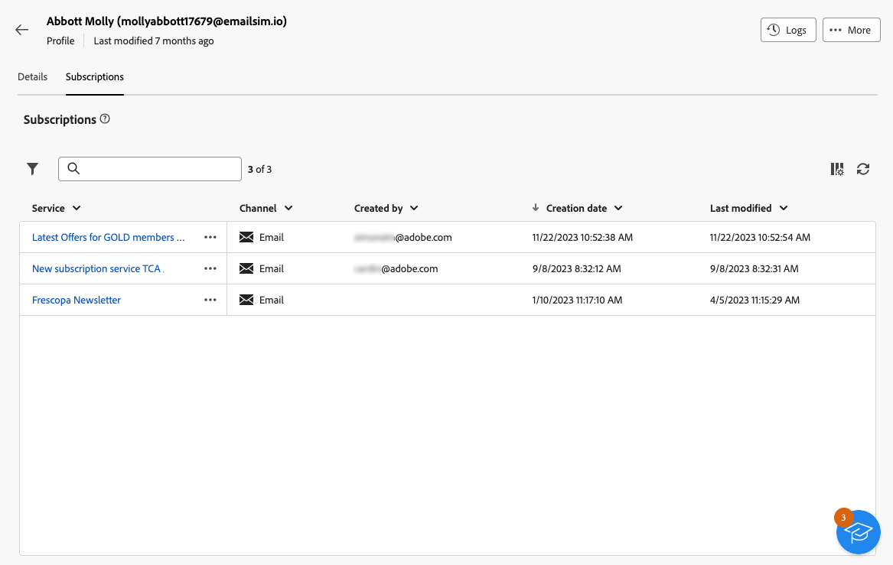

# Conheça os detalhes de perfis {#profile-view}

>[!CONTEXTUALHELP]
>id="acw_recipients_subscription_list"
>title="Lista de assinaturas"
>abstract="Esta guia lista todos os serviços que o perfil assinou."

Para acessar os detalhes de um perfil, navegue até **[!UICONTROL Gerenciamento de clientes]** > **[!UICONTROL Perfis]** em seguida, clique no perfil que deseja acessar.

As informações no perfil são organizadas da seguinte maneira:

* A variável **[!UICONTROL Detalhes]** permite navegar pelos atributos incorporados e personalizados do perfil. Para editar um atributo, faça as alterações no campo desejado e clique no **[!UICONTROL Salvar]** botão. Informações detalhadas sobre os atributos dos perfis estão disponíveis no [Criar um perfil](create-profile.md) seção.

  {zoomable=&quot;yes&quot;}

* A variável **[!UICONTROL Assinaturas]** A guia fornece informações sobre os serviços aos quais o perfil está inscrito. [Saiba mais sobre serviços de assinatura](manage-services.md)

  {zoomable=&quot;yes&quot;}

* Além disso, a **[!UICONTROL Logs]** O botão, localizado no canto superior direito da tela, permite visualizar o histórico das interações do perfil por meio de envio, exclusão e logs de rastreamento. [Saiba mais sobre logs do delivery](../monitor/delivery-logs.md)

  Nesses logs, também é possível revisar as ofertas apresentadas ao perfil selecionado na **[!UICONTROL Apresentações]** guia. [Saiba mais sobre ofertas](../msg/offers.md)

  {zoomable=&quot;yes&quot;}
