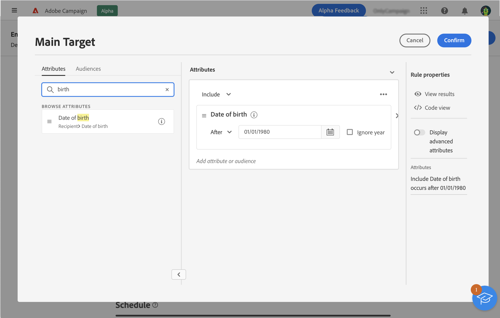
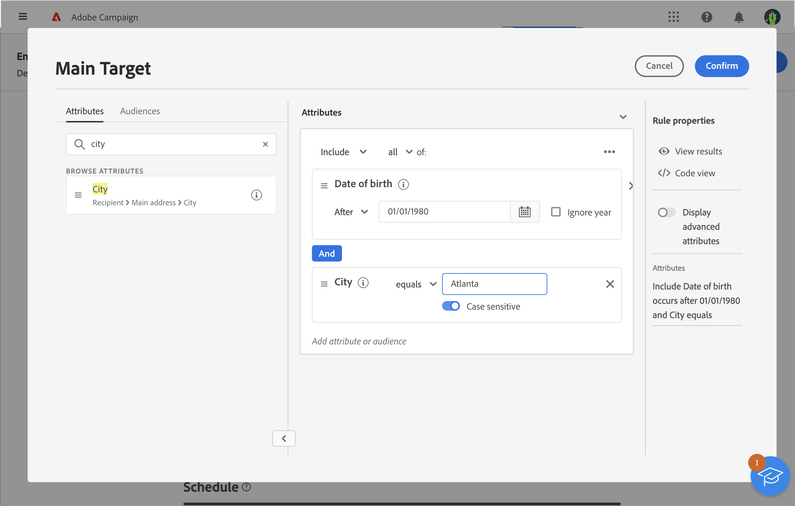

# Definir um público com o construtor de regras {#segment-builder}

>[!CONTEXTUALHELP]
>id="acw_homepage_card5"
>title="Públicos-alvo"
>abstract="Criar um público-alvo de entrega nunca foi tão fácil. Com nosso construtor de regras mais recente, agora é possível definir critérios de filtragem para destinatários ou qualquer outro targeting dimension do banco de dados. Aproveite seus públicos-alvo da Adobe Experience Platform para refinar ainda mais o público-alvo e maximizar o impacto da campanha."

Esta seção descreve como criar um público ao elaborar um novo email. O público criado só pode ser usado nesse email.

O construtor de regras permite definir a população direcionada pela mensagem por meio da filtragem dos dados contidos no banco de dados. Se desejar selecionar um público existente, consulte esta [seção](add-audience.md).

Para obter mais informações sobre o construtor de regras, consulte [Documentação do serviço de segmentação](https://experienceleague.adobe.com/docs/experience-platform/segmentation/ui/segment-builder.html?lang=pt-br).

Para criar um novo público ao elaborar um email, siga estas etapas:

1. Na seção **Público** do assistente de criação de entrega, clique no botão **[!UICONTROL Selecionar público]**.

   

1. Selecione **Criar o seu**. O construtor de regras é exibido.

   

## A paleta

A paleta, localizada no lado esquerdo, contém todos os elementos que podem ser filtrados para criar o público. Os blocos contidos na paleta devem ser movidos para a tela central para serem configurados e considerados. A paleta é dividida em duas guias:

* **Atributos**: essa guia permite acessar todos os campos disponíveis no schema. A lista de campos depende do schema de direcionamento definido no template de email.

  {width="70%" align="left"}

* **Públicos**: essa guia permite filtrar usando um dos públicos existentes que foram definidos no console do Campaign Classic ou na Adobe Experience Platform.

  {width="70%" align="left"}

  >[!NOTE]
  >
  >Para aproveitar os públicos da Adobe Experience Platform, é necessário configurar a integração com o serviço de Destinos. Consulte a [Documentação de destinos do Adobe Experience Platform](https://experienceleague.adobe.com/docs/experience-platform/destinations/home.html?lang=pt-BR){target="_blank"}.

Você pode usar a barra de pesquisa para localizar elementos rapidamente.

## A tela

A tela é a área central onde você pode configurar e combinar regras com base nos elementos adicionados da paleta. Para adicionar uma nova regra, arraste um bloco da paleta e solte-o na tela. Você pode receber opções específicas do contexto, de acordo com o tipo de dado que está sendo adicionado.

{width="70%" align="left"}

## O painel de propriedades da regra

No lado direito, o painel **Propriedades da regra** permite executar as seguintes ações:

{width="70%" align="left"}

* **Exibir resultados:** exibe a lista de recipients direcionados pelo público.
* **Visualização de código**: exibe uma versão baseada em código do público em SQL.
* **Exibir atributos avançados**: marque esta opção se quiser exibir a lista completa de atributos na paleta esquerda: nós, agrupamentos, links 1-1, links 1-N.
* **Atributos**: exibe uma descrição do público criado.

## Exemplo

Neste exemplo, criamos um público para direcionar todos os clientes que moram em Atlanta ou Seattle e nasceram depois de 1980.

1. Na guia **Atributos** da paleta, procure pelo campo **Data de nascimento**. Arraste o bloco e solte-o na tela.

   

1. Na tela, escolha o operador **Após** e insira a data desejada.

   

1. Na paleta, procure o campo **Cidade** e adicione-o na tela abaixo da primeira regra.

   

1. No campo de texto, digite o nome da cidade e pressione Enter.

   

1. Repita essa ação para o nome da segunda cidade.

   

1. Clique em **Exibir resultados** para exibir a lista e o número de recipients correspondentes à consulta. Também é possível adicionar colunas para visualizar e verificar os dados. No nosso exemplo, adicione a coluna **Cidade** e as opções Atlanta e Seattle deverão ser exibidas.

   

1. Clique em **Confirmar**.

Seu público está definido e pronto para ser usado no email.