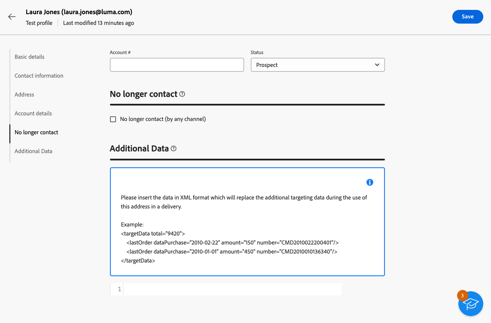

# Criar e gerenciar perfis de teste {#create-test-profiles}

>[!CONTEXTUALHELP]
>id="acw_recipients_testprofiles_menu"
>title="Criar perfis de teste"
>abstract="Os perfis de teste são destinatários adicionais que permitem visualizar e testar a personalização e renderização antes de enviar suas mensagens. É possível selecionar um perfil de teste ao visualizar um conteúdo de mensagem e enviar provas aos perfis de teste para controlar e validar o conteúdo e as configurações da mensagem."

Os perfis de teste são usados para enviar provas e validar o conteúdo e as configurações da mensagem. Esses perfis são recipients adicionais que permitem visualizar e testar a personalização e renderização antes de enviar suas mensagens. É possível selecionar um perfil de teste ao visualizar um conteúdo de mensagem e enviar provas aos perfis de teste para controlar e validar o conteúdo e as configurações da mensagem.

➡️ [Conheça este recurso no vídeo](#video)

<!--Learn more about test profiles in the [Campaign v8 (client console) documentation](https://experienceleague.adobe.com/docs/campaign/campaign-v8/audience/add-profiles/test-profiles.html){target="_blank"}.-->

As etapas para enviar provas para perfis de teste estão detalhadas em [esta seção](../preview-test/test-deliveries.md#test-profiles).

>[!NOTE]
>
>* Os perfis de teste são criados como seed addresses no console do cliente.
>
>* Os perfis de teste são excluídos automaticamente dos relatórios nas seguintes estatísticas de entrega: **[!UICONTROL Cliques]**, **[!UICONTROL Aberturas]**, **[!UICONTROL Cancelamentos de assinatura]**.

## Acessar e gerenciar perfis de teste {#access-test-profiles}

Para acessar a lista de perfis de teste, selecione **[!UICONTROL Gerenciamento de clientes]** > **[!UICONTROL Perfis]** no menu esquerdo e clique na guia **[!UICONTROL Perfis de teste]**.

{zoomable="yes"}

* Você pode filtrar em uma [pasta](../get-started/permissions.md#folders) específica usando a lista suspensa ou adicionar regras usando o [modelador de consultas](../query/query-modeler-overview.md).

  {zoomable="yes"}

* É possível duplicar qualquer perfil de teste e atualizá-lo conforme necessário. As etapas para editar um perfil de teste são as mesmas de quando [criando um perfil de teste](#create-test-profile).

* Para excluir um perfil de teste, selecione a opção correspondente no menu **[!UICONTROL Mais ações]**.

  {zoomable="yes"}

* Para editar um perfil de teste, clique no item desejado na lista. As etapas para editar um perfil de teste são as mesmas de quando [criando um perfil de teste](#create-test-profile).

Você também pode acessar perfis de teste por meio da exibição do **[!UICONTROL Explorer]**, no nó **[!UICONTROL Resources]** > **[!UICONTROL Campaign Management]** > **[!UICONTROL Seed addresses]**.

Nela, você pode navegar, criar e gerenciar pastas ou subpastas, bem como verificar permissões associadas. [Saiba como criar pastas](../get-started/permissions.md#folders)

{zoomable="yes"}

No modo de exibição **[!UICONTROL Explorer]**, você também pode filtrar, excluir, editar e [criar](#create-test-profile) perfis de teste.

## Criar um perfil de teste {#create-test-profile}

>[!CONTEXTUALHELP]
>id="acw_recipients_testprofiles_additionaldata"
>title="Dados adicionais de perfis de teste"
>abstract="Insira os dados de personalização usados para as entregas criadas nos fluxos de trabalho de gerenciamento de dados e aos quais você deseja atribuir um valor específico."

Para criar um perfil de teste, siga as etapas abaixo:

1. Navegue até **[!UICONTROL Customer management]** > **[!UICONTROL Profiles]** e selecione a guia **[!UICONTROL Test profiles]**.

1. Clique no botão **[!UICONTROL Criar perfil de teste]**.

   {zoomable="yes"}

1. Preencha os detalhes do perfil de teste, conforme necessário. <!--Most of the fields are the same as when creating profiles. [Learn more]-->

   {zoomable="yes"}

   >[!NOTE]
   >
   >O campo **[!UICONTROL Rótulo]** é preenchido automaticamente com o nome e sobrenome definidos.

1. Por padrão, perfis de teste são armazenados na pasta **[!UICONTROL Seed addresses]**. Você pode alterá-la navegando até o local desejado. [Saiba como trabalhar com pastas](../get-started/permissions.md#folders)

   <!--{zoomable="yes"}-->

<!--
You do not need to enter all fields of each tab when creating a seed address. Missing personalization elements are entered randomly during delivery analysis. (Not valid?)
-->

1. Na seção **[!UICONTROL Informações de contato]**, insira o endereço de email e outros dados relevantes. O endereço de email é exibido entre colchetes após o rótulo do perfil de teste.

   {zoomable="yes"}

1. Se você marcar a caixa de seleção **[!UICONTROL Não contatar mais (por qualquer canal)]**, o perfil de teste estará em incluir na lista de bloqueios. Esse recipient não é mais direcionado em nenhum canal (email, SMS, etc.).

1. Na guia **[!UICONTROL Additional data]**, insira os dados de personalização usados para os deliveries criados nos workflows de gestão de dados e a qual você deseja atribuir um valor específico. [Saiba mais sobre fluxos de trabalho](../workflows/gs-workflows.md)

   {zoomable="yes"}

   Verifique se os dados de destino adicionais foram definidos com um alias iniciado por &#39;@&#39; na atividade de fluxo de trabalho **[!UICONTROL Enriquecimento]**. Caso contrário, você não poderá usá-lo corretamente com seus seed addresses na atividade do delivery. [Saiba mais sobre a atividade de Enriquecimento](../workflows/activities/enrichment.md)

1. Clique no botão **[!UICONTROL Save]**.

O perfil de teste que você acabou de criar está pronto para ser usado para enviar uma prova. [Saiba mais](../preview-test/test-deliveries.md#test-profiles)

<!--Use test profiles in Direct mail? cf v7/v8-->

## Vídeo tutorial {#video}

Saiba como criar e gerenciar perfis de teste usando a interface da Web do Campaign.

>[!VIDEO](https://video.tv.adobe.com/v/3442844?quality=12)