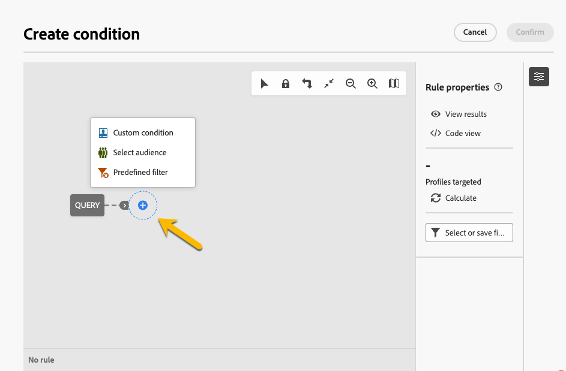

# Usar um **[!UICONTROL grupo de interceptação]** {#trap-group}

Um **[!UICONTROL grupo de interceptação]** é usado para direcionar destinatários que não correspondem aos critérios de destino definidos. Dessa forma, os recipients que estiverem fora do escopo de delivery podem recebê-lo, como qualquer outro recipient target receberia.
Um **[!UICONTROL grupo de interceptação]** é um grupo de **[!UICONTROL seed addresses]**.

## Por que usar o **[!UICONTROL grupo de interceptação]**

Você pode usar **[!UICONTROL grupo de interceptação]**:

1. **Como uma prova**: cada membro do **[!UICONTROL grupo de interceptação]** receberá a entrega como se fizesse parte do público-alvo.

1. **Para proteger sua lista de endereçamento**: ao receber o que o público receberá, cada **[!UICONTROL seed address]** do **[!UICONTROL grupo de interceptação]** será notado se a lista de endereçamento for usada por um terceiro.

## Sobre o **[!UICONTROL grupo de interceptação]**

Os seed addresses são excluídos automaticamente dos relatórios nas seguintes estatísticas de entrega: **Cliques**, **Aberturas**, **Cancelamentos de assinatura**. Os relatórios são somente sobre o público real.

Para uma entrega de email, somente o endereço de email é necessário para o **[!UICONTROL Grupo de interceptação]**. A personalização de outros campos será preenchida aleatoriamente pelo Campaign.

## Como configurar um **[!UICONTROL Grupo de interceptação]** na entrega

Para configurar um **[!UICONTROL Grupo de interceptação]**, vá para as configurações de **[!UICONTROL Público]** da sua entrega. Você terá duas opções:
- [Selecionar perfis de teste](#select-test-profile)
- [Criar condição](#create-condition)

{zoomable="yes"}

### Selecionar perfis de teste {#select-test-profiles}

Ao escolher &quot;Selecionar perfis de teste&quot;, você terá a janela abaixo, onde é convidado a **[!UICONTROL Adicionar perfil(s) de teste]**:

{zoomable="yes"}

Ao clicar no botão, você terá acesso aos seed addresses aos quais pode adicionar seu **[!UICONTROL grupo de trap]**. Marque as que deseja usar.
Você pode criar novos seed addresses. [Saiba mais](#create-seed)

{zoomable="yes"}

Ao confirmar seus endereços de interceptação, verifique se você tem o número correto em **[!UICONTROL Grupo de interceptação]**.

{zoomable="yes"}

### Criar condição {#create-condition}

Com a opção **[!UICONTROL Criar condição]**, você obterá uma nova janela onde poderá personalizar uma consulta para definir os seed addresses que deseja usar:

{zoomable="yes"}

Sua consulta será exibida em **[!UICONTROL Grupo de interceptação]**.

{zoomable="yes"}

## Como criar um novo **[!UICONTROL seed address]** {#create-seed}

Você pode criar um novo **[!UICONTROL seed address]** no **[!UICONTROL Explorer]** > **[!UICONTROL Recursos]** > **[!UICONTROL Campaign Management]** > **[!UICONTROL Seed member]**

{zoomable="yes"}

Você pode concluir todos os detalhes sobre o membro inicial como se ele fosse um perfil de público-alvo:

{zoomable="yes"}