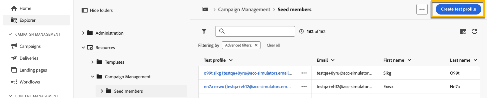

# Use um **[!UICONTROL grupo de trapping]** {#trap-group}

A **[!UICONTROL grupo de trapping]** é usado para direcionar destinatários que não correspondem aos critérios de direcionamento definidos. Dessa forma, os recipients que estiverem fora do escopo de delivery podem recebê-lo, como qualquer outro recipient target receberia.
A **[!UICONTROL grupo de trapping]** é um grupo de **[!UICONTROL seed addresses]**.

## Por que usar **[!UICONTROL grupo de trapping]**

Você pode usar **[!UICONTROL grupo de trapping]** :

1. **Como prova** : cada membro do **[!UICONTROL Grupo de interceptação]** O receberá a entrega como se fizesse parte do público-alvo.

1. **Para proteger sua lista de endereçamento** : ao receber o que o público receberá, cada **[!UICONTROL seed address]** do **[!UICONTROL Grupo de interceptação]** será notado se a lista de endereçamento for usada por um terceiro.

## Sobre **[!UICONTROL Grupo de interceptação]**

Os seed addresses são excluídos automaticamente dos relatórios nas seguintes estatísticas do delivery: **Cliques**, **Aberturas**, **Cancelamentos de assinatura**. Os relatórios são somente sobre o público real.

Para um delivery de email, somente o endereço de email é necessário para o **[!UICONTROL Grupo de interceptação]**, a personalização de outros campos será preenchida aleatoriamente pelo Campaign.

## Como configurar um **[!UICONTROL Grupo de interceptação]** no delivery

Para configurar um **[!UICONTROL Grupo de interceptação]**, vá para a **[!UICONTROL Público]** configurações da sua entrega. Você terá duas opções:
- [Selecionar perfis de teste](#select-test-profile)
- [Criar condição](#create-condition)

{zoomable="yes"}

### Selecionar perfis de teste {#select-test-profiles}

Ao escolher &quot;Selecionar perfis de teste&quot;, você terá a janela abaixo, onde é convidado a **[!UICONTROL Adicionar perfil(s) de teste]** :

{zoomable="yes"}

Ao clicar no botão, você terá acesso aos seed addresses que podem ser adicionados **[!UICONTROL grupo de trapping]**. Marque as que deseja usar.
Você pode criar novos seed addresses. [Saiba mais](#create-seed)

{zoomable="yes"}

Ao confirmar seus endereços de trap, verifique se você tem o número correto em **[!UICONTROL Grupo de interceptação]**.

{zoomable="yes"}

### Criar condição {#create-condition}

Com o **[!UICONTROL Criar condição]** , você receberá uma nova janela onde poderá personalizar um query para definir os seed addresses que deseja utilizar:

{zoomable="yes"}

Sua consulta será exibida em **[!UICONTROL Grupo de interceptação]**.

{zoomable="yes"}

## Como criar um novo **[!UICONTROL seed address]** {#create-seed}

Você pode criar um novo **[!UICONTROL seed address]** in **[!UICONTROL Explorer]** > **[!UICONTROL Recursos]** > **[!UICONTROL Campaign Management]** > **[!UICONTROL Seed Members]**

{zoomable="yes"}

Você pode concluir todos os detalhes sobre o membro inicial como se ele fosse um perfil de público-alvo:

{zoomable="yes"}