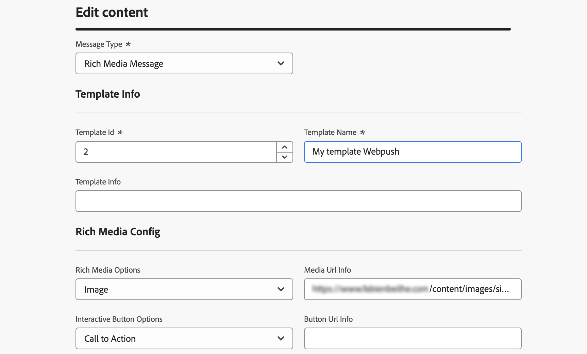

# Introdução a canais personalizados {#gs-custom-channel}

>[!CONTEXTUALHELP]
>id="acw_homepage_welcome_rn1"
>title="Canal personalizado para entregas de API"
>abstract="Agora você pode, diretamente da interface do usuário da Web do Adobe Campaign, orquestrar e executar deliveries com base em canais de API personalizados. Esses deliveries podem ser independentes ou fazer parte de um fluxo de trabalho."
>additional-url="https://experienceleague.adobe.com/docs/campaign-web/v8/release-notes/release-notes.html?lang=pt-BR" text="Consulte as notas de versão"

Você pode, diretamente da interface do usuário da Web do Adobe Campaign, orquestrar e executar deliveries com base em canais personalizados integrados com terceiros. A configuração do canal personalizado é executada no Console do cliente.

Há suporte para dois tipos de canais personalizados, externo e API. Com canais externos, o Campaign gera arquivos de exportação personalizáveis com todos os dados de contato e personalização necessários. Com os canais de API, as mensagens são enviadas aos perfis do público-alvo por meio da API configurada.

Você pode adicionar deliveries de canal personalizados em workflows ou apenas usá-los como deliveries independentes.

As etapas abaixo detalham o procedimento para um delivery independente (único). A maioria das etapas é semelhante aos deliveries da central de atendimento. Para obter mais detalhes, consulte esta [página](../call-center/create-call-center.md).

Para enviar um novo delivery personalizado independente, siga estas etapas principais:

1. Configure o canal personalizado, [leia mais](#create-channel)
1. Crie a entrega, [leia mais](#create-delivery)
1. Defina a audiência, [leia mais](#select-audience)
1. Edite o conteúdo, [leia mais](#edit-content)
1. Pré-visualizar e enviar a entrega, [leia mais](#preview-send)

## Configurar o canal personalizado{#create-channel}

Primeiro, é necessário configurar o canal personalizado. Estas são as principais etapas a serem executadas no Console do cliente. Essas etapas são comuns aos canais externos e de API personalizados:

1. Configure o schema para adicionar o novo canal à lista de canais disponíveis. [Leia mais](https://experienceleague.adobe.com/docs/campaign/campaign-v8/send/custom-channel.html#configure-schema){target="_blank"}
1. Crie uma nova conta externa de roteamento. [Leia mais](https://experienceleague.adobe.com/docs/campaign/campaign-v8/send/custom-channel.html#reate-ext-account){target="_blank"}
1. Crie um novo template do delivery associado ao novo canal. [Leia mais](https://experienceleague.adobe.com/docs/campaign/campaign-v8/send/custom-channel.html#create-template){target="_blank"}

Os canais de API personalizados exigem configuração adicional. [Leia mais](https://experienceleague.adobe.com/docs/campaign/campaign-v8/send/custom-channel.html#api-additional){target="_blank"}

## Criar a entrega{#create-delivery}

Siga estas etapas para criar o delivery e configurar suas propriedades:

1. Selecione o menu **[!UICONTROL Deliveries]** e clique no botão **[!UICONTROL Criar delivery]**.

1. Escolha o canal personalizado desejado, selecione o modelo associado e clique em **[!UICONTROL Criar entrega]** para confirmar.

   {zoomable="yes"}

1. Em **[!UICONTROL Propriedades]**, insira um **[!UICONTROL Rótulo]** para a entrega.

   {zoomable="yes"}

Para obter mais informações sobre a criação de entregas, consulte a [documentação](../call-center/create-call-center.md#create-delivery) da central de atendimento.

## Definir o público-alvo{#select-audience}

Agora, é necessário definir o público-alvo que será direcionado.

1. Na seção **[!UICONTROL Público-alvo]** do painel de entrega, clique em **[!UICONTROL Selecionar público-alvo]**.

1. Escolha um público existente ou crie o seu próprio público.

   {zoomable="yes"}

Para obter mais informações sobre definição de público, consulte a [documentação](../call-center/create-call-center.md#select-audience) da central de atendimento.

## Editar o conteúdo{#edit-content}

Agora, vamos editar o conteúdo do delivery.

>[!BEGINTABS]

>[!TAB Canal externo personalizado]

1. No painel de entrega, clique no botão **[!UICONTROL Editar conteúdo]**.

1. Especifique um **[!UICONTROL Nome do arquivo]**, selecione um **[!UICONTROL Formato de arquivo]** e adicione quantas colunas forem necessárias para o arquivo de extração.

   

>[!TAB Canal de API personalizado]

1. No painel de entrega, clique no botão **[!UICONTROL Editar conteúdo]**.

1. Preencha os campos conforme necessário. Para saber como configurar esta tela, consulte esta [página](https://experienceleague.adobe.com/docs/campaign/campaign-v8/send/custom-channel.html#api-additional-screen){target="_blank"}.

   

>[!ENDTABS]

Para obter mais informações sobre a edição de conteúdo, consulte a [documentação](../call-center/create-call-center.md#edit-content) da central de atendimento.

## Pré-visualizar e enviar o delivery{#preview-send}

Quando o conteúdo do delivery estiver pronto, você poderá pré-visualizá-lo usando perfis de teste. Você pode enviar o delivery para gerar o arquivo de extração ou enviar a mensagem por meio da API.

>[!BEGINTABS]

>[!TAB Canal externo personalizado]

1. No painel de entrega, clique no botão **[!UICONTROL Editar conteúdo]**.

1. Na página de conteúdo da entrega, clique no botão **[!UICONTROL Simular conteúdo]** e selecione perfis de teste.

   {zoomable="yes"}

>[!TAB Canal de API personalizado]

1. No painel de entrega, clique no botão **[!UICONTROL Editar conteúdo]**.

1. Na página de conteúdo da entrega, clique no botão **[!UICONTROL Simular conteúdo]** e selecione perfis de teste.

1. No lado direito, clique em **Abrir visualização**. Esse recurso precisa ser configurado usando JSSP. Consulte esta [página](https://experienceleague.adobe.com/docs/campaign/campaign-v8/send/custom-channel.html#api-additional-preview){target="_blank"}.

   {zoomable="yes"}

>[!ENDTABS]

No painel de entrega, clique em **[!UICONTROL Revisar e enviar]** e em **[!UICONTROL Preparar]**. Em seguida, confirme. Clique em **[!UICONTROL Enviar]** para continuar com o processo de envio final e, em seguida, confirme.

{zoomable="yes"}

Para obter mais detalhes sobre visualização e envio, consulte a [documentação](../call-center/create-call-center.md#preview-send) da central de atendimento.
