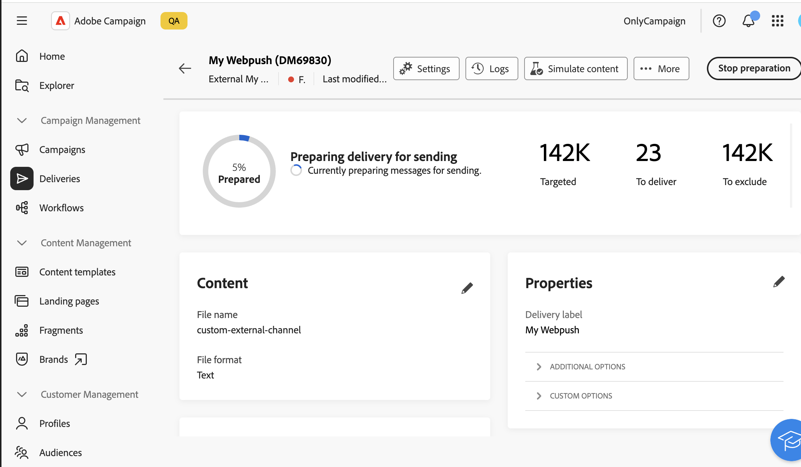

# Introdução a canais externos personalizados {#gs-custom-channel}

Você pode, diretamente da interface do usuário da Web do Adobe Campaign, orquestrar e executar deliveries com base em canais externos personalizados integrados com terceiros. A criação do canal externo personalizado é executada no Console do cliente.

Você pode configurar deliveries externos de canal personalizados em workflows ou como deliveries independentes, definir seu público e gerar arquivos de exportação personalizáveis com todos os dados de contato e personalização necessários.

>[!NOTE]
>
>Os relatórios não estão disponíveis na interface do usuário da Web para entregas externas de canal personalizado. Você deve navegar até o Console do cliente para acessar os relatórios.

As etapas abaixo detalham o procedimento para um delivery independente (único). A maioria das etapas é semelhante aos deliveries da central de atendimento. Para obter mais detalhes, consulte esta [página](../call-center/create-call-center.md).

Para criar e enviar um novo delivery externo personalizado independente, siga estas etapas principais:

1. Crie o canal externo personalizado, [leia mais](#create-channel)
1. Crie a entrega, [leia mais](#create-delivery)
1. Defina a audiência, [leia mais](#select-audience)
1. Edite o conteúdo, [leia mais](#edit-content)
1. Pré-visualizar e enviar a entrega, [leia mais](#preview-send)

## Criar o canal externo personalizado{#create-channel}

Primeiro, é necessário configurar o canal externo personalizado. Estas são as principais etapas a serem executadas no Console do cliente:

1. Configure o schema para adicionar o novo canal à lista de canais disponíveis.
1. Crie uma nova conta externa de roteamento.
1. Crie um novo template do delivery associado ao novo canal.

Para obter mais detalhes, consulte a [documentação do Console do Cliente](https://experienceleague.adobe.com/docs/campaign/campaign-v8/send/custom-channel.html)

## Criar a entrega{#create-delivery}

Siga estas etapas para criar o delivery e configurar suas propriedades:

1. Selecione o menu **[!UICONTROL Deliveries]** e clique no botão **[!UICONTROL Criar delivery]**.

1. Escolha o canal externo personalizado desejado, selecione o modelo associado e clique em **[!UICONTROL Criar entrega]** para confirmar.

   {zoomable="yes"}

1. Em **[!UICONTROL Propriedades]**, insira um **[!UICONTROL Rótulo]** para a entrega.

   {zoomable="yes"}

Para obter mais informações sobre a criação de entregas, consulte a [documentação](../call-center/create-call-center.md#create-delivery) da central de atendimento.

## Definir o público-alvo{#select-audience}

Agora, é necessário definir o público-alvo que será direcionado para o arquivo de extração.

1. Na seção **[!UICONTROL Público-alvo]** da página de entrega, clique em **[!UICONTROL Selecionar público-alvo]**.

1. Escolha um público existente ou crie o seu próprio público.

   {zoomable="yes"}

Para obter mais informações sobre definição de público, consulte a [documentação](../call-center/create-call-center.md#select-audience) da central de atendimento.

## Editar o conteúdo{#edit-content}

Agora, vamos editar o conteúdo do arquivo de extração que será gerado pela entrega do canal personalizado.

1. Na página de entrega, clique no botão **[!UICONTROL Editar conteúdo]**.

1. Especifique um **[!UICONTROL Nome do arquivo]**, selecione um **[!UICONTROL Formato de arquivo]** e adicione quantas colunas forem necessárias para o arquivo de extração.

   

Para obter mais informações sobre a edição de conteúdo, consulte a [documentação](../call-center/create-call-center.md#edit-content) da central de atendimento.

## Pré-visualizar e enviar o delivery{#preview-send}

Quando o conteúdo do delivery estiver pronto, você poderá pré-visualizá-lo usando perfis de teste e enviar provas. Em seguida, você pode enviar o delivery para gerar o arquivo de extração.

1. Na página de conteúdo da entrega, clique no botão **[!UICONTROL Simular conteúdo]** e selecione perfis de teste.

   {zoomable="yes"}

1. Na página de entrega, clique em **[!UICONTROL Revisar e enviar]** e em **[!UICONTROL Preparar]**. Em seguida, confirme.

   {zoomable="yes"}

1. Clique em **[!UICONTROL Enviar]** para continuar com o processo de envio final e, em seguida, confirme.

Para obter mais detalhes sobre visualização e envio, consulte a [documentação](../call-center/create-call-center.md#preview-send) da central de atendimento.
