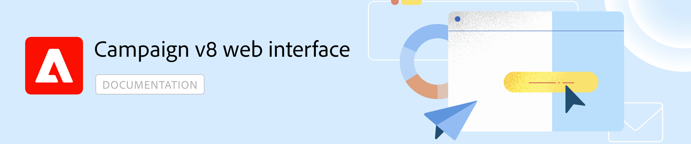

# Documentação do Adobe Campaign Web v8 {#campaign-documentation}

O Campaign agora oferece uma nova interface da web, com utilização e acessibilidade aprimoradas e um novo design para melhorar significativamente a experiência do usuário. Essa nova interface moderna simplifica a criação da campanha de marketing e a entrega, e oferece consistência, além de outras soluções da Adobe, incluindo a Adobe Experience Platform. [Saiba mais](get-started/get-started.md)

>A Web do Campaign v8 está atualmente na versão Beta. O acesso é restrito a um pequeno conjunto de clientes Beta. Observe que a interface do produto, os recursos e os fluxos de uso podem mudar sem aviso prévio. [Saiba mais](rn/whats-new.md)

## Novos recursos do Campaign Web

**Conheça a nova interface do Campaign Web v8**

A nova interface da Web do Campaign v8 oferece uma experiência de usuário moderna e intuitiva para simplificar o design e a entrega da campanha de marketing. Essa nova interface é integrada à Adobe Experience Platform.

**Interface de tela de workflow reformulada**

Nosso ambiente gráfico abrangente que permite criar processos complexos que podem ajudá-lo a gerenciar suas campanhas de marketing com facilidade. Com os workflows, é possível orquestrar a gama completa de processos e tarefas, melhorar a velocidade e a escala de cada aspecto de suas campanhas de marketing, desde a criação de segmentos e a preparação de mensagens até a entrega. Além disso, você pode sincronizar seus canais com uma interface única e fácil de usar para a orquestração de campanhas.

**Conheça o Designer de email**

Comece a partir de um modelo ou use o novo Designer de email do Adobe Campaign para criar emails sem precisar escrever uma única linha de código. Saiba como usar o Designer de email para criar seu conteúdo, visualizá-lo e testá-lo. Você ainda pode enviar um email para um público-alvo já existente no caso de uso completo.

**Tornar seu conteúdo dinâmico**

Personalize o conteúdo com base nas informações coletadas sobre os destinatários. A utilização do conteúdo dinâmico torna seu conteúdo mais atraente e aumenta sua probabilidade de leitura. Personalize suas mensagens para cada destinatário específico, aproveitando os dados do perfil como nome, interesses, onde vive, o que comprou e muito mais. Crie conteúdo condicional para adaptar suas entregas a cada destinatário e mostrar apenas o conteúdo relevante para um determinado cliente, com base nas informações que você tem sobre ele.

**Criar campanhas entre canais**

Use o Adobe Campaign para criar campanhas entre canais. Com seus recursos de orquestração de campanhas de marketing, é possível gerenciar e centralizar os dados do cliente e elaborar comunicações e campanhas do cliente para criar experiências personalizadas em diferentes canais. Nesta versão, os canais de email, push e SMS estão disponíveis. Meça a eficácia das entregas com relatórios detalhados, incluindo a contagem de aberturas, cliques, encaminhamentos e muito mais.

## Vamos nos aprofundar um pouco mais

Agora que você entende o que pode fazer no Adobe Campaign Web, é hora de se aprofundar nessas seções de documentação para começar a trabalhar com ele.

<table style="table-layout:fixed"><tr style="border: 0;">
<td>

<a href="get-started/user-interface.md"><strong>Conheça a nova interface</strong>

</td>
<td>

<a href="workflows/gs-workflows.md"><strong>Interface de tela de workflow reformulada</strong></a>

</td>
<td>

<a href="content/get-started-email-designer.md"><strong>Conheça o Designer de email</strong></a>

</td>
<td>

<a href="personalization/gs-personalization.md"><strong>Tornar seu conteúdo dinâmico</strong></a>

</td>
<td>

<a href="campaigns/gs-campaigns.md"><strong>Criar campanhas entre canais</strong></a>

</td>
</tr></table>

<!--
<table style="table-layout:fixed">
<tr style="border: 0;"><td width="30%"></td><td>Discover Campaign Web new user interface, latest improvements, key capabilities. Learn how to use them to build cross-channel campaigns for your audiences. With its user-friendly features, Campaign helps you streamline personalized cross-channel campaign creation process, drive results, and gain a competitive edge.</td></tr>
<tr style="border: 0;"><td width="30%"></td><td>Our comprehensive graphical canvas makes it easy for you to design processes such as segmentation, campaign execution, and more. With this advanced tool at your fingertips, you can streamline your workflow and elevate your campaigns.</td></tr>
<tr style="border: 0;"><td width="30%"></td><td>Start from a template, or use Adobe Campaign's new Email Designer to create emails without having to write a single line of code. Learn how to use the Email Designer to create your content, preview and test it, and send an email to an existing audience in an end-to-end use case.</td></tr>
<tr style="border: 0;"><td width="30%"></td><td>Create conditional content to define dynamic personalization based on the recipient's profile, automatically replacing text blocks and images when certain conditions are met. This feature can take your campaigns to new heights and deliver highly targeted, personalized experiences to your audience</td></tr>
<tr style="border: 0;"><td width="30%"></td><td>Adobe Campaign capabilities help you manage centralized customer data, design customer communications and campaigns, and create personalized experiences across different channels: Email, Push and SMS.</td></tr>
</table>
-->

