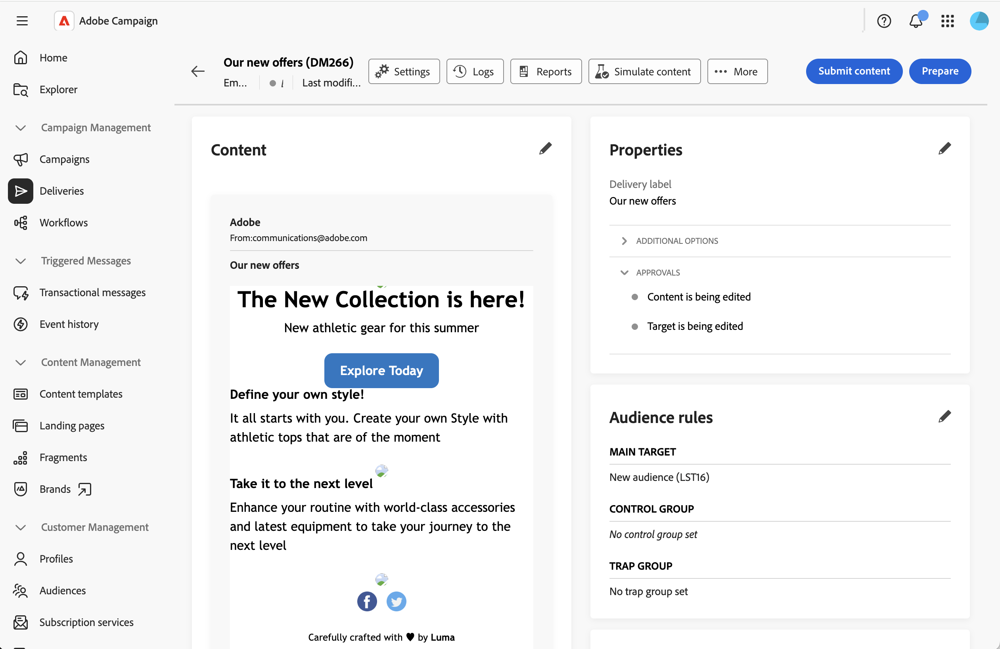
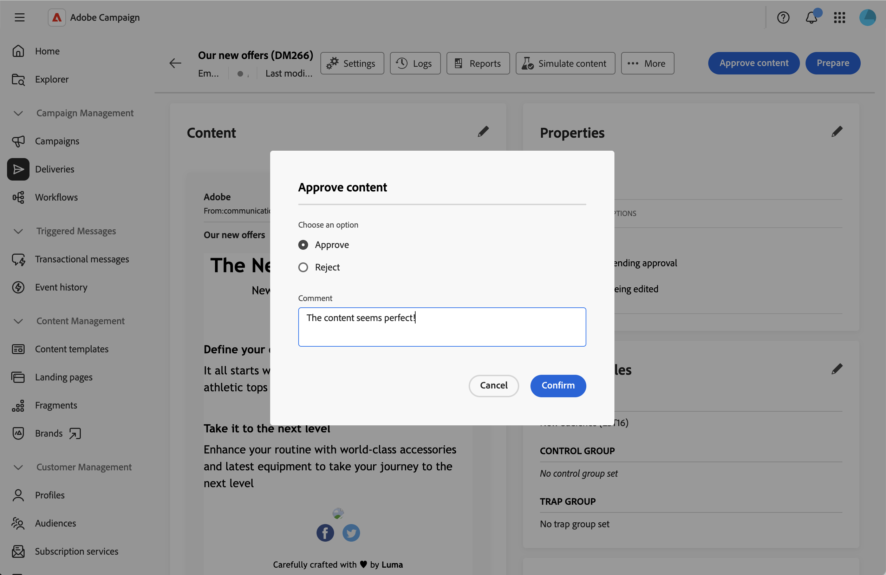

# Gerenciar o processo de aprovação {#campaign-approvals}

>[!IMPORTANT]
>
>Aprovações só estão disponíveis para campanhas e deliveries criados em uma campanha.

O processo de aprovação ajuda a coordenar as diversas partes interessadas e garante o controle de qualidade antes do envio das entregas. Utilize o processo de aprovação quando sua organização precisar da validação de diferentes equipes, como gerentes de marketing que precisam revisar conteúdo ou analistas de dados que precisam validar públicos-alvo.

Quando as aprovações estiverem habilitadas, você deverá enviar conteúdo ou público alvo para aprovação. Os revisores designados recebem notificações por email solicitando validação e podem aprovar ou rejeitar diretamente da interface da Web. Os deliveries não podem ser enviados até que todas as aprovações necessárias sejam concedidas. Você pode ativar:

* **Aprovação de conteúdo**: validar o conteúdo da mensagem, o design e a personalização. Você pode adicionar uma etapa de edição antes da aprovação do conteúdo, realizada por um operador designado, e uma etapa de aprovação para um revisor externo depois que o conteúdo for aprovado internamente.
* **Aprovação do público-alvo**: validar o público-alvo e os critérios de direcionamento
* **Aprovação de orçamento**: validar o orçamento de entrega
* **Início da entrega**: restringir quem pode começar a enviar a entrega para um revisor específico
* **Confirmação de entrega**: é necessária uma confirmação final antes de enviar

## Definir configurações de aprovação {#configure-approvals}

As configurações de aprovação são herdadas do template de campanha e podem ser modificadas para campanhas individuais. A mesma seção **[!UICONTROL Aprovações]** também está disponível nas configurações de uma entrega criada em uma campanha, permitindo que você substitua a configuração no nível da campanha somente para essa entrega.

Siga estas etapas para definir configurações de aprovação no nível da campanha:

1. Abra sua campanha ou modelo de campanha, ou crie um novo, no menu **[!UICONTROL Campanhas]**.

1. Clique no botão **[!UICONTROL Configurações]** na parte superior direita do painel de campanha.

1. Na seção **[!UICONTROL Aprovações]**, configure as seguintes opções:

   {zoomable="yes"}

   >[!NOTE]
   >
   > Se decidir habilitar uma opção de aprovação, clique no ícone de pasta no campo **[!UICONTROL Revisor]** para selecionar um operador ou grupo de operadores.

1. Configurar **[!UICONTROL Aprovação de conteúdo]**: quando habilitado, o conteúdo da entrega deve ser aprovado antes do envio. Quando essa opção está ativada, dois campos são exibidos:

   * **[!UICONTROL Atribuir edição de conteúdo]**: adiciona uma etapa de edição antes da aprovação do conteúdo. Um operador designado, como um webmaster, é notificado a editar o conteúdo e, em seguida, o disponibiliza para aprovação.
   * **[!UICONTROL Aprovação de conteúdo externo]**: adiciona uma etapa de aprovação para um revisor externo, como um parceiro ou fornecedor, que valida a renderização da entrega (por exemplo, consistência de marca) depois que o conteúdo é aprovado internamente.

1. Definir a **[!UICONTROL Aprovação de público-alvo]**: quando habilitada, o público-alvo de entrega deve ser aprovado.

1. Definir a **[!UICONTROL Aprovação de orçamento]**: quando habilitada, o orçamento de entrega deve ser aprovado. Essa opção requer que um orçamento já esteja atribuído à campanha, o que é feito no momento no Console do cliente.

1. Defina o **[!UICONTROL Início da entrega]**: restrinja o início da entrega a um operador ou grupo de operadores específico. Se um operador não autorizado tentar enviar o delivery, ele verá um erro indicando que não está autorizado a executar essa ação.

1. Definir o **[!UICONTROL Confirmar a entrega antes de enviar]**: requer uma confirmação manual final antes de enviar, mesmo após a conclusão de todas as outras aprovações.

>[!NOTE]
>
>* Se nenhum revisor for especificado, o proprietário da campanha será atribuído como revisor.
>* Os revisores precisam de permissões apropriadas para aprovar deliveries. Somente os usuários identificados na lista de revisores podem aprovar.

## Enviar para aprovação {#submit-approval}

Depois de criar o delivery, siga estas etapas para enviar conteúdo e público-alvo para aprovação.

>[!NOTE]
>
>As aprovações se aplicam se o delivery foi criado diretamente na campanha ou por meio de um workflow da campanha.

1. No painel de entrega, clique no botão **[!UICONTROL Enviar conteúdo]**. Os revisores designados podem aprovar ou rejeitar. Consulte esta [seção](#approve-reject).

   {zoomable="yes"}

   O status de aprovação muda para pendente na seção **[!UICONTROL Properties]** do painel de entrega. Consulte esta [seção](#track-approvals).

1. Depois que o conteúdo for aprovado, clique no botão **[!UICONTROL Preparar]** para preparar o destino de entrega. O sistema prepara o público-alvo e os critérios de direcionamento.

1. Clique no botão **[!UICONTROL Enviar destino]**. Os revisores designados podem aprovar ou rejeitar. Consulte esta [seção](#approve-reject).

   {zoomable="yes"}

   O status de aprovação muda para pending. Consulte esta [seção](#track-approvals).

1. Se a aprovação do orçamento estiver habilitada, envie o orçamento para aprovação seguindo o mesmo princípio. Os revisores designados podem aprovar ou rejeitar. Consulte esta [seção](#approve-reject).

1. Quando o target e, se aplicável, o orçamento forem aprovados, a preparação será retomada e o delivery poderá ser enviado.

>[!NOTE]
>Se uma aprovação for rejeitada, o proprietário do delivery deverá fazer todas as alterações necessárias no conteúdo ou público alvo com base no feedback do revisor e reenviar para aprovação.

## Aprovar ou rejeitar {#approve-reject}

Os revisores designados podem aprovar ou rejeitar o conteúdo, o público-alvo e os envios de orçamento. Consulte esta [seção](#submit-approval).

>[!NOTE]
>Para que a notificação por email seja enviada, o endereço do revisor deve ser configurado na instância.

1. Ao receber o email de notificação, abra o delivery que requer aprovação diretamente da interface do usuário da Web.

1. Revise o conteúdo ou as informações de direcionamento.

1. Clique no botão **[!UICONTROL Aprovar conteúdo]**, **[!UICONTROL Aprovar destino]** ou **[!UICONTROL Aprovar orçamento]**.

   {zoomable="yes"}

1. Clique em **[!UICONTROL Aprovar]** ou **[!UICONTROL Rejeitar]**.

1. Opcionalmente, adicione um **[!UICONTROL Comentário]** para explicar sua decisão.

   {zoomable="yes"}

1. Confirme sua decisão. O status de aprovação é atualizado imediatamente no painel do delivery. Consulte esta [seção](#track-approvals).

## Rastrear status de aprovação {#track-approvals}

O status de aprovação é visível na seção **[!UICONTROL Properties]** do painel de entrega. O status exibe quais aprovações estão aguardando e seu estado atual:

{zoomable="yes"}

* **[!UICONTROL Sendo editado]**: o conteúdo ou destino ainda não foi enviado para aprovação
* **[!UICONTROL Aprovação pendente]**: o conteúdo ou destino está aguardando revisão
* **[!UICONTROL Aprovado]**: o conteúdo ou destino foi aprovado pelo revisor
* **[!UICONTROL Rejected]**: o conteúdo ou destino foi rejeitado pelo revisor

A seção de aprovação mostra todas as aprovações e atualizações ativadas em tempo real, conforme os revisores validam ou rejeitam cada etapa.

## Tópicos relacionados {#related}

* [Criar campanhas](create-campaigns.md)
* [Gerenciar campanhas](manage-campaigns.md)
