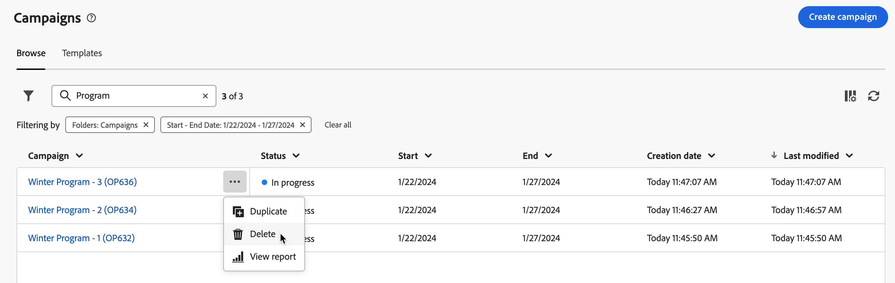

# Acesso e gerenciamento de suas campanhas{#manage-campaigns}

>[!CONTEXTUALHELP]
>id="acw_campaign_schedule"
>title="Programação de campanha"
>abstract="Defina ou modifique a programação da campanha."

Para acessar e gerenciar suas campanhas, clique no menu **[!UICONTROL Campanhas]** na navegação à esquerda.

## Lista de campanhas {#access-campaigns}

Na lista de campanhas, duas guias estão disponíveis:

* A guia **Procurar** lista todas as campanhas existentes. É possível clicar em uma campanha para abrir seu painel ou criar uma nova campanha clicando no botão **Criar campanha**. Consulte esta [seção](create-campaigns.md#create-campaigns).

* A guia **Modelos** lista todos os modelos de campanha disponíveis. É possível exibir um modelo existente ou criar um novo. [Leia mais](#manage-campaign-templates).

Por padrão, cada campanha na lista exibe informações sobre seu status atual, datas de início e término, data de criação, a última vez que foi modificada, etc.

É possível personalizar as colunas exibidas clicando no ícone **Configurar coluna para um layout personalizado** localizado no canto superior direito da lista. Isso permite adicionar ou remover colunas e reordenar informações na lista de campanhas.

Além disso, uma barra de pesquisa e filtros estão disponíveis para facilitar a pesquisa na lista. [Saiba mais](../get-started/user-interface.md#list-screens).

Por exemplo, você pode filtrar pelo cronograma da campanha. Abra o painel de filtro e use a seção **Data de início - término**:

## Painel de campanha {#campaign-dashboard}

>[!CONTEXTUALHELP]
>id="acw_campaign_delivery_list"
>title="Lista de entregas na campanha"
>abstract="A guia **Entregas** lista todas as entregas vinculadas à campanha atual. Clique no nome de uma entrega para editar. Use o botão Criar entrega para adicionar uma nova entrega a esta campanha."

>[!CONTEXTUALHELP]
>id="acw_campaign_workflow_list"
>title="Lista de workflows em uma campanha"
>abstract="A guia **Fluxo de trabalho** lista todos os fluxos de trabalho vinculados à campanha atual. "

Na guia **Procurar** da lista de campanhas, clique em um nome de campanha para exibir seus detalhes.

O status e o cronograma da campanha são exibidos na parte superior da tela. Você pode usar o botão **Configurações** para atualizar as propriedades da campanha, como rótulo, pasta e descrição. Você também pode alterar a programação da campanha na tela de configurações. Saiba mais sobre o agendamento da campanha em [esta seção](create-campaigns.md#campaign-schedule).

No painel de campanha, use os botões **Logs** e **Reports** para monitorar sua campanha. Saiba mais nesta [seção](create-campaigns.md#create-campaigns)

Para cada campanha, o painel mostra duas guias principais: Workflows e Deliveries.

* A guia **Workflows** lista todos os workflows associados à campanha. Essa guia também permite criar um novo workflow dentro da campanha. Consulte esta [seção](create-campaigns.md#create-campaigns).

* A guia **Deliveries** lista todas as entregas criadas na campanha atual. Você também pode criar uma nova entrega dentro da campanha. Consulte esta [seção](create-campaigns.md#create-campaigns).

>[!NOTE]
>
>A guia **Entrega** exibe todas as entregas vinculadas à campanha. No entanto, as entregas criadas em um fluxo de trabalho não podem ser excluídas dali. Para excluir uma entrega criada no contexto de um workflow, será necessário excluir a atividade de entrega do workflow. [Saiba mais](../msg/gs-messages.md#delivery-delete).

## Excluir uma campanha {#campaign-delete}

Há duas maneiras de excluir uma campanha:

* na lista de campanhas, clique no botão de reticências e selecione **Excluir**

  

* da própria campanha, clique no botão **Mais** e selecione **Excluir**

  

## Duplicar uma campanha {#campaign-duplicate}

Há duas maneiras de duplicar uma campanha:

* na lista de campanhas, clique no botão de reticências e selecione **Duplicar**

* da própria campanha, clique no botão **Mais** e selecione **Duplicar**

Em ambos os casos, confirme a duplicação para criar a nova campanha. O rótulo da campanha **Cópia de`<label of the initial campaign`**. Navegue até as configurações da campanha para atualizar esse rótulo.

## Trabalhar com modelos de campanha{#manage-campaign-templates}

Os templates de campanha contêm configurações pré-definidas que podem ser reutilizadas para criar novas campanhas. Um conjunto de modelos integrados está disponível para ajudar você a começar. Você pode criar e configurar seus modelos de campanha e, em seguida, criar campanhas com base nesses modelos.

Um template de campanha pode armazenar as seguintes informações:

* a campanha **Configurações**
* a campanha **Agenda**
* modelos de fluxo de trabalho
* templates do delivery

Para criar um template de campanha, siga as etapas abaixo:

1. Clique no menu **[!UICONTROL Campanhas]**, navegue até a guia **Modelos** e clique no botão **[!UICONTROL Criar modelo]**.
1. Selecione o **Modelo** para usar. Isso permite basear o novo modelo em um modelo criado anteriormente.
1. Forneça um rótulo para o modelo.
1. Se necessário, você pode alterar as **Opções adicionais** a seguir: nome interno, pasta, destinatário, descrição e natureza.
1. Defina o **Agendamento** da sua campanha. Saiba como definir seu agendamento de campanha em [esta seção](create-campaigns.md#campaign-schedule)
1. Clique em **Create**.
1. Adicione workflows e templates de delivery à sua campanha.
