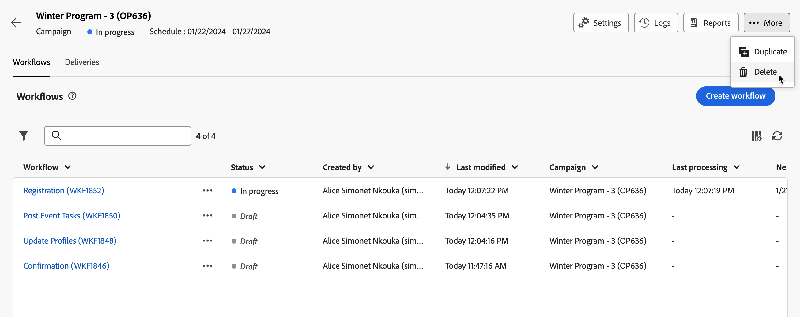

# Acesso e gerenciamento de suas campanhas {#manage-campaigns}

>[!CONTEXTUALHELP]
>id="acw_campaign_schedule"
>title="Programação de campanha"
>abstract="Defina ou modifique a programação da campanha."

Para acessar e gerenciar suas campanhas, clique no menu **[!UICONTROL Campanhas]** na navegação à esquerda. Duas guias estarão disponíveis:

* A guia **Procurar** lista todas as campanhas existentes. É possível clicar em uma campanha para abrir seu painel ou criar uma nova campanha clicando no botão **Criar campanha**. Consulte esta [seção](create-campaigns.md#create-campaigns).

* A guia **Modelos** lista todos os modelos de campanha disponíveis. É possível exibir um modelo existente ou criar um novo. [Leia mais](#manage-campaign-templates).

## Estoque de campanhas {#inventory}

A guia **[!UICONTROL Procurar]** fornece informações sobre o status atual das campanhas, as datas de início e término, a data de criação, a última vez que foram modificadas, etc. É possível personalizar as colunas exibidas clicando no ícone **Configurar coluna para um layout personalizado** localizado no canto superior direito da lista. Isso permite adicionar ou remover colunas e reordenar informações na lista de campanhas.

### Pesquisar e filtrar o inventário {#search}

Uma barra de pesquisa e filtros estão disponíveis para facilitar a pesquisa na lista. [Saiba mais](../get-started/user-interface.md#list-screens). Por exemplo, você pode filtrar pelo cronograma da campanha. Abra o painel de filtro e use a seção **Data inicial - final**:

### Exibição da linha do tempo {#timeline}

Por padrão, a tela da campanha mostra a **Exibição de lista** (inventário). Você pode alternar para **exibição da Linha do Tempo** a qualquer momento usando a opção de exibição. Ambas as exibições mostram as mesmas campanhas e compartilham os mesmos filtros e pesquisa: quando você altera filtros ou pesquisa em uma exibição, a outra exibição reflete a mesma seleção.

A visualização da Linha do tempo ajuda você a visualizar e gerenciar suas campanhas ao longo do tempo. Você pode ver todas as suas campanhas em um formato baseado em tempo, facilitando planejar, agendar e coordenar suas atividades de marketing.

**Como funciona a linha do tempo:**

* A linha do tempo exibe suas campanhas de acordo com as datas de início e término. Campanhas que abrangem vários dias aparecem nas datas relevantes.
* Você pode navegar por semana, mês ou dia. Use o seletor de datas ou os botões de seta para se mover entre os períodos. Use o botão **Hoje** para retornar rapidamente à data atual.
* Selecionar uma campanha abre um painel direito com detalhes da campanha: status, datas de início e término, lista de workflows e lista de deliveries. Você pode navegar para esses workflows e deliveries no painel.
* As campanhas em andamento são priorizadas na exibição quando muitas campanhas estão na mesma data.
* Quando muitas campanhas ocorrem em um único dia (por exemplo, na exibição de mês), um controle **Mais** permite expandir para ver o conjunto completo desse dia ou alternar para a exibição de semana ou dia para obter mais detalhes.

## Painel de campanha {#campaign-dashboard}

>[!CONTEXTUALHELP]
>id="acw_campaign_delivery_list"
>title="Lista de entregas na campanha"
>abstract="A guia **Entregas** lista todas as entregas vinculadas à campanha atual. Clique no nome de uma entrega para editar. Use o botão Criar entrega para adicionar uma nova entrega a esta campanha."

>[!CONTEXTUALHELP]
>id="acw_campaign_workflow_list"
>title="Lista de fluxos de trabalho em uma campanha"
>abstract="A guia **Fluxo de trabalho** lista todos os fluxos de trabalho vinculados à campanha atual. "

Na guia **Procurar** da lista de campanhas, clique em um nome de campanha para exibir seus detalhes.

O status e o agendamento da campanha são exibidos na parte superior da tela. Use o botão **Configurações** para atualizar as propriedades da campanha, como rótulo, pasta e descrição. Você também pode alterar a programação da campanha na tela de configurações. Saiba mais sobre o agendamento da campanha em [esta seção](create-campaigns.md#campaign-schedule).

No painel de campanha, use os botões **Logs** e **Reports** para monitorar sua campanha. Saiba mais nesta [seção](create-campaigns.md#create-campaigns).

Para cada campanha, o painel mostra duas guias principais: Workflows e Deliveries.

* A guia **Workflows** lista todos os workflows associados à campanha. Essa guia também permite criar um novo fluxo de trabalho dentro da campanha. Consulte esta [seção](create-campaigns.md#create-campaigns).

* A guia **Deliveries** lista todas as entregas criadas na campanha atual. Você também pode criar uma nova entrega dentro da campanha. Consulte esta [seção](create-campaigns.md#create-campaigns).

>[!NOTE]
>
>A guia **Entrega** exibe todas as entregas vinculadas à campanha. No entanto, as entregas criadas em um fluxo de trabalho não podem ser excluídas dali. Para excluir um delivery criado no contexto de um workflow, exclua a atividade de delivery do workflow. [Saiba mais](../msg/gs-messages.md#delivery-delete).

## Excluir uma campanha {#campaign-delete}

Há duas maneiras de excluir uma campanha:

* Na lista de campanhas, clique no botão de reticências e selecione **Excluir**.

  

* Na própria campanha, clique no botão **Mais** e selecione **Excluir**.

  

## Duplicar uma campanha {#campaign-duplicate}

Há duas maneiras de duplicar uma campanha:

* Na lista de campanhas, clique no botão de reticências e selecione **Duplicar**.

* Na própria campanha, clique no botão **Mais** e selecione **Duplicar**.

Em ambos os casos, confirme a duplicação para criar a nova campanha. O rótulo da campanha é **Cópia de`<label of the initial campaign>`**. Navegue até as configurações da campanha para atualizar esse rótulo.

## Trabalhar com modelos de campanha {#manage-campaign-templates}

Os templates de campanha contêm configurações pré-definidas que podem ser reutilizadas para criar novas campanhas. Um conjunto de modelos integrados está disponível para ajudar você a começar. Você pode criar e configurar seus modelos de campanha e, em seguida, criar campanhas com base nesses modelos.

Um template de campanha pode armazenar as seguintes informações:

* A campanha **Configurações**
* A campanha **Agenda**
* Modelos de fluxo de trabalho
* Modelos de entrega

Para criar um modelo de campanha, siga as etapas abaixo:

1. Clique no menu **[!UICONTROL Campanhas]**, navegue até a guia **Modelos** e clique no botão **[!UICONTROL Criar modelo]**.
1. Selecione o **Modelo** para usar. Isso permite basear o novo modelo em um modelo criado anteriormente.
1. Forneça um rótulo para o modelo.
1. Se necessário, altere as seguintes **Opções adicionais**: nome interno, pasta, destinatário, descrição e natureza.
1. Defina o **Agendamento** da sua campanha. Saiba como definir o agendamento da campanha em [esta seção](create-campaigns.md#campaign-schedule).
1. Clique em **Create**.
1. Adicione workflows e templates de delivery à sua campanha.
