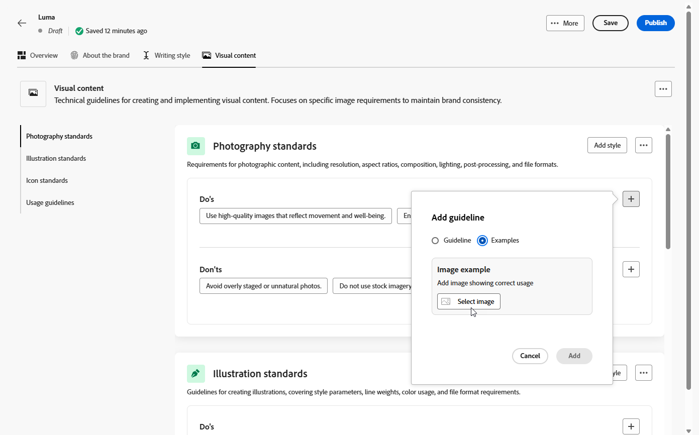
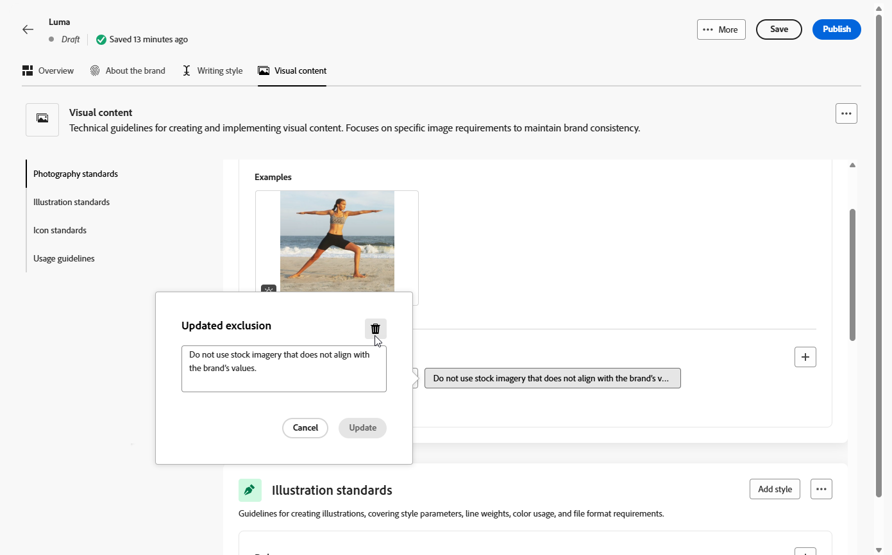

# Personalizar sua marca {#brands-personalize}

Para criar um kit de marca abrangente que garanta a consistência em todo o seu conteúdo e canais, configure as quatro guias a seguir, cada uma focada em um aspecto diferente da identidade da sua marca:

* **[!UICONTROL Sobre a marca]** estabelece a identidade e os valores principais da sua marca.
* **[!UICONTROL O estilo de escrita]** define o idioma e os padrões de conteúdo.
* **[!UICONTROL O conteúdo visual]** define as diretrizes de imagem e design.
* **[!UICONTROL Cores]** gerencia o sistema de cores e o uso da sua marca.

Após a configuração, é possível usar as diretrizes da marca para validar a qualidade do conteúdo e o alinhamento da marca. [Saiba mais sobre a validação de qualidade do conteúdo](brands-score.md#validate-quality)

## Sobre a marca {#about-brand}

Use a guia **[!UICONTROL Sobre a marca]** para estabelecer a identidade principal da sua marca, descrevendo a finalidade, a personalidade, o slogan e outros atributos de definição.

1. Comece preenchendo as informações fundamentais da sua marca na categoria **[!UICONTROL Detalhes da chave]**:

   * **[!UICONTROL Nome do Kit de Marcas]**: digite o nome do kit de marcas.

   * **[!UICONTROL Quando usar]**: especifique cenários ou contextos nos quais este kit de marcas deve ser aplicado.

   * **[!UICONTROL Nome da Marca]**: insira o nome oficial da marca.

   * **[!UICONTROL Descrição da marca]**: forneça uma visão geral do que esta marca representa.

   * **[!UICONTROL Slogan padrão]**: adicione o slogan principal associado à marca.

     

1. Na categoria **[!UICONTROL Princípios orientadores]**, esclareça a direção principal e a filosofia da sua marca:

   * **[!UICONTROL Missão]**: detalhe a finalidade de sua marca.

   * **[!UICONTROL Vision]**: descreva sua meta de longo prazo ou o estado futuro desejado.

   * **[!UICONTROL Posicionamento no mercado]**: explique como sua marca está posicionada no mercado.

   

1. Na categoria **[!UICONTROL Valores de marca principais]**, clique em  para adicionar os valores de marca principais e preencher os detalhes:

   * **[!UICONTROL Valor]**: nomeie um valor de marca principal.

   * **[!UICONTROL Descrição]**: explique o que esse valor significa para sua marca.

   * **[!UICONTROL Comportamentos]**: descreva as ações ou atitudes que refletem este valor na prática.

   * **[!UICONTROL Manifestações]**: forneça exemplos de como esse valor é expresso em marcas reais.

     

1. Se necessário, clique no ícone para atualizar ou excluir um de seus valores de marca principal.

   

Agora você pode personalizar ainda mais sua marca ou [publicar sua marca](#create-brand-kit).

## Estilo de escrita {#writing-style}

A seção **[!UICONTROL Estilo de escrita]** descreve os padrões para a escrita de conteúdo, detalhando como o idioma, a formatação e a estrutura devem ser usados para manter a clareza, a coerência e a consistência entre todos os materiais.

+++ Categoria disponível e exemplos

<table>
  <thead>
    <tr>
      <th>Categoria</th>
      <th>Subcategoria</th>
      <th>Exemplo de diretrizes</th>
      <th>Exemplo de exclusões</th>
    </tr>
  </thead>
  <tbody>
    <tr>
      <td rowspan="4">Padrões de criação de conteúdo</td>
      <td>Padrões de mensagem da marca</td>
      <td>Destaque a inovação e as mensagens direcionadas ao cliente.</td>
      <td>Não exagere nos recursos do produto.</td>
    </tr>
    <tr>
      <td>Uso do slogan</td>
      <td>Coloque o slogan abaixo do logotipo em todos os ativos de marketing digital.</td>
      <td>Não modifique ou traduza o slogan.</td>
    </tr>
    <tr>
      <td>Mensagens principais</td>
      <td>Enfatize a principal declaração de benefícios, como maior produtividade.</td>
      <td>Não use propostas de valor não relacionadas.</td>
    </tr>
    <tr>
      <td>Padrões de nomenclatura</td>
      <td>Use nomes simples e descritivos, como "ProScheduler".</td>
      <td>Não use termos complexos ou caracteres especiais.</td>
    </tr>
    <tr>
      <td rowspan="5">Estilo de comunicação da marca</td>
      <td>Características de personalidade da marca</td>
      <td>Amigável e acessível.</td>
      <td>Não seja derrotista.</td>
    </tr>
    <tr>
      <td>Mecânica de escrita</td>
      <td>Mantenha as frases curtas e impactantes.</td>
      <td>Não use jargão em excesso.</td>
    </tr>
    <tr>
      <td>Tom de situação</td>
      <td>Mantenha um tom profissional nas comunicações de crise.</td>
      <td>Não ignore as comunicações de suporte.</td>
    </tr>
    <tr>
      <td>Diretrizes de Escolha do Word</td>
      <td>Use palavras como "inovador" e "inteligente".</td>
      <td>Evite palavras como "barato" ou "hack".</td>
    </tr>
    <tr>
      <td>Padrões de Idioma</td>
      <td>Siga as convenções do inglês americano.</td>
      <td>Não misture ortografias britânicas e americanas.</td>
    </tr>
    <tr>
      <td rowspan="3">Padrões de conformidade legal</td>
      <td>Padrões de marca comercial</td>
      <td>Sempre use o símbolo ™ ou ®.</td>
      <td>Não omita símbolos legais quando necessário.</td>
    </tr>
    <tr>
      <td>Padrões de direitos autorais</td>
      <td>Inclua avisos de direitos autorais nos materiais de marketing.</td>
      <td>Não use conteúdo de terceiros sem permissão.</td>
    </tr>
    <tr>
      <td>Padrões de isenção de responsabilidade</td>
      <td>Exibir avisos de isenção de responsabilidade de forma legível em ativos digitais.</td>
      <td>Não oculte isenções de responsabilidade em áreas não visíveis.</td>
    </tr>
</table>

+++

 

Para personalizar seu **[!UICONTROL Estilo de Redação]**:

1. Na guia **[!UICONTROL Estilo de Escrita]**, clique em  para adicionar uma diretriz, exceção ou exclusão.

1. Insira sua diretriz, exceção ou exclusão. Você também pode incluir **[!UICONTROL Exemplos]** para ilustrar melhor como ele deve ser aplicado.

   

1. Especifique o **[!UICONTROL contexto de uso]** para sua diretriz, exceção ou exclusão:

   * **[!UICONTROL Tipo de canal]**: escolha onde esta diretriz, exceção ou exclusão deve ser aplicada. Por exemplo, talvez você queira que um estilo de escrita específico apareça apenas em E-mail, Celular, Impressões ou outros canais de comunicação.

   * **[!UICONTROL Tipo de elemento]**: especifique a qual elemento de conteúdo a regra se aplica. Isso pode incluir elementos como Títulos, Botões, Links ou outros componentes no conteúdo.

   

1. Depois de configurar sua diretriz, exceção ou exclusão, clique em **[!UICONTROL Adicionar]**.
1. Se necessário, selecione uma de suas diretrizes ou exclusões para atualizar ou excluir.

1. Clique no  para editar seu exemplo ou no ícone para excluí-lo.

   

Agora você pode personalizar ainda mais sua marca ou [publicar sua marca](#create-brand-kit).

## Conteúdo visual {#visual-content}

A seção **[!UICONTROL Conteúdo visual]** define os padrões de imagem e design, detalhando as especificações necessárias para manter uma aparência de marca unificada e consistente.

+++ Categorias e exemplos disponíveis

<table>
  <thead>
    <tr>
      <th>Categoria</th>
      <th>Exemplo de diretrizes</th>
      <th>Exemplo de exclusões</th>
    </tr>
  </thead>
  <tbody>
    <tr>
      <td>Padrões de fotografia</td>
      <td>Use a iluminação natural para fotos ao ar livre.</td>
      <td>Evite imagens editadas ou pixeladas em excesso.</td>
    </tr>
    <tr>
      <td>Padrões de ilustração</td>
      <td>Use estilos limpos e minimalistas.</td>
      <td>Evite complexos demais.</td>
    </tr>
    <tr>
      <td>Ícone padrões</td>
      <td>Use um sistema de grade de 24px consistente.</td>
      <td>Não misture dimensões de ícone, use espessuras de traçado inconsistentes ou desvie das regras de grade.</td>
    </tr>
    <tr>
      <td>Diretrizes de uso</td>
      <td>Escolha imagens de estilo de vida que reflitam clientes reais usando o produto em ambientes profissionais.</td>
      <td>Não use imagens que estejam em contradição com o tom da marca ou que apareçam fora de contexto.</td>
    </tr>
</table>

+++

 

Para personalizar seu **[!UICONTROL conteúdo visual]**:

1. Na guia **[!UICONTROL Visual content]**, clique em  para adicionar uma diretriz, exclusão ou exemplo.

1. Insira sua diretriz, exclusão ou exemplo.

   

1. Especifique o **[!UICONTROL contexto de uso]** para sua diretriz ou exclusão:

   * **[!UICONTROL Tipo de canal]**: escolha onde esta diretriz, exceção ou exclusão deve ser aplicada. Por exemplo, talvez você queira que um estilo de escrita específico apareça apenas em E-mail, Celular, Impressões ou outros canais de comunicação.

   * **[!UICONTROL Tipo de elemento]**: especifique a qual elemento de conteúdo a regra se aplica. Isso pode incluir elementos como Títulos, Botões, Links ou outros componentes no conteúdo.

     

1. Depois de configurar sua diretriz, exceção ou exclusão, clique em **[!UICONTROL Adicionar]**.

1. Para adicionar uma imagem mostrando o uso correto, selecione **[!UICONTROL Exemplo]** e clique em **[!UICONTROL Selecionar imagem]**. Você também pode adicionar uma imagem mostrando o uso incorreto como exemplo de exclusão.

   

1. Selecione uma de suas diretrizes ou exclusões para atualizar ou excluir.

1. Selecione uma diretriz ou exclusão para atualizá-la. Clique no ícone para excluí-lo.

   

Agora você pode personalizar ainda mais sua marca ou [publicar sua marca](#create-brand-kit).

## Cores {#colors}

A seção **[!UICONTROL Cores]** define os padrões do sistema de cores da sua marca, descrevendo como as cores são selecionadas, organizadas e aplicadas entre experiências. Ela garante o uso consistente das cores primária, secundária, de destaque e neutra para manter uma identidade de marca coesa, acessível e reconhecível.

+++ Categorias e exemplos disponíveis

<table>
  <thead>
    <tr>
      <th>Categoria</th>
      <th>Exemplo de diretrizes</th>
      <th>Exemplo de exclusões</th>
    </tr>
  </thead>
  <tbody>
    <tr>
      <td>Cores primárias</td>
      <td>Use as cores primárias da marca para logotipos, cabeçalhos e elementos principais do call-to-action.</td>
      <td>Não substitua nem modifique as cores da marca principal.</td>
    </tr>
    <tr>
      <td>Cores secundárias</td>
      <td>Use cores secundárias para suportar layouts, ilustrações e componentes de interface do usuário.</td>
      <td>Não deixe as cores secundárias sobrepuserem as cores da marca principal.</td>
    </tr>
    <tr>
      <td>Cores de destaque</td>
      <td>Use cores de ênfase com moderação para botões, links e alertas.</td>
      <td>Não use cores de ênfase para áreas grandes do plano de fundo.</td>
    </tr>
    <tr>
      <td>Cores neutras</td>
      <td>Use cores neutras para texto, divisores, bordas e elementos sutis da interface do usuário.</td>
      <td>Evite usar neutrais com contraste fraco ou moldes de cores intensas.</td>
    </tr>
    <tr>
      <td>Cores do plano de fundo</td>
      <td>Use planos de fundo claros ou neutros para garantir legibilidade e clareza visual.</td>
      <td>Não coloque texto ou logotipos em planos de fundo de baixo contraste.</td>
    </tr>
    <tr>
      <td>Cores adicionais</td>
      <td>Use cores adicionais apenas para visualização de dados ou campanhas aprovadas.</td>
      <td>Não introduza cores não aprovadas ou fora da marca.</td>
    </tr>
    <tr>
      <td>Escalas de cores</td>
      <td>Use tons e sombras aprovados para estados da interface do usuário, como focalizar, ativo e desativado.</td>
      <td>Não crie sombras ou gradientes não oficiais.</td>
    </tr>
    <tr>
      <td>Diretrizes de uso</td>
      <td>Mantenha o uso consistente de cores e o contraste acessível em todos os ativos.</td>
      <td>Não misture paletas conflitantes nem aplique cores de forma inconsistente.</td>
    </tr>
</table>

+++

 

Para personalizar suas **[!UICONTROL Cores]**:

1. Na guia **[!UICONTROL Cores]**, clique em  para adicionar uma cor, diretriz ou exclusão.

1. Insira as informações de cor para defini-las com precisão:

   * **Nome da cor**: forneça um nome claro e descritivo para identificar a cor no sistema da sua marca.

   * **Valor da cor**: escolha a cor usando o seletor de matiz ou insira valores precisos usando RGB, HEX ou nome/código do Pantone para garantir a consistência entre os ativos digitais e de impressão.

   

1. Revise sua seleção para confirmar a precisão e a consistência visual e clique em **[!UICONTROL Adicionar]** para salvar sua cor.

1. Em seguida, insira a diretriz ou a exclusão.

1. Especifique o contexto de uso para sua diretriz ou exclusão:

   * **[!UICONTROL Tipo de canal]**: escolha onde esta diretriz, exceção ou exclusão deve ser aplicada. Por exemplo, talvez você queira que um estilo de escrita específico apareça apenas em E-mail, Celular, Impressões ou outros canais de comunicação.

   * **[!UICONTROL Tipo de elemento]**: especifique a qual elemento de conteúdo a regra se aplica. Isso pode incluir elementos como Títulos, Botões, Links ou outros componentes no conteúdo.

     

1. Depois de configurar sua diretriz, exceção ou exclusão, clique em **[!UICONTROL Adicionar]**.

1. Se necessário, selecione uma de suas diretrizes ou exclusões para atualizar ou excluir.

1. Selecione uma diretriz ou exclusão para atualizá-la. Clique no ícone para excluí-lo.

   

1. Clique em **[!UICONTROL Adicionar grupo]** para definir cores adicionais para sua marca ou para adicionar um grupo de escala de cores.

Agora você pode personalizar ainda mais sua marca ou [publicar sua marca](brands.md#create-brand-kit).

