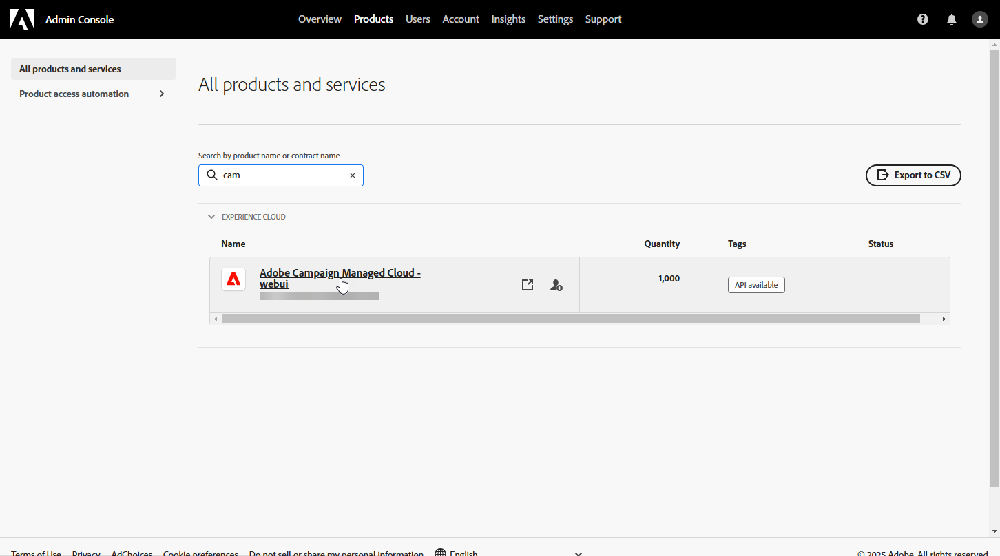
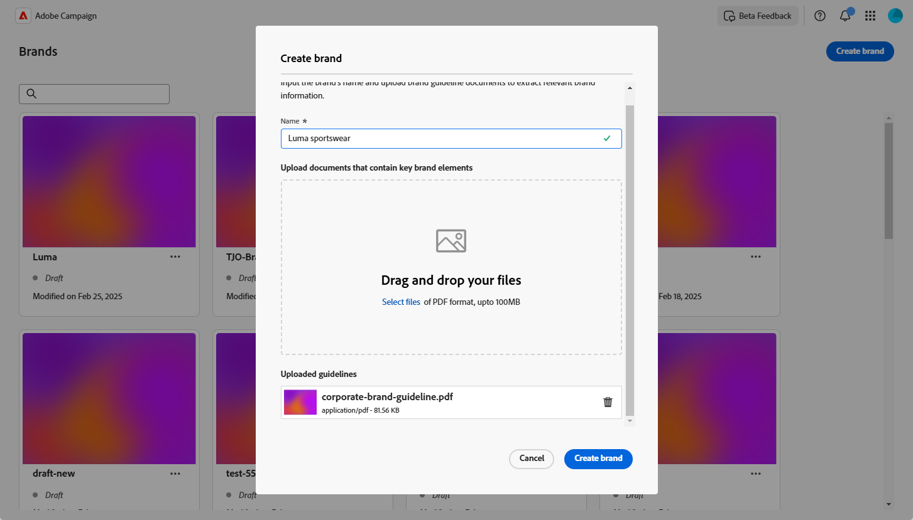

# Criar e gerenciar suas marcas {#brands}

>[!AVAILABILITY]
>
>Esse recurso foi lançado como um beta privado. Ele se tornará progressivamente disponível para todos os clientes em versões futuras.

As diretrizes da marca são um conjunto abrangente de regras e padrões que definem a identidade visual e verbal de uma marca. Eles servem como referência para garantir uma representação de marca consistente em todos os canais de marketing e comunicação.

No [!DNL Adobe Campaign Web], os usuários podem inserir e organizar manualmente informações da marca ou carregar documentos de diretrizes da marca para extração automática de dados.

## Acessar marcas {#generative-access}

Para acessar o menu **[!UICONTROL Marcas]** no [!DNL Adobe Campaign Web], os usuários devem receber os perfis de produto **[!UICONTROL Administrador (administrador)]** e **[!UICONTROL Kit de marcas]** para criar e gerenciar marcas. Para acesso somente leitura, os usuários precisam do perfil de produto [!UICONTROL Assistente de IA].

[Saiba mais](https://experienceleague.adobe.com/en/docs/campaign/campaign-v8/admin/permissions/manage-permissions)

+++ Saiba como atribuir permissões relacionadas à marca

1. Na página inicial do [Admin Console](https://adminconsole.adobe.com/enterprise), acesse seu produto do Campaign.

   

1. Selecione o **[!DNL Product profile]** com base no nível de permissões que você deseja conceder ao usuário.

   

1. Clique em **[!DNL Add users]** para atribuir o perfil de produto selecionado.

   

1. Digite seu nome de usuário, grupo de usuários ou endereço de email.

1. Clique em **Salvar** para aplicar as alterações.

Os usuários já atribuídos a esta função têm suas permissões automaticamente atualizadas.

+++

## Criar sua marca {#create-brand-kit}

Para criar e gerenciar as diretrizes da sua marca, siga as etapas abaixo.

Os usuários podem inserir os detalhes manualmente ou fazer upload de um documento de diretrizes de marca para extrair as informações automaticamente:

1. No menu **[!UICONTROL Gestão de conteúdo]**, selecione **[!UICONTROL Marcas]**.

1. No menu **[!UICONTROL Marcas]**, clique em **[!UICONTROL Criar marca]**.

   

1. Digite um **[!UICONTROL Nome]** para sua marca.

1. Arraste e solte ou selecione seu arquivo para fazer upload das diretrizes de marca e extrair automaticamente as informações relevantes sobre a marca. Clique em **[!UICONTROL Criar marca]**.

   O processo de extração de informações é iniciado. Observe que pode levar vários minutos para ser concluído.

   

1. Seus padrões de criação de conteúdo e visual são preenchidos automaticamente. Navegue pelas diferentes guias para adaptar as informações conforme necessário.

1. Na guia **[!UICONTROL Estilo de Escrita]**, clique em  para adicionar uma diretriz ou exclusão, incluindo exemplos.

   

1. Na guia **[!UICONTROL Visual content]**, clique em  para adicionar outra diretriz ou exclusão.

1. Para adicionar uma imagem mostrando o uso correto, selecione **[!UICONTROL Exemplos]** e clique em **[!UICONTROL Selecionar imagem]**. Você também pode adicionar uma imagem mostrando o uso incorreto como exemplo de exclusão.

   

1. Após a configuração, clique em **[!UICONTROL Salvar]** e em **[!UICONTROL Publicar]** para disponibilizar a diretriz de marca no Assistente de IA.

1. Para modificar a marca publicada, clique em **[!UICONTROL Editar marca]**.

   >[!NOTE]
   >
   >Isso cria uma cópia temporária no modo de edição, substituindo a versão online depois de publicada.

   

1. No painel **[!UICONTROL Marcas]**, abra o menu avançado clicando no ícone  para:

   * Exibir marca
   * Editar
   * Duplicar
   * Publicação
   * Cancelar publicação
   * Excluir

   

As diretrizes de marca agora podem ser acessadas no menu suspenso **[!UICONTROL Marca]** do Assistente de IA. Isso permite que o Assistente de IA gere conteúdo e ativos alinhados às suas especificações. [Saiba mais sobre o Assistente de IA](../email/generative-gs.md)

