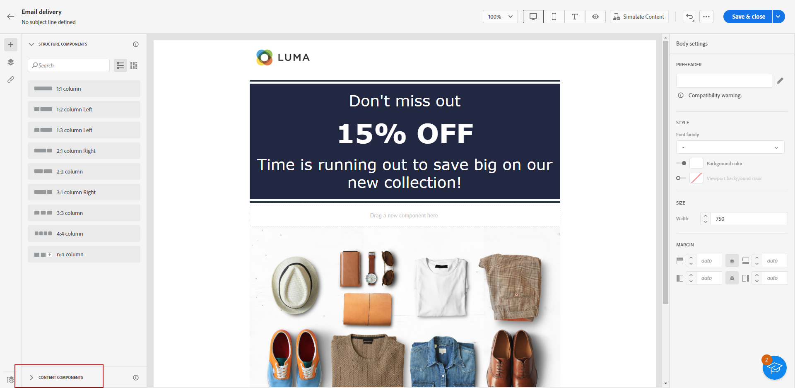
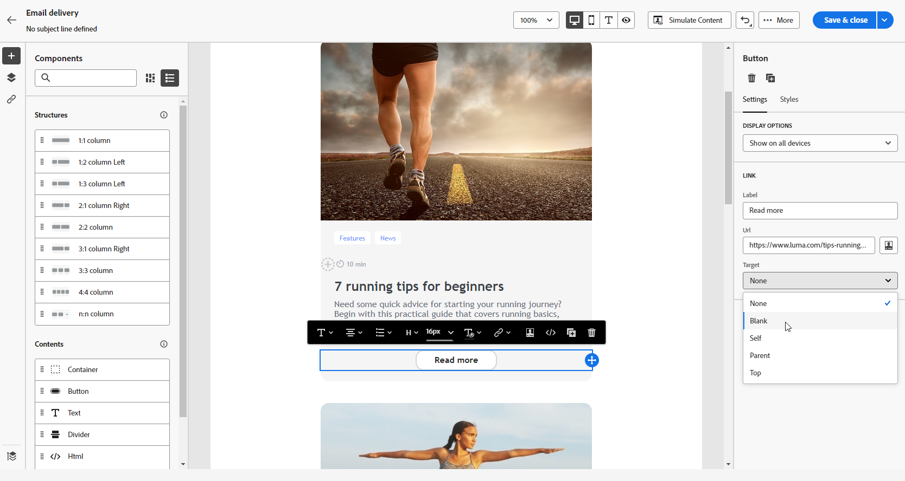
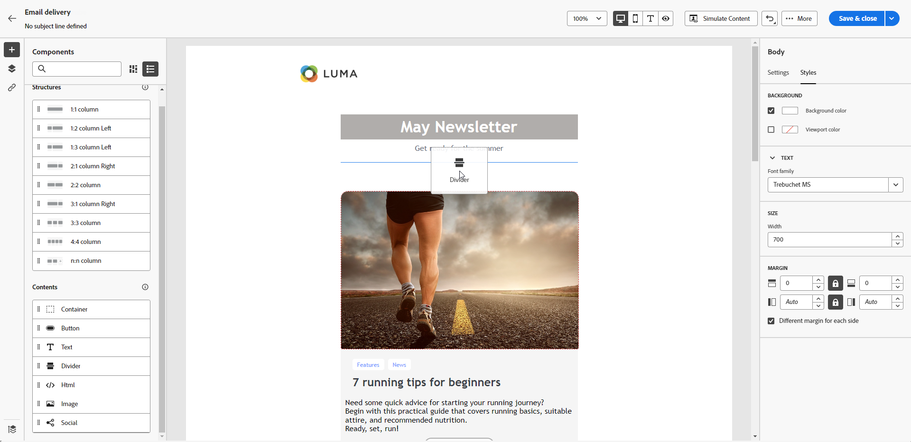

# Usar os componentes de conteúdo do Designer de email {#content-components}

>[!CONTEXTUALHELP]
>id="ac_content_components_email"
>title="Sobre componentes de conteúdo"
>abstract="Os componentes do conteúdo são espaços reservados para o conteúdo vazio que podem ser usados para criar o layout de um email."

>[!CONTEXTUALHELP]
>id="ac_content_components_landing_page"
>title="Sobre componentes de conteúdo"
>abstract="Os componentes do conteúdo são espaços reservados vazios para o conteúdo que você pode usar para criar o layout de uma página de aterrissagem."

>[!CONTEXTUALHELP]
>id="ac_content_components_fragment"
>title="Sobre componentes de conteúdo"
>abstract="Os componentes do conteúdo são espaços reservados vazios para o conteúdo que você pode usar para criar o layout de um fragmento."

>[!CONTEXTUALHELP]
>id="ac_content_components_template"
>title="Sobre componentes de conteúdo"
>abstract="Os componentes de conteúdo são espaços reservados para o conteúdo vazio que podem ser usados para criar o layout de um modelo."

## Adicionar componentes de conteúdo {#add-content-components}

Para adicionar componentes de conteúdo ao seu email e ajustá-los às suas necessidades, siga as etapas abaixo.

1. No Designer de email, use um conteúdo existente ou arraste e solte **[!UICONTROL Componentes da estrutura]** no conteúdo vazio para definir o layout do email. [Saiba como](create-email-content.md)

1. Para acessar o **[!UICONTROL Componentes de conteúdo]** selecione o botão correspondente no painel esquerdo do Designer de email.

   

1. Arraste e solte os componentes de conteúdo de sua escolha dentro dos componentes de estrutura relevantes.

   

   >[!NOTE]
   >
   >É possível adicionar vários componentes em um único componente de estrutura e em cada coluna de um componente de estrutura.

1. Ajuste os atributos de estilo para cada componente usando o **[!UICONTROL Configurações do componente]** painel à direita. Por exemplo, é possível alterar o estilo do texto, o preenchimento ou a margem de cada componente. [Saiba mais sobre alinhamento e preenchimento](alignment-and-padding.md)

   

Ao criar seu conteúdo de email do zero, **[!UICONTROL Componentes de conteúdo]** O permite personalizar ainda mais seu email com componentes brutos e vazios que podem ser usados depois de colocados no email.
Você pode adicionar quantos **[!UICONTROL Componentes de conteúdo]** conforme necessário dentro de um **[!UICONTROL Componente Estrutura]** que define o layout do email.

## Container {#container}

É possível adicionar um contêiner simples dentro do qual você adiciona outro componente de conteúdo. Isso permite aplicar um estilo específico ao contêiner, que é diferente do componente usado no.

Por exemplo, adicione uma **[!UICONTROL Contêiner]** e, em seguida, adicione um [Botão](#button) componente dentro desse contêiner. Você pode usar um plano de fundo específico para o contêiner e outro para o botão .

## Botão {#buttons}

Use o **[!UICONTROL Botão]** para inserir um ou vários botões no email e redirecionar o público do email para outra página.

1. De **[!UICONTROL Componentes de conteúdo]**, arraste e solte a **[!UICONTROL Botão]** em um **[!UICONTROL Componente Estrutura]**.

   

1. Clique no botão recém-adicionado para personalizar o texto e ter acesso ao **[!UICONTROL Configurações de componentes]** no painel direito do Email Designer.

   

1. No **[!UICONTROL Link]** adicione o URL para o qual deseja redirecionar ao clicar no botão .

1. Escolha como o conteúdo será exibido com o **[!UICONTROL Target]** lista suspensa:

   * **[!UICONTROL Nenhum]**: abre o link no mesmo quadro em que foi clicado (padrão).
   * **[!UICONTROL Em branco]**: abre o link em uma nova janela ou guia.
   * **[!UICONTROL Auto]**: abre o link no mesmo quadro em que foi clicado.
   * **[!UICONTROL Pai]**: abre o link no quadro principal.
   * **[!UICONTROL Topo]**: abre o link no corpo completo da janela.

   

1. Você pode personalizar ainda mais seu botão alterando atributos de estilo como **[!UICONTROL Borda]**, **[!UICONTROL Tamanho]**, **[!UICONTROL Margem]**, etc. do **[!UICONTROL Configurações do componente]** painel.

## Texto {#text}

Use o **[!UICONTROL Texto]** componente para inserir texto no email e ajustar o estilo (borda, tamanho, preenchimento etc.) usando o **[!UICONTROL Configurações do componente]** painel.

1. De **[!UICONTROL Componentes de conteúdo]**, arrastar e soltar **[!UICONTROL Texto]** em **[!UICONTROL Componente Estrutura]**.

   

1. Clique no componente recém-adicionado para personalizar o texto e ter acesso ao **[!UICONTROL Configurações de componentes]** no painel direito do designer de email.

1. Altere o texto com as seguintes opções disponíveis na barra de ferramentas:

   

   * **[!UICONTROL Alterar estilo do texto]**: aplique negrito, itálico, sublinhado ou riscado ao seu texto.
   * **Alterar alinhamento**: escolha entre alinhamento esquerdo, direito, central ou justificado para o texto.
   * **[!UICONTROL Criar lista]**: adicione marcadores ou listas de números ao texto.
   * **[!UICONTROL Definir cabeçalho]**: adicione até seis níveis de cabeçalho ao texto.
   * **Tamanho da fonte**: selecione o tamanho da fonte do texto em pixels.
   * **[!UICONTROL Editar imagem]**: adicione uma imagem ou um ativo ao seu componente de texto.
   * **[!UICONTROL Mostrar o código-fonte]**: exibir o código-fonte do texto. Ele não pode ser modificado.
   * **[!UICONTROL Duplicar]**: adicione uma cópia do seu componente de texto.
   * **[!UICONTROL Excluir]**: exclua o componente de texto selecionado do seu email.
   * **[!UICONTROL Adicionar personalização]**: adicione campos de personalização para personalizar o conteúdo dos dados de seus perfis.
   * **[!UICONTROL Habilitar conteúdo condicional]**: adicione conteúdo condicional para adaptar o conteúdo do componente aos perfis segmentados.

1. Ajuste os outros atributos de estilo, como cor do texto, família da fonte, borda, preenchimento, margem etc. do **[!UICONTROL Configurações do componente]** painel.

   

## Divisor {#divider}

Use o **[!UICONTROL Divisor]** para inserir uma linha divisória para organizar o layout e o conteúdo do seu email.

É possível ajustar atributos de estilo, como cor da linha, estilo e altura da **[!UICONTROL Configurações do componente]** painel.

## HTML {#HTML}

Use o **[!UICONTROL HTML]** componente para copiar e colar as diferentes partes do HTML existente. Isso permite que você crie componentes de HTML modulares gratuitos para reutilizar algum conteúdo externo.

1. De **[!UICONTROL Componentes de conteúdo]**, arraste e solte a **[!UICONTROL HTML]** em um **[!UICONTROL Componente Estrutura]**.

   

1. Clique no componente recém-adicionado e selecione **[!UICONTROL Mostrar o código-fonte]** na barra de ferramentas contextual para adicionar o HTML.

   

>[!NOTE]
>
>Para simplesmente tornar um conteúdo externo compatível com o Designer de email, o Adobe recomenda criar uma mensagem do zero e copiar o conteúdo do email existente para componentes.

## Imagem {#image}

Use o **[!UICONTROL Imagem]** componente para inserir um arquivo de imagem de seu computador no email.

1. Em **[!UICONTROL Componentes de conteúdo]**, arrastar e soltar **[!UICONTROL Imagem]** em **[!UICONTROL Componente Estrutura]**.

   

1. Clique em **[!UICONTROL Procurar]** para escolher um arquivo de imagem de seus ativos.

1. Clique no componente recém-adicionado e configure as propriedades da imagem usando o **[!UICONTROL Configurações de componentes]** painel:

   * **[!UICONTROL Título da imagem]** permite definir um título para a imagem.
   * **[!UICONTROL Texto alternativo]** permite definir a legenda vinculada à imagem. Isso corresponde ao atributo HTML alt.

   

1. Ajuste os outros atributos de estilo, como margem, borda etc. ou adicionar um link para redirecionar seu público para outro conteúdo do **[!UICONTROL Configurações do componente]** painel.

## Social {#social}

Use o **[!UICONTROL Social]** componente para inserir links às páginas de mídia social no seu conteúdo de email.

1. De **[!UICONTROL Componentes de conteúdo]**, arraste e solte a **[!UICONTROL Social]** em um **[!UICONTROL Componente Estrutura]**.

1. Clique no componente recém-adicionado.

1. No **[!UICONTROL Social]** do **[!UICONTROL Configurações de componentes]** escolha que mídia social deseja adicionar ou remover.

   

1. Escolha o tamanho dos ícones no **[!UICONTROL Tamanho das imagens]** campo.

1. Clique em cada um dos ícones de redes sociais para configurar o **[!UICONTROL URL]** para o qual o público-alvo é redirecionado.

   

1. Você também pode alterar os ícones de cada uma das redes sociais, se necessário, na variável **[!UICONTROL Imagem]** campo.

1. Ajuste os outros atributos de estilo, como estilo, margem, borda etc. do **[!UICONTROL Configurações do componente]** painel.
