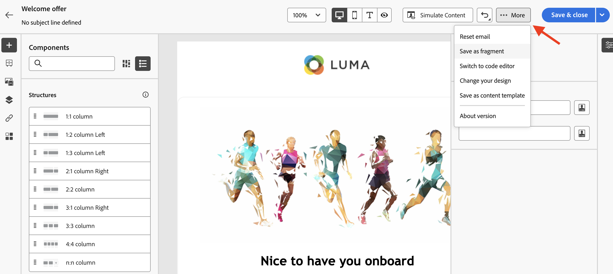

# Criar fragmentos de conteúdo {#fragments}

>[!CONTEXTUALHELP]
>id="acw_fragments_create"
>title="Defina seus próprios fragmentos de conteúdo"
>abstract="Defina as propriedades do fragmento e o tipo de fragmento que você deseja criar. Você poderá usar o designer de email ou o editor de expressão para configurar o conteúdo do seu fragmento."

<!-- pas vu dans l'UI-->

>[!CONTEXTUALHELP]
>id="acw_fragments_properties"
>title="Propriedades dos fragmentos"
>abstract="Insira o rótulo do fragmento. Se necessário, é possível definir opções adicionais, como o nome interno do fragmento, sua pasta e uma descrição."

>[!CONTEXTUALHELP]
>id="acw_fragments_type"
>title="Tipo de fragmento de conteúdo"
>abstract="Escolha o tipo de fragmento que deseja criar. **Fragmentos visuais** são blocos visuais predefinidos que podem ser reutilizados em várias entregas de email ou em modelos de conteúdo. **Fragmentos de expressão** são expressões predefinidas disponíveis em uma entrada dedicada no editor de expressão."

Há duas maneiras de criar fragmentos de conteúdo:

* Crie um fragmento do zero, usando o menu dedicado **[!UICONTROL Fragmentos]**. [Saiba como](#create-from-scratch)
* Ao criar o conteúdo, salve uma parte do conteúdo como fragmento. [Saiba como](#save-as-fragment)

  >[!NOTE]
  >
  >Esse recurso está disponível somente para fragmentos visuais. Os fragmentos de expressão são criados exclusivamente a partir do menu **Fragmentos**.

Depois de salvo, o fragmento de conteúdo fica disponível para uso em qualquer delivery ou template de conteúdo.

## Criar um fragmento de conteúdo do zero {#create-from-scratch}

Para criar um fragmento de conteúdo do zero, siga as etapas abaixo.

1. [Acesse a lista de fragmentos](#access-manage-fragments) por meio do menu esquerdo **[!UICONTROL Gerenciamento de Conteúdo]** > **[!UICONTROL Fragmentos]** e selecione **[!UICONTROL Criar fragmento]**.

   

1. Insira o rótulo do fragmento. Se necessário, é possível definir opções adicionais, como o nome interno do fragmento, sua pasta e uma descrição.

1. Escolha o tipo de fragmento que deseja criar: **Fragmento visual** ou **Fragmento de expressão**. [Saiba mais sobre as diferenças entre fragmentos visuais e de expressão](fragments.md)

   

   >[!AVAILABILITY]
   >
   >Os fragmentos visuais estão em Disponibilidade limitada (DL). Eles estão restritos a clientes que estão migrando **do Adobe Campaign Standard para o Adobe Campaign v8** e não podem ser implantados em nenhum outro ambiente.

1. Clique no botão **Create**.

   * Para **fragmentos visuais**, o [Designer de email](../email/get-started-email-designer.md) é exibido. Edite seu conteúdo conforme necessário, da mesma forma que faria para qualquer email dentro de uma campanha, e clique no botão **Salvar e fechar**. Você pode adicionar imagens, links, campos de personalização e conteúdo dinâmico.

     

   * Para **fragmentos de expressão**, o editor de Expressão é aberto. Aproveite os recursos de personalização e criação para criar o seu conteúdo e clique em **Confirmar**. [Saiba como trabalhar com o editor de expressão](../personalization/personalize.md)

     

1. Quando o conteúdo estiver pronto, clique em **Salvar**.

O fragmento de conteúdo agora está pronto para ser usado ao criar qualquer entrega ou [modelo de conteúdo](../email/use-email-templates.md) no Campaign. Saiba como usar fragmentos visuais e de expressão nesta seção:
* [Adicionar fragmentos visuais aos emails](use-visual-fragments.md)
* [Adicionar fragmento de expressão ao editor de expressão](use-expression-fragments.md)

## Salvar um conteúdo como fragmento visual {#save-as-fragment}

>[!CONTEXTUALHELP]
>id="acw_fragments_save"
>title="Salvar como fragmento"
>abstract="Para salvar um conteúdo como fragmento visual, selecione os elementos que deseja incluir no fragmento, incluindo campos de personalização e conteúdo dinâmico. Você só pode selecionar seções adjacentes umas às outras. Não é possível selecionar uma estrutura vazia ou outro fragmento de conteúdo. Esse conteúdo será um fragmento independente, adicionado à lista de fragmentos e acessível no menu dedicado. Você pode usar esse fragmento ao criar qualquer email ou modelo de conteúdo no Campaign."

<!--pas vu dans l'UI-->

Qualquer conteúdo de email pode ser salvo como fragmento visual para futura reutilização. Ao criar uma entrega de [modelo de conteúdo](../email/use-email-templates.md) ou de [email](../email/get-started-email-designer.md), você pode salvar uma parte do seu conteúdo como fragmento visual. Para fazer isso, siga as etapas abaixo:

1. No [Designer de Email](../email/get-started-email-designer.md), clique no botão **Mais** na parte superior direita da tela.

1. Selecione **[!UICONTROL Salvar como fragmento]** no menu suspenso.

   

1. A tela **[!UICONTROL Salvar como fragmento]** é exibida. Lá, selecione os elementos que deseja incluir no fragmento, incluindo campos de personalização e conteúdo dinâmico.

   >[!CAUTION]
   >
   >Você só pode selecionar seções adjacentes umas às outras. Não é possível selecionar uma estrutura vazia ou outro fragmento de conteúdo.

   

1. Clique em **[!UICONTROL Criar]**. Preencha o nome do fragmento e salve-o.

   

   Este conteúdo agora é um fragmento independente, adicionado à [lista de fragmentos](#manage-fragments) e acessível pelo menu dedicado. Agora você pode usar este fragmento ao criar qualquer [email](../email/get-started-email-designer.md) ou [modelo de conteúdo](../email/use-email-templates.md) no Campaign. [Saiba como](../content/use-visual-fragments.md)

>[!NOTE]
>
>Qualquer alteração nesse novo fragmento não é propagada para o email ou modelo de onde vem. Da mesma forma, quando o conteúdo original é editado nesse email ou modelo, o novo fragmento não é modificado.—>

## Gerenciar os fragmentos de conteúdo {#manage-fragments}

É possível editar, atualizar, duplicar ou excluir um fragmento de conteúdo da lista de fragmentos.

### Editar e atualizar um fragmento de conteúdo {#edit-fragments}

Para editar um fragmento de conteúdo, siga as etapas abaixo.

1. Clique no nome do fragmento para editar na lista **[!UICONTROL Fragmentos]**.
1. Clique no botão **Editar conteúdo** para abrir o conteúdo deste fragmento.

   

1. Faça as alterações necessárias e salve as modificações.

>[!CAUTION]
>
>Qualquer alteração em um fragmento é propagada para os deliveries ou templates que o utilizam.

### Excluir um fragmento de conteúdo {#delete-fragments}

Para excluir um fragmento de conteúdo, siga estas etapas:

1. Navegue até a lista de fragmentos e clique no botão **[!UICONTROL Mais ações]** ao lado do fragmento a ser excluído.
1. Clique em **Excluir** e confirme.

   

>[!CAUTION]
>
>Ao excluir um fragmento, os deliveries e os templates que o utilizam são atualizados: o fragmento é removido do conteúdo, mas ainda é referenciado. Para manter o conteúdo do fragmento nessas entregas e modelos, você deve interromper a herança antes de excluir o fragmento, [conforme detalhado nesta seção](use-visual-fragments.md#break-inheritance).

### Arquivar um fragmento de conteúdo {#archive}

Você pode limpar a lista de fragmentos dos fragmentos que não são mais relevantes para sua marca. Para fazer isso, clique no botão **[!UICONTROL Mais ações]** ao lado do fragmento desejado e selecione **[!UICONTROL Arquivar]**. O fragmento é removido da lista de fragmentos, o que impede que os usuários o usem em emails ou modelos futuros.

Para acessar fragmentos arquivados, use o painel de filtragem para exibi-los. Para desarquivar um fragmento, clique no botão **[!UICONTROL Mais ações]** e selecione **[!UICONTROL Desarquivar]**.

>[!NOTE]
>
>Se você arquivar um fragmento usado em um conteúdo, esse conteúdo não será afetado.

### Duplicação de um fragmento de conteúdo {#duplicate-fragments}

É possível duplicar facilmente um fragmento de conteúdo para criar um novo. Para duplicar um fragmento existente, siga estas etapas:

1. Navegue até a lista de fragmentos e clique no botão **[!UICONTROL Mais ações]** ao lado do fragmento a ser duplicado.
1. Clique em **Duplicar** e confirme.
1. Insira o rótulo do novo fragmento e salve as alterações.

   O fragmento é adicionado à lista de fragmentos de conteúdo. Você pode editá-la e configurá-la conforme necessário.
