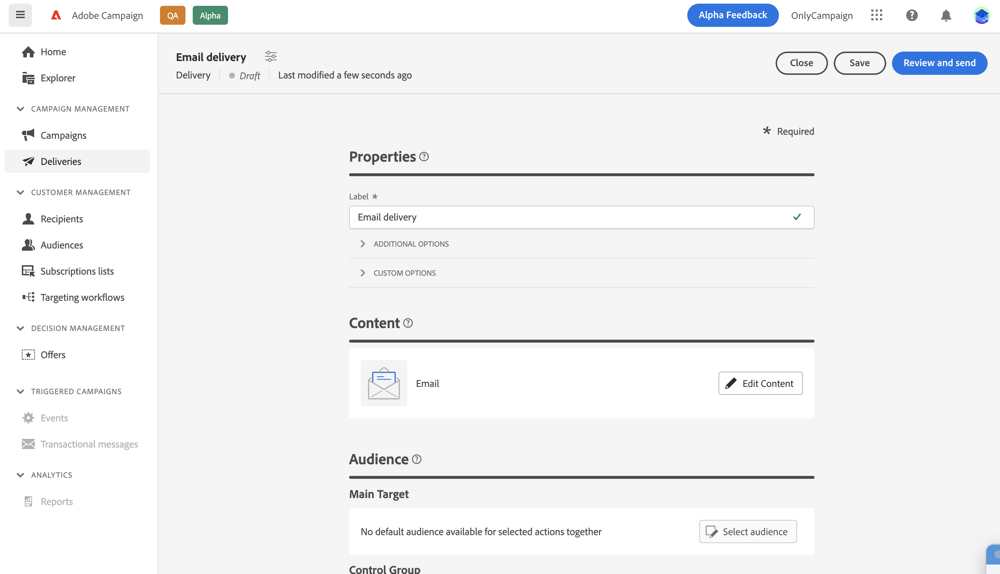

# Editar o conteúdo do email {#configure-content}

>[!CONTEXTUALHELP]
>id="acw_deliveries_email_content"
>title="Criar conteúdo de email"
>abstract="Com esta seção, você pode criar o conteúdo do seu email e usar o Designer de email para dar a ele uma aparência polida."

>[!CONTEXTUALHELP]
>id="acw_deliveries_email_header"
>title="Cabeçalho de email"
>abstract="Nesta seção, você pode controlar os valores Do nome e De email que estão definidos no modelo de email. O campo Linha de assunto pode ser personalizado usando o editor de expressão."

>[!CONTEXTUALHELP]
>id="acw_deliveries_email_attachment"
>title="Anexo de email"
>abstract="Selecione um ou vários arquivos para inserir na mensagem."

>[!CONTEXTUALHELP]
>id="acw_deliveries_email_options"
>title="Opções de rastreamento"
>abstract="Por padrão, o rastreamento é ativado para o delivery. Você pode desativar esta opção aqui."

Para começar a criar o conteúdo de um email, clique no link **[!UICONTROL Editar conteúdo]** na tela de criação de email.

Essa tela permite definir o conteúdo do email e acessar o Designer de email para projetá-lo.

As etapas para definir o conteúdo do email são as seguintes:

1. Verifique a **[!UICONTROL Nome de origem]** e **[!UICONTROL Do email]** informações. Esses campos são somente leitura e são configurados no template de email selecionado ao criar o email.

1. Definir o email **[!UICONTROL Linha de assunto]**. Para fazer isso, digite o assunto diretamente no campo dedicado ou abra o Editor de expressão para definir a fim de adicionar personalização usando vários atributos e blocos de conteúdo ou ofertas. [Saiba como personalizar conteúdo](../personalization/personalize.md)

1. Se desejar enviar ofertas com seu email, selecione-as usando a variável **[!UICONTROL Configurar ofertas]** botão. É possível inseri-los no email usando campos de personalização. [Saiba como enviar ofertas](offers.md)

1. Clique no botão **[!UICONTROL Editar corpo do email]** para estruturar e projetar o conteúdo do email. Informações adicionais sobre como criar conteúdo de email estão disponíveis nestas seções:

   * [Saiba como criar e-mails](create-email-content.md)
   * [Estilo do conteúdo](get-started-email-style.md)

1. Se quiser anexar um arquivo ao email, clique no link **[!UICONTROL Adicionar anexo]** em seguida, selecione um ou vários arquivos.

   Para evitar problemas de desempenho, é recomendável não incluir mais de um anexo por email.

   <!--limitation on size + number of files?-->

1. Por padrão, o rastreamento é ativado para o delivery. Você pode desativar essa opção no **[!UICONTROL Recursos opcionais]** seção. [Saiba como adicionar links e gerenciar o rastreamento](message-tracking.md)

Depois que o conteúdo do email tiver sido definido, use a variável **[!UICONTROL Simular conteúdo]** para verificar como é exibido antes de enviá-lo. [Saiba como visualizar e testar seu email](../preview-test/preview-test.md)
