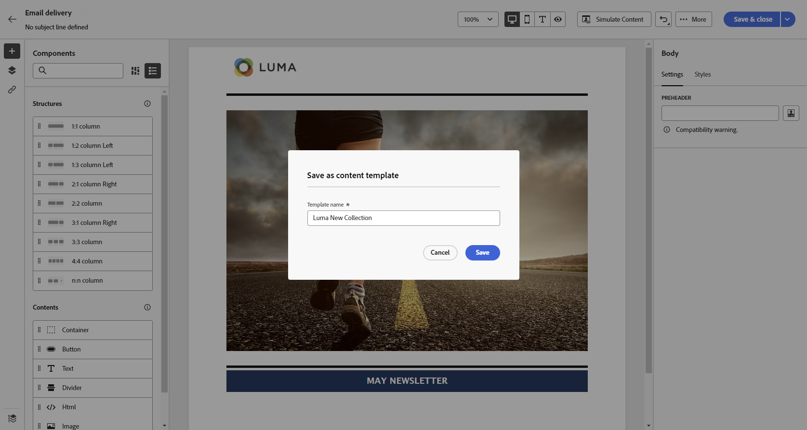

# Trabalho com modelos de email {#email-content-templates}

Quando [criação de um email](../email/create-email.md), use o **[!UICONTROL Selecionar modelo de design]** seção do **[!UICONTROL Criar seu email]** para começar a criar o conteúdo a partir de um modelo.

Você pode escolher entre:

* **Modelos de amostra**. O Campaign vem com um conjunto de modelos integrados que você pode escolher.

* **Modelos salvos**. Também é possível usar um modelo personalizado que você salvou como modelo a partir de um conteúdo existente.

Saiba como usar modelos e como salvar um conteúdo de email como modelo nas seções abaixo.

## Usar um modelo {#use-templates}

Para começar a criar o conteúdo com um dos modelos de amostra ou salvos, siga as etapas abaixo.

1. Abra o [Email Designer](create-email-content.md).

1. Na tela **[!UICONTROL Criar seu email]**, a guia **[!UICONTROL Modelos de exemplo]** é selecionada por padrão.

1. Para usar um modelo personalizado existente, navegue até o **[!UICONTROL Modelos salvos]** guia.

   

1. A lista de todos os [modelos salvos](#save-as-template) será exibida. Você pode classificá-las **[!UICONTROL Por nome]**, **[!UICONTROL Última modificação]** e **[!UICONTROL Última criação]**.

   

1. Selecione um template da lista para exibir seu conteúdo.

1. Use as setas para a direita e para a esquerda para navegar entre os modelos (amostra ou salvo, dependendo da seleção).

   

1. Clique em **[!UICONTROL Usar este modelo]** na parte superior direita da tela.

1. Edite seu conteúdo conforme desejado usando o Designer de email. [Saiba mais](create-email-content.md)

## Salvar conteúdo de email como modelo {#save-as-template}

Uma vez que [criou um email](create-email-content.md), é possível salvar esse conteúdo como um template para reutilização futura. Os modelos salvos estão disponíveis para todos os usuários do seu ambiente Adobe Campaign.

Para salvar um conteúdo de email como modelo, siga as etapas a seguir:

1. No designer de email, clique nas reticências na parte superior direita da tela.

1. Selecionar **[!UICONTROL Salvar como modelo de conteúdo]** no menu suspenso.

   

1. Insira um nome para este modelo e salve.

   

Agora você pode [usar este modelo](#use-templates) para criar um novo conteúdo: ele está disponível na **[!UICONTROL Modelos salvos]** do Designer de email.

