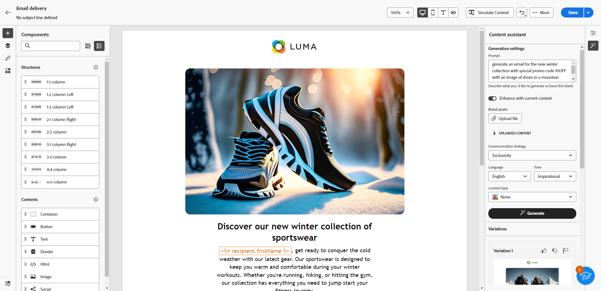

# Introdução ao assistente de Conteúdo {#generative-gs}

>[!CONTEXTUALHELP]
>id="generation_settings"
>title="Criar conteúdo de email"
>abstract="Depois de criar e personalizar o delivery, você pode usar o Assistente de conteúdo para aprimorar o conteúdo. Esse recurso simplifica o processo de personalização e melhoria de conteúdo, permitindo que você ajuste o conteúdo descrevendo o que deseja gerar."

